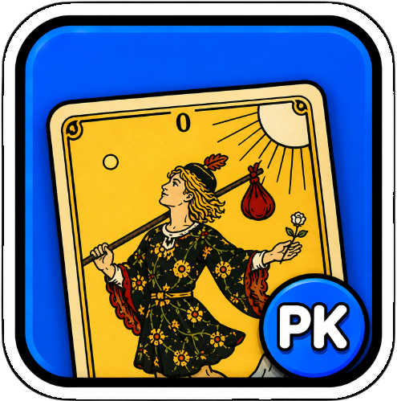

# Tarot Divinatoire

[🇫🇷 FR](README.md) · [🇬🇧 EN](README_en.md)

An editorial website for exploring the 78 Rider-Waite-Smith Tarot cards, their meanings, and their associations.

## ✅ Features

- **78 cards**: 22 Major Arcana + 56 Minor Arcana (Wands, Swords, Cups, Pentacles)
- **Complete home page**: all 78 cards are immediately visible, grouped by family with five dividers
- **Editorial card sheets**: identity, card of the day, Love, Work, Finances, Guidance, meaning, and description
- **Associations**: card combinations available in a collapsible panel
- **Interactive spreads**: several integrated spread layouts
- **Learning mode**: multiple-choice flashcard quiz (simplified Leitner) using either each card's distinctive keyword or central description phrase — known cards go to the bottom of the deck, missed ones come back quickly; progress is saved locally
- **Fullscreen search**: instant filtering by name or number, with family filters
- **Nuances**: a reference comparing cards with closely related themes
- **URL sharing**: every card has its own address (`?carte=…&deck=…&theme=…&kw=1`) updated live — a **Share** button in each sheet (native Android/iOS share sheet, otherwise copied link) and an Open Graph card preview in WhatsApp/iMessage
- **Arcana Index (experimental v11)**: a dense Three.js library arranged as 3D shelves by family and number, with instant search and click-to-open card sheets
- **Keyboard navigation**: type to search, use `←`/`→` between card sheets, and `Esc` to return
- **Self-contained architecture**: PHP application with content embedded in a SQLite vault

## 🧠 Usage

1. Browse all 78 cards on the home page or select a divider to filter one family.
2. Click a card to open its detailed sheet.
3. Use `←`/`→` to move to the previous or next card.
4. Type a letter or number to open and prefill search.
5. Open **Spreads**, **Nuances** or **Learn** from the top navigation.
6. **Share a card**: use the *Share* button in the sheet, or simply copy the address — it carries the current card and display settings.

## ⚙️ Settings

The global palette and accent colors are defined through CSS variables in the `:root` block of `src/website/v9/index.php`.

## 🧾 Shortcuts

| Key | Action |
|-----|--------|
| Letter or number | Open and prefill search |
| `←` / `→` | Previous / next card (card sheet) |
| `Esc` | Back to grid from a card sheet |
| `1`–`5` | Answer in learning mode |
| `Enter` / `→` | Move to the next card (learning mode) |

## 📦 Build & Package

V9 requires no build step: `index.php` serves the interface and resources, while `vault.sqlite` contains the data and illustrations.

## 🧪 Local test

The site (V9) runs from `src/website/v9/` with `launch.command` (macOS
double-click: free port, PHP, opens the browser), or from the CLI:

```bash
php -n -d auto_prepend_file= -S 127.0.0.1:8772 -t src/website/v9 src/website/v9/index.php
```

To test the archived versions (V2 through V7, extracted from the git branches), use
`scripts/tester-server.py`. Do not open an `index.html` via `file://`: the
browser blocks `fetch()` to SQLite and WebAssembly loading.

## 📋 See [CHANGELOG](CHANGELOG.md) for full history.

Current version: `v2026.09.02`

## 🔗 Links

- **Current version (V9)**: [mondary.design/pk/-Games-cards/tarot](https://mondary.design/pk/-Games-cards/tarot/)
- **V8**: [mondary.design/pk/-Games-cards/tarot8](https://mondary.design/pk/-Games-cards/tarot8/)
- **V7**: [mondary.design/pk/-Games-cards/tarot7](https://mondary.design/pk/-Games-cards/tarot7/)
- Older sites: [V3](https://mondary.design/pk/tarot3/) · [V1/V2](https://mondary.design/pk/tarot/)
- **Illustrations**: Rider-Waite-Smith Tarot — public domain
- **Typography**: [Cormorant Garamond](https://fonts.google.com/specimen/Cormorant+Garamond), [Plus Jakarta Sans](https://fonts.google.com/specimen/Plus+Jakarta+Sans), [DM Mono](https://fonts.google.com/specimen/DM+Mono)

---

## ⚖️ Attribution

The code and design of this project are MIT-licensed (see `LICENSE`).
The descriptive texts are original. The Rider-Waite-Smith Tarot illustrations are in the public domain.
