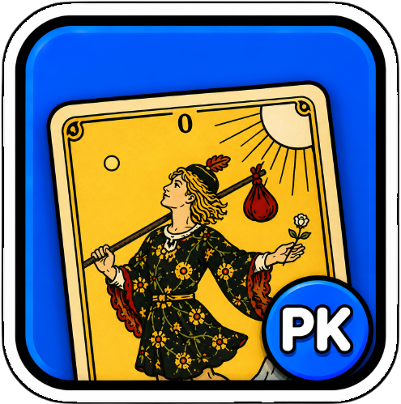
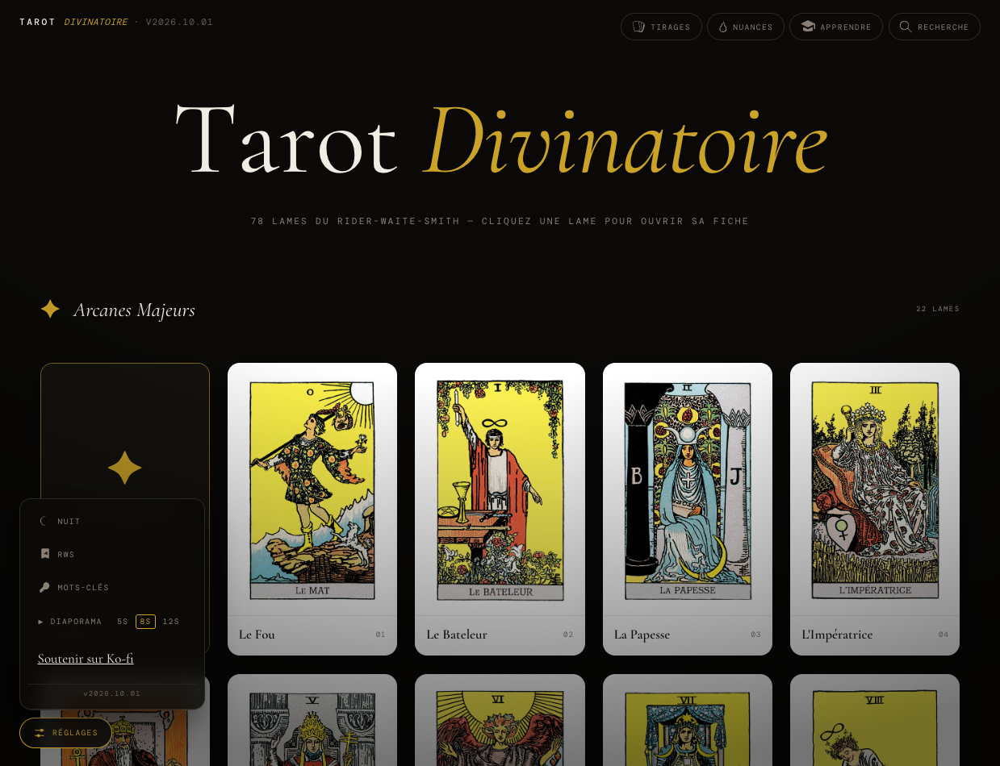
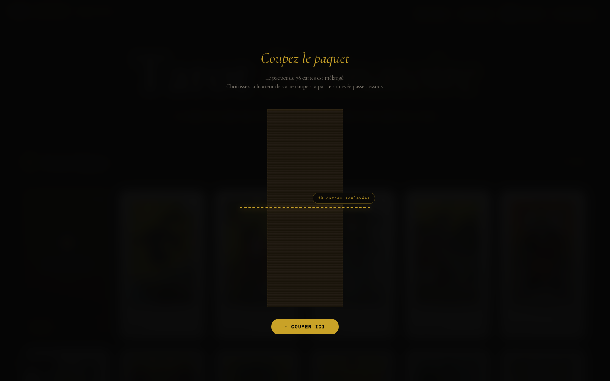
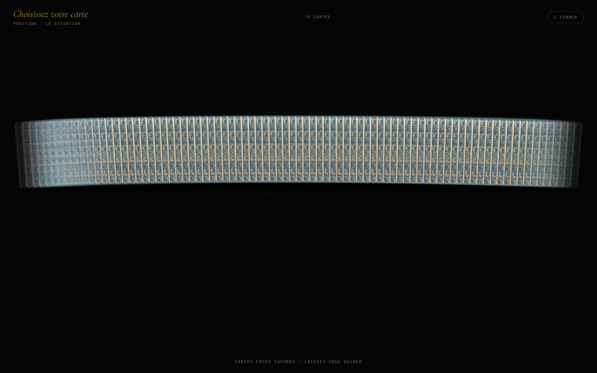
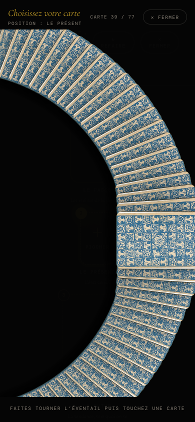
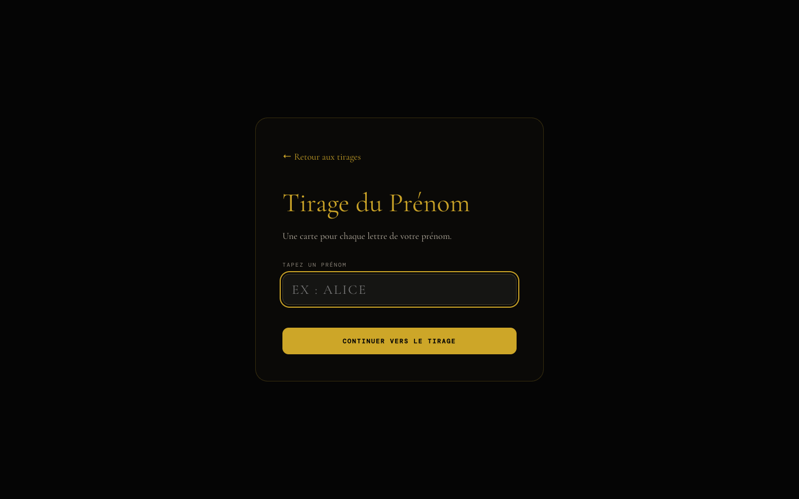
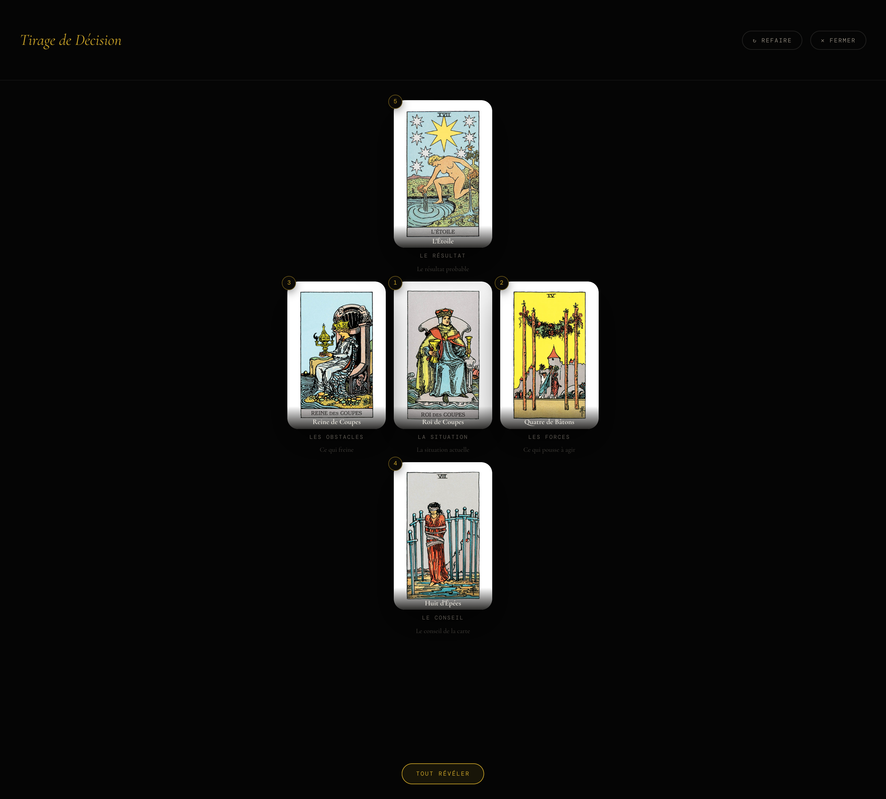

# Tarot Divinatoire

[🇫🇷 FR](README.md) · [🇬🇧 EN](README_en.md)

An editorial website for exploring the 78 Rider-Waite-Smith Tarot cards, their meanings, and their associations.

The Android app bundles **this exact interface**, including its themes, three decks and spreads; the PHP site is exported to local assets for offline use. Install the APK at `release/android/tarot-divinatoire-release.apk` (durable signing key) or from the public [GitHub Releases](https://github.com/mondary/Web_Tarot/releases). Capacitor/pnpm are used only for native CI packaging: no local `node_modules` is needed to run the website or export it. CLM image generations are grouped under `src/TAROTclm/` and tracked in Git.













## ✅ Features

- **78 cards**: 22 Major Arcana + 56 Minor Arcana (Wands, Swords, Cups, Pentacles)
- **Complete home page**: all 78 cards are immediately visible, grouped by family with five dividers
- **Editorial card sheets**: identity, card of the day, Love, Work, Finances, Guidance, meaning, and description
- **Associations**: card combinations available in a collapsible panel
- **Interactive spreads**: several integrated layouts, including the Decision Cross (illustrations visible after revealing) and the Name Reading with its own entry screen
- **Two draw modes**: *Pick* (default) — cut the shuffled deck at your chosen height, then choose your cards — or *Quick* (automatic deal). On desktop: a right-to-left fan whose hovered card protrudes slightly. On mobile: a shallow arc, native touch scrolling or mouse wheel, with the central card slightly protruding; tap a card to pick it directly. The dark back with its gold geometric symbol appears in the fan and dealt spread. The ↑ / ↓ buttons help browse the deck. The cut and fan adapt to small screens and landscape. The Card of the Day stays remembered for the day.
- **Guided draw order**: every position carries its order number (①②③…) and the next one to pick or reveal pulses in gold. The default is a *predetermined* order (draw then reveal in sequence, the fan chains automatically); a *free* order remains available in the Spreads menu for those who want to pick and reveal as they feel
- **Learning mode**: multiple-choice flashcard quiz (simplified Leitner) using either each card's distinctive keyword or central description phrase — known cards go to the bottom of the deck, missed ones come back quickly; progress is saved locally
- **Fullscreen search**: instant filtering by name or number, with family filters
- **Nuances**: a reference comparing cards with closely related themes
- **URL sharing**: every card has its own address (`?carte=…&deck=…&theme=…&kw=1`) updated live — a **Share** button in each sheet (native Android/iOS share sheet, otherwise copied link) and an Open Graph card preview in WhatsApp/iMessage
- **Arcana Index (experimental v11)**: a dense Three.js library arranged as 3D shelves by family and number, with instant search and click-to-open card sheets
- **Soixante-Dix-Huit (experimental v13)**: an animated 3D shelf (Three.js) in a bestsellers-showcase spirit — cards bound as numbered rare books, a camera gliding along the shelf, hover lift, click bringing the card up large with its book sheet, family filters
- **Keyboard navigation**: type to search, use `←`/`→` between card sheets, and `Esc` to return
- **Self-contained architecture**: PHP application with content embedded in a SQLite vault

## 🧠 Usage

1. Browse all 78 cards on the home page or select a divider to filter one family.
2. Click a card to open its detailed sheet.
3. Use `←`/`→` to move to the previous or next card.
4. Type a letter or number to open and prefill search.
5. Open **Spreads**, **Nuances** or **Learn** from the top navigation.
6. **Draw in Pick mode**: choose a spread and cut the deck at your chosen height. On mobile, swipe to browse the cards, then tap the one you want to pick. In predetermined order, the next position opens automatically; in free order, touch the desired slot. Then reveal the dealt cards.
7. **Name Reading**: choose it from the list, enter your first name on the dedicated screen, then continue to the draw. The Back button returns to the list.
8. **Share a card**: use the *Share* button in the sheet, or simply copy the address — it carries the current card and display settings.

## ⚙️ Settings

The global palette and accent colors are defined through CSS variables in the `:root` block of `src/website/index.php`.
In **Settings** at the bottom of the screen, choose **Petit**, **Normal** or **Grand** under “Taille du texte”. The choice is stored on the device, both on the website and in the offline app. The app and website icon comes from the root `icon.png`. On iPhone/iPad, the **“Installer sur iPhone”** entry in Settings installs the site as an offline app (Share → “Add to Home Screen”), without the App Store.

## 🧾 Shortcuts

| Key | Action |
|-----|--------|
| Letter or number | Open and prefill search |
| `←` / `→` | Previous / next card (card sheet) |
| `Esc` | Back to grid from a card sheet |
| `1`–`5` | Answer in learning mode |
| `Enter` / `→` | Move to the next card (learning mode) |
| `Enter` | Confirm the deck cut (Pick mode) |
| `Esc` | Close the fan or cancel the cut |
| `↑` / `↓`, `Home` / `End` | Choose a card while the mobile fan is focused |

## 📦 Build & Package

V9 requires no build step: `index.php` serves the interface and resources, while `vault.sqlite` contains the data and illustrations.

## 🧪 Local test

The site (V9) runs from `src/website/` with `launch.command` (macOS
double-click: free port, PHP, opens the browser), or from the CLI:

```bash
php -n -d auto_prepend_file= -S 127.0.0.1:8772 -t src/website src/website/index.php
```

To test the archived versions (V2 through V7, extracted from the git branches), use
`scripts/tester-server.py`. Do not open an `index.html` via `file://`: the
browser blocks `fetch()` to SQLite and WebAssembly loading.

## 📋 See [CHANGELOG](CHANGELOG.md) for full history.

Current local version: **2026.10.24**

## 🔗 Links

- **Current version (V9)**: [mondary.design/pk/-Games-cards/tarot](https://mondary.design/pk/-Games-cards/tarot/)
- **V8**: [mondary.design/pk/-Games-cards/tarot8](https://mondary.design/pk/-Games-cards/tarot8/)
- **V7**: [mondary.design/pk/-Games-cards/tarot7](https://mondary.design/pk/-Games-cards/tarot7/)
- Older sites: [V3](https://mondary.design/pk/tarot3/) · [V1/V2](https://mondary.design/pk/tarot/)
- **Illustrations**: Rider-Waite-Smith Tarot — public domain
- **Typography**: [Cormorant Garamond](https://fonts.google.com/specimen/Cormorant+Garamond), [Plus Jakarta Sans](https://fonts.google.com/specimen/Plus+Jakarta+Sans), [DM Mono](https://fonts.google.com/specimen/DM+Mono)

---

## ⚖️ Attribution

The code and design of this project are MIT-licensed (see `LICENSE`).
The descriptive texts are original. The Rider-Waite-Smith Tarot illustrations are in the public domain.

[Support on Ko-fi](https://ko-fi.com/pouark)

Promotional page: [store/website](store/website/index.html) (French only; bilingual version pending). Historical media: `store/v1/`.
