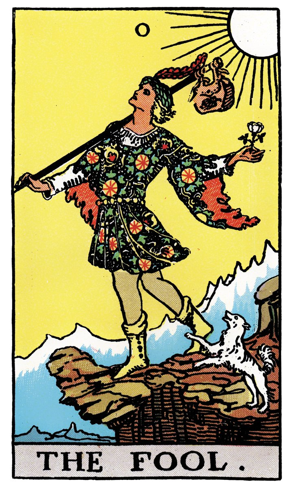

# 0 — LE MAT / LE FOU

## Signification

**Type de Carte :** Arcane Majeur — les grandes étapes ou leçons de la Vie
**Élément :** Air
**Numérologie / Rang :** 0 (ou pas de numéro attribué)
**Planète :** Uranus
**Pierre / Cristal :** Aventurine verte
**Plante :** Ginseng

## Description

Un jeune homme s'élance sur le chemin, muni d'un modeste baluchon pour tout bagage… Le sourire aux lèvres, les yeux tournés vers le Soleil. Il fait beau, et il s'en remet pleinement au Destin qui guide ses pas vers… l'inconnu !

Le petit chien blanc, emblème d'Amitié, l'accompagne… ou tente de l'avertir d'un danger. Emporté dans son enthousiasme, Le Fou ne réalise pas qu'il marche à deux doigts du vide. S'en rendra-t-il compte à temps ?

## Mots-clés

### À l'endroit
- Renouveau ou occasion à saisir
- Péripétie, périple
- Faire le « fou-fou »
- Innocence, légèreté, libre arbitre

### À l'envers
- Inconscience, actes à l'emporte-pièce
- Mauvaise préparation, risque possible
- Se comporter en enfant

## Interprétation

Le Fou porte tantôt le numéro zéro, tantôt le numéro XXII. De la sorte, Le Fou s'inscrit comme la première et la dernière Carte des Arcanes Majeurs : il incarne à la fois l'amorce du cheminement spirituel et l'être que vous êtes devenu.e au terme de ce parcours.

Dans le Tarot de Marseille, le Fou est nommé Le Mat et sa Carte ne porte aucun numéro, comme pour marquer son statut singulier parmi les Lames Majeures.

Les Arcanes Majeurs représentent les grandes étapes de l'existence humaine, les phases du cheminement spirituel et de l'accomplissement de soi. En ce sens, le Fou est à la fois la Carte de « départ » — il faut une dose de « folie » pour s'engager dans une telle Aventure… — et la Carte « d'arrivée », car si vous vous êtes découvert.e durant ce voyage, vous êtes aussi resté.e vous-même. Sur ce sentier initiatique, l'on part de soi pour revenir… à soi, avec une vision affinée de soi-même, des autres et du monde.

Le Fou est ainsi un aventurier, un pionnier qui s'élance dans une nouvelle quête, plein d'enthousiasme, espérant que sa recherche porte ses fruits. Il n'a emporté que peu de choses — un simple baluchon — et ne semble pas vraiment savoir où ses pas vont le conduire.

Cette Carte irradie d'une Énergie exaltante. Un nouveau départ se dessine, êtes-vous prêt·e à faire le grand saut ? Qu'est-ce qui vous retient encore ? L'optimisme est de mise, foncer est permis ! Vos idées sortent des sentiers battus, alors oui, certains pourraient jouer les rabat-joie. Mais rien ne vous oblige à les écouter, et encore moins à les croire ! La confiance en l'avenir rayonne partout dans cette Carte.

Le revers de cet enthousiasme tient à l'immaturité dont Le Fou peut faire preuve, à son goût pour les « chimères », à son manque de préparation et à son incapacité à apercevoir le péril. Le Fou peut se révéler un « casse-cou », un « risque-tout » qui agit sans réfléchir et qui essuie ensuite les conséquences de ses actes.

## Le Fou et l'Amour

Le Fou et l'Amour, ou l'Amour Fou ? L'Énergie du Fou vibre du côté du plaisir, du jeu et des rencontres.

Si vous êtes en quête d'Amour, le Fou vous invite à foncer et à vous engager de tout votre être dans l'aventure de la rencontre de l'Autre. L'idée est de cultiver cette légèreté typique du Fou et de ne pas (trop) vous poser de questions.

Si vous interrogez votre relation actuelle dans un Tirage, Le Fou peut traduire l'inexpérience ou l'immaturité de l'un des deux partenaires.

La Carte du Fou peut aussi vous éclairer sur l'état de votre relation. Celle-ci manque peut-être de « fun » ; votre dynamique de couple s'est peut-être assoupie. Puisez dans l'Énergie du Fou, légère et insouciante, pour relancer votre couple, surprendre l'autre et repartir.

## Le Fou et le Travail

Côté professionnel, le Fou augure favorablement d'un nouvel emploi, d'un changement de carrière ou d'un projet inédit. Puisque cette Carte annonçant un nouveau cycle de votre vie, Le Fou peut également présager un déménagement ou une promotion. Sa présence signale qu'il est temps de tenter quelque chose d'inhabituel, de sortir de votre zone de confort : endosser davantage de responsabilités, réclamer un « gros » dossier à gérer ou développer une nouvelle compétence.

## Le Fou et les Finances

Quand il est question d'Argent et de Finances, Le Fou apporte là encore son Énergie enthousiaste et aventurière, signalant qu'il est temps de « prendre des risques ». Prudence ! Si l'opportunité semble trop belle pour être vraie… c'est très vraisemblablement le cas.

Le Fou peut aussi révéler que dépenser de l'argent pour vous faire plaisir constitue, en ce moment, le meilleur investissement possible.

## Le Fou et la Guidance

Sur le sentier spirituel, Le Fou est une présence rassurante. Il est comme nous, il est nous : en quête et en devenir. Lui non plus ne sait pas où ce processus de découverte de lui-même le mène… mais il est heureux d'avancer. Il pressent d'instinct que ce n'est pas la destination qui compte, mais le voyage.

L'Énergie du Fou vous encourage à oser : l'essentiel est d'essayer, d'apprendre et de cheminer vers soi.

## Affirmation

> « Le passé n'a plus d'emprise sur moi, car je suis prêt·e à apprendre et à évoluer. » — Louise Hay

---

*Source : [Vivre Intuitif](https://vivre-intuitif.com/apprendre-le-tarot/signification/majeures/le-fou-le-mat/)*
*Illustration : Tarot de A.E. Waite — Domaine public*
