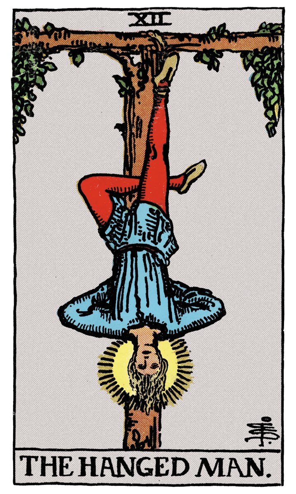

# XII — LE PENDU

](a_12_Pendu.jpg)

## Signification

**Type de Carte :** Arcane Majeur — les grandes étapes ou leçons de la Vie
**Élément :** l'Eau
**Numérologie / Rang :** 12 associé au développement spirituel
**Planète / Constellation :** Neptune
**Pierre / Cristal :** L'Agate mousse
**Plante :** L'Algue brune

## Description

La carte du Pendu dépeint un homme suspendu par un pied à une branche d'arbre. La Justice étant passée, notre homme se trouve ainsi condamné. Sa jambe gauche fléchie forme un triangle avec la jambe droite tendue, tandis que ses mains restent liées dans le dos. Un halo lumineux encadre son visage. À mi-chemin entre le supplice réservé autrefois aux pires malfaiteurs et une posture qui évoque le Yoga, Le Pendu oscille, recueilli et concentré. Il fascine… et dérange. C'est sans doute la carte la plus paradoxale de tout le Tarot… Dans une posture peu flatteuse, Le Pendu ne manifeste pourtant aucune souffrance. Il semble en paix. Pas de lutte, ni tristesse, ni colère : il a lâché prise face à ce qu'il ne peut changer et accueille son sort avec sérénité.

## Mots-clés

### À l'endroit
- Lâcher-prise
- Confiance
- Abandon
- Suspension, attente

### À l'envers
- Sentiment – ou réalité – d'être coincé
- Refus de lâcher prise
- "Prises de tête" et rancunes

## Interprétation

Le Pendu traduit la nécessité de mettre entre parenthèses votre action pour l'heure. **Même si un sentiment d'urgence émane de la situation, Le Pendu révèle que le moment n'est pas propice à la décision et que, dans la mesure du possible,vous avez tout intérêt à prendre le temps de la réflexion avant de passer à l'acte.** Marquez une pause afin de laisser éclore de nouvelles opportunités, de nouveaux possibles et de nouvelles idées. Profitez de ce temps pour explorer en profondeur votre Être Authentique et ressentir la direction à emprunter.

**Le Pendu peut aussi révéler que vous vous sentez coincé.e, enfermé.e, bloqué.e dans votre existence.** Il vous invite alors à identifier l'origine de ce ressenti afin de dénouer la situation. Accepter la situation, admettre que tout ne dépend pas de vous et… lâcher prise est peut-être indispensable ! Le lâcher-prise libère du poids des soucis quotidiens, des tracas et des pensées limitantes, et fait émerger en vous la solution, le chemin pour sortir de l'ornière.

**Pour finir, Le Pendu vous encourage à porter un regard neuf sur votre situation.** Dans l'enfance, au jeu du "cochon pendu", suspendu par les jambes à une branche, le monde apparaît tout autre. C'est ce regard que Le Pendu vous suggère d'adopter… un éclairage différent sur vous-même, sur votre environnement, sur vos problèmes. Cet exercice peut vous conduire à une réponse éclairée à vos interrogations… Il est possible – et même souhaitable – que cette introspection vous pousse à questionner vos habitudes et croyances, à déposer celles qui aujourd'hui ne servent plus vos objectifs de vie Authentiques. En ce sens, Le Pendu est une carte de sacrifice : sacrifier les anciens fonctionnements, les vieilles idées et habitudes pour laisser place au renouveau.

## Le Pendu et l'Amour

Si vous êtes en quête d'Amour, Le Pendu vous suggère… de procéder autrement ! Il est temps d'expérimenter de nouvelles méthodes pour rencontrer celui ou celle qui fera chavirer votre cœur. Changer d'habitudes, changer de lieux de rencontres, voire changer d'approche : Le Pendu vous pousse à repenser votre stratégie et à innover.

Il se peut aussi que Le Pendu vous alerte sur vos attentes vis-à-vis de la relation à l'autre. Vous portez sûrement en vous une version plus ou moins idéalisée de la relation de couple et du bonheur à deux. Votre vision est-elle réaliste ? Si vous êtes en couple, cette version est-elle partagée ? Le Pendu interroge sur ce qui compte essentiellement chez son partenaire et dans la relation amoureuse. Cette réflexion pourrait vous amener à sacrifier certaines de vos exigences pour rencontrer votre Âme sœur.

Si vous vivez en couple, Le Pendu révèle que les choses sont "suspendues", en pause… tout particulièrement si vous traversez des difficultés. Vous pesez "le pour et le contre". Arrêter ? Continuer ? Suis-je heureux / heureuse dans cette relation ? Correspond-elle vraiment à ce que je souhaite ou est-ce que je reste parce que j'ai déjà tant sacrifié pour en arriver là ? Le Pendu encourage le dialogue et l'écoute de l'autre, mais surtout l'écoute de votre boussole intérieure, de votre Intuition afin de prendre la bonne décision pour votre bonheur.

## Le Pendu et le Travail

Quand le Tirage porte sur le travail, Le Pendu annonce que votre situation professionnelle est en stand-by. Par exemple, une promotion ou une évolution attendue tarde à se matérialiser. Vous restez dans l'attente, espérant ce changement qui se fait désirer.

Il se peut aussi que vous mettiez votre vie professionnelle entre parenthèses pour consacrer davantage de temps à votre famille, à vos projets personnels ou à votre développement spirituel… ou que vous en ayez grandement besoin !

Si vous cherchez un emploi, Le Pendu présage un délai, une réponse qui se fait attendre. Pour dénicher le bon poste, il vous faudra peut-être renoncer à certaines exigences (salaire, proximité géographique…) ou consentir à des concessions.

## Le Pendu et les Finances

Dans le domaine des Finances, Le Pendu vous suggère de "mettre en veille" vos projets et dépenses. Cette pause doit vous servir à porter un regard neuf sur votre situation financière et à l'évaluer. Il est sans doute temps d'ouvrir les yeux sur les paramètres de votre budget et de revoir vos habitudes de dépenses et d'épargne.

Le Pendu peut également révéler que vos finances sont "bloquées", que les fonds ne sont pas accessibles dans l'immédiat. Il peut s'agir de placements à long terme, de tracasseries administratives ou d'une rentrée d'argent attendue mais différée. Il faudra patienter pour que votre situation se débloque.

## Le Pendu et la Guidance

Le Pendu incarne le besoin que nous avons tous de lâcher prise et d'accéder à l'éveil spirituel. Comment devenir un être plus spirituel ? Comment demeurer sur le chemin de l'accomplissement de soi ? Quels sacrifices, le cas échéant, faut-il consentir pour y parvenir ? Pourquoi est-ce si difficile alors que vous avez tout à y gagner ? Voici les interrogations que Le Pendu a résolues et que sa présence vous invite à méditer.

## Affirmation

> "Lâcher prise, c'est redouter moins et aimer plus".

---

*Source : [Vivre Intuitif](https://vivre-intuitif.com/apprendre-le-tarot/signification/majeures/le-pendu/)*
*Illustration : Tarot de A.E. Waite — Domaine public*
