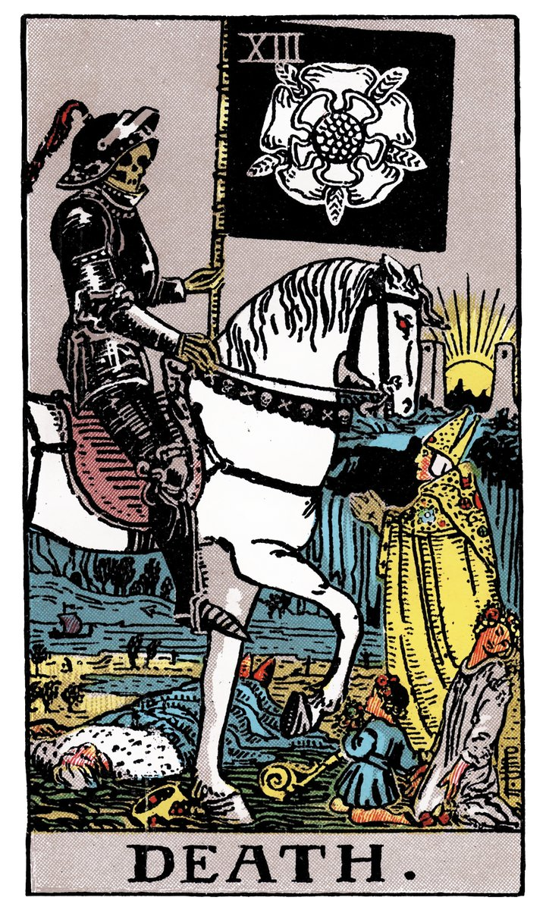

# XIII — LA MORT — L'ARCANE SANS NOM

](a_13_Mort.jpg)

## Signification

**Type de Carte :** Arcane Majeur — les grandes étapes ou leçons de la Vie
**Élément :** l'Eau
**Numérologie / Rang :** 13 associé à la chance… ou à la malchance
**Planète / Constellation :** Scorpion
**Pierre / Cristal :** L'Obsidienne
**Plante :** Le Sureau

## Description

Dans le Tarot de Marseille, la carte de L'Arcane sans Nom / La Mort est représentée par une "faucheuse". Cette image classique dépeint un squelette armé d'une grande faux sillonnant villes et campagnes et frappant à l'aveugle ses victimes.

Dans le Rider-Waite, La Mort est illustrée par un squelette en armure chevauchant un grand cheval blanc, brandissant à la main une large bannière noire. L'armure portée par cet étrange cavalier rappelle que la mort est invincible : personne n'a jamais réussi à lui échapper. La présence d'hommes, de femmes et d'enfants sur la carte évoque les Danses Macabres et symbolise l'universalité de la Mort. Elle frappe sans distinction d'âge, de sexe ou de religion.

**Malgré son nom et son illustration évocateurs, L'Arcane sans Nom du Tarot n'annonce pas la mort physique d'un être ou d'une chose. La carte de La Mort parle de changement, de transformation et de renaissance**… encore faut-il savoir en déchiffrer les symboles.

Dans le Tarot de Marseille, le sol noir correspond à la "matière noire" des Alchimistes, produit de la première transformation alchimique qui appelle nécessairement les suivantes. La transformation est donc en cours et inachevée. Dans le Rider-Waite, le Soleil se lève à l'arrière-plan entre les deux tours de l'Arcane La Lune, preuve que le cheminement n'est pas terminé ou "mort" non plus.

## Mots-clés

### À l'endroit
- Achèvement
- Mutation, transition
- Affranchissement

### À l'envers
- Stagnation
- Refus du changement
- Impossibilité d'avancer

## Interprétation

La Mort ! Qui peut contempler cette silhouette squelettique sans éprouver un certain malaise ? Nous voici confrontés à notre peur la plus ancrée, à l'Inconnu le plus profond. L'Arcane sans Nom est probablement la carte la plus mal comprise de tout le Tarot car malgré son illustration et son nom, l'Arcane sans Nom ne nous parle que très rarement de la mort physique.

L'Arcane sans Nom symbolise la fin, certes, mais uniquement dans la mesure où cette fin permet à un nouveau chapitre de s'écrire… un chapitre plus important et plus bénéfique. Il faut être en capacité de laisser le passé derrière soi pour accueillir ces nouvelles opportunités. Si l'exercice n'est pas simple, il est indispensable pour que le renouveau et la transformation entrent dans votre vie. Résister aux changements, refuser « la fin » peut générer plus de souffrance émotionnelle que d'embrasser ces nouvelles possibilités. Quand La Mort – L'Arcane sans Nom apparait dans un Tirage de Tarot, elle s'accompagne de solutions constructives pour vous aider à franchir ce cap. Observez les autres cartes et demandez-vous en quoi elles peuvent constituer des "panneaux indicateurs" vers la transformation de soi.

Parfois, La Mort indique que vous devez vous défaire d'une ancienne habitude ou couper un lien toxique afin de vivre de façon plus épanouie. Dans ce cas, La Mort vous pousse à vous détacher des mauvaises habitudes, des excès, des souvenirs dépassés… tout ce qui "encombre" inutilement votre vie, votre esprit et vous empêche d'avancer. L'objectif ici est de cheminer vers plus d'accomplissement de soi, d'être mieux dans sa peau et dans sa vie. Le passé, loin d'être renié, reste à sa juste place : derrière soi.

## La Mort — L'Arcane Sans Nom et l'Amour

Si vous êtes en quête d'Amour, L'Arcane Sans Nom vous interroge sur un point crucial de votre recherche : vos relations précédentes sont-elles bien "digérées" ? Avez-vous le cœur et l'esprit véritablement libres pour accueillir une nouvelle histoire ? Avez-vous effectivement fait le deuil de vos relations passées ou reste-t-il des sentiments, des contacts, des espoirs ? La Mort révèle que vous devez avoir réellement mis votre passé amoureux derrière vous avant de pouvoir vivre une nouvelle histoire d'amour.

Si vous êtes en couple, La Mort annonce qu'un changement s'impose et que ce changement passe par la mise à distance du passé. Si vous avez décidé de tourner la page et de repartir ensemble, laissez le passé derrière vous, ne remuez pas les vieilles rancœurs. Cela doit vous permettre d'avancer ensemble avec une meilleure communication et davantage de compréhension mutuelle.

Il se peut aussi que vous ayez l'impression que votre relation amoureuse difficile ne changera jamais. Dans ce cas, La Mort peut évoquer un break ou une rupture et le Tirage de Tarot peut servir à identifier ce qui pourrait être positif et bénéfique dans cette perspective, à court terme et à long terme.

## La Mort — L'Arcane Sans Nom et le Travail

La Mort est une carte de changement : il faut donc se préparer à toutes les éventualités ! Des changements majeurs dans l'environnement de travail pourraient impacter votre vie. Restructuration, nouvelle organisation, nouveau projet : un virage s'annonce. Si le changement annoncé par la carte est de moindre importance, il se peut qu'un collègue parte ou qu'un projet significatif se termine ou s'interrompe. Ces changements sont probablement source de stress – voire de peur – pour vous. Gardez à l'esprit que si vous n'avez pas prise sur ces changements, vous gardez la main sur la façon de les accueillir et de vous y adapter. Ces changements peuvent vous apporter des éléments positifs sur le long terme… même si c'est difficile, voire impossible, à imaginer pour l'instant.

Si vous envisagez de changer de voie professionnelle, c'est le bon moment ! L'Arcane Sans Nom du Tarot est alors de bon augure. Vous êtes prêt.e pour ce changement, impatient.e d'entrer dans cette nouvelle phase de votre vie. Bravo ! La transformation et la renaissance se profilent.

## La Mort — L'Arcane Sans Nom et les Finances

Dans un tirage de Tarot portant sur votre argent et vos finances, l'Arcane sans Nom évoque des changements susceptibles d'impacter fortement votre situation financière. Le risque est celui d'un impact négatif bien sûr, avec une perte de revenus ou de capitaux. Dans ce cas, La Mort – L'Arcane Sans Nom vous invite à ne pas vous voiler la face et à bien évaluer votre situation financière, ainsi que les risques que vous êtes prêt.e à prendre. Ensuite, il vous faut prendre les mesures qui s'imposent. Vous en êtes capable et l'impact négatif potentiel s'en trouve atténué.

## La Mort — L'Arcane Sans Nom et la Guidance

Comment vivez-vous le changement ? L'accueillez-vous à bras et à cœur ouverts ? Le changement est-il pour vous générateur de stress voire d'anxiété ?

Et si vous pouviez modifier quelque chose en vous, d'un coup de baguette magique, que changeriez-vous ?

La Mort interroge le changement personnel, la transformation… Se défaire de ce qui n'est pas utile au développement spirituel, laisser derrière soi les bagages encombrants pour avancer plus vite et plus loin sur le chemin de l'accomplissement de Soi. Le changement est une opportunité de faire mieux, d'être plus en adéquation avec vos besoins Authentiques et de vous aligner avec le bonheur. Profitez-en !

## Affirmation

> "Un changement en prépare un autre." – Nicolas Machiavel

---

*Source : [Vivre Intuitif](https://vivre-intuitif.com/apprendre-le-tarot/signification/majeures/la-mort-larcane-sans-nom/)*
*Illustration : Tarot de A.E. Waite — Domaine public*
