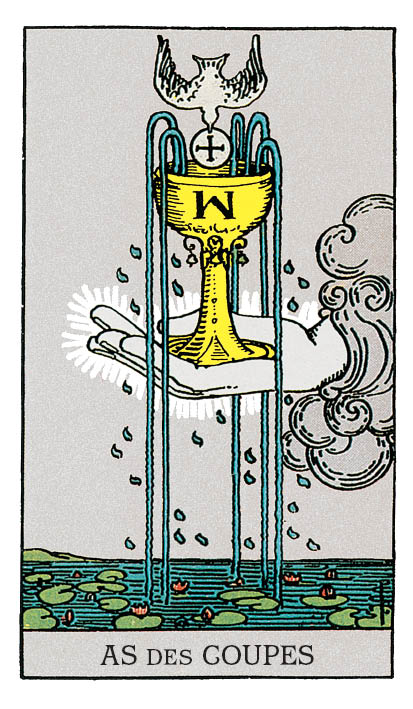

# As de Coupe

## Signification

**Type de Carte :** Arcane Mineur de la Suite des Coupes associée aux sentiments, aux émotions et à l'amour
**Élément :** l'Eau
**Numérologie / Rang :** 1, associé au commencement, aux opportunités

## Description

Une main surgit du Ciel. Elle émerge des nuages pour tendre une Coupe évoquant un Calice, voire le Saint Graal. Sur ce récipient, la lettre W fait référence à l'initiale du créateur du Tarot, A.E. Waite. De l'eau s'écoule de la Coupe pour se déverser dans un plan d'eau orné de nénuphars. Ces fleurs incarnent l'ascension des pensées et des désirs inconscients vers la conscience. Une colombe transporte une hostie, figure de l'incarnation de l'Esprit dans le Monde matériel.

## Mots-clés

### À l'endroit
- Amour naissant
- Fécondité, restauration émotionnelle
- Sentiments intenses difficiles à contenir

### À l'envers
- Émotions enfouies ou entravées
- Frustration amoureuse

## Interprétation

À l'instar de tous les As du Tarot, l'As de Coupe vous invite à saisir l'occasion qui se présente, à boire le contenu de la Coupe. La promesse ? Amour, contentement et guérison du cœur ! Pour y accéder, l'As de Coupe vous pousse à prendre les rênes, à agir dans cette quête de bonheur et d'équilibre émotionnel. Il se peut que vous deviez prendre un risque – exprimer vos ressentis, formuler ce que votre cœur désire – afin que ce flot d'Amour et d'Abondance vous parvienne. Avec l'As de Coupe, il est aussi question de « flow », ce flux émotionnel, cette Energie échangée entre deux êtres. L'As de Coupe annonce une nouvelle relation amoureuse ou amicale, porteuse de bonheur et de compréhension mutuelle. Il peut aussi suggérer que, pour que ce « flow » renaisse, une conversation à « cœur ouvert » doit avoir lieu. Il peut s'agir de pardonner, de solliciter le pardon, de déposer colère et regret pour « repartir à zéro » avec un proche. L'As de Coupe est également une Carte qui incarne la Loi de l'Attraction. Si l'As de Coupe parle de recevoir, il vous enjoint aussi à donner. C'est le moment idéal pour déployer votre générosité, pour partager, pour offrir « un peu de vous-même » sous toutes les formes possibles. Enfin, dans les Tirages divinatoires, l'As de Coupe peut présager d'une grossesse, d'une naissance.

## As de Coupe et l'Amour

L'As de Coupe compte parmi les meilleures Cartes d'un Tirage amoureux, tout particulièrement si vous êtes en quête d'Amour. N'attendez pas passivement que l'Univers place sur votre chemin votre Âme-Sœur. Allez activement à sa rencontre ! Vous allez bientôt croiser une personne qui fera chavirer votre Cœur. Si vous vivez en couple, l'occasion vous est donnée d'avancer dans la relation – un mariage ou un enfant, par exemple – ou de « repartir à zéro », si la relation a récemment traversé des difficultés. La clé : ressentir et exprimer la connexion émotionnelle qui vous unit l'un à l'autre.

## As de Coupe et le Travail

Côté professionnel, l'As de Coupe révèle qu'une belle opportunité va se présenter à vous. C'est donc une Carte très favorable si vous cherchez un emploi ou une nouvelle occasion professionnelle, ou que vous lancez votre activité. L'As de Coupe signale que, à ce stade de votre carrière, l'essentiel réside dans votre investissement émotionnel au travail. Vous voulez que votre travail vous plaise, mais surtout, vous avez besoin que vos activités aient du sens. Cette passion peut réapparaître dans votre vie professionnelle si un renouveau est possible – amélioration des relations, nouvelles responsabilités… –, ou bien parce que vous décidez de changer purement et simplement d'activité.

## As de Coupe et les Finances

L'As de Coupe est une Carte synonyme d'Abondance. Elle constitue donc un excellent présage dans un Tirage portant sur les finances. Toutefois, dans ce domaine, les émotions ne doivent pas l'emporter sur la réflexion et la planification. Il convient toujours de bâtir l'Abondance, même avec une Carte qui semble vous la servir sur un plateau d'argent. L'As de Coupe indique que le moment est idéal pour reprendre votre budget en main avec un « regard neuf », via une nouvelle approche ou un nouvel outil, par exemple.

## As de Coupe et la Guidance

L'As de Coupe incarne l'Energie d'une personne en « flow » avec les autres. Cette personne exprime ses émotions avec aisance et fait part de ses sentiments sans s'en excuser. Est-ce votre cas ? Avez-vous tendance, à l'inverse, à garder vos émotions pour vous ? À les refouler ? L'Energie de l'As de Coupe vous permet de vous connecter à vos émotions (et à votre Intuition !) afin de les ressentir pleinement, de les travailler si nécessaire et de progresser vers la guérison émotionnelle. Faites-en votre alliée !

---

*Source : [Vivre Intuitif](https://vivre-intuitif.com/apprendre-le-tarot/signification/coupes/as-de-coupe/)*
*Illustration : Tarot de A.E. Waite — Rider-Waite-Smith*
