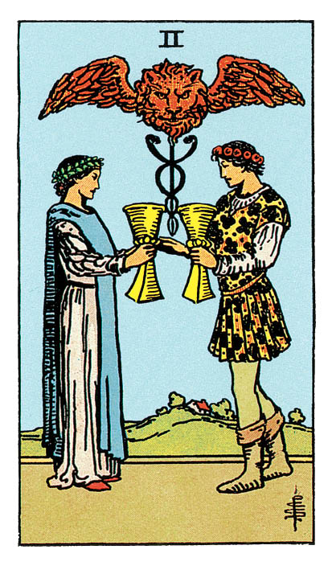

# Deux de Coupe

## Signification

**Type de Carte :** Arcane Mineur de la Suite des Coupes associée aux sentiments, aux émotions et à l'amour
**Élément :** l'Eau
**Numérologie / Rang :** 2, associé au couple, à l'équilibre et au choix

## Description

Un homme et une femme se font face. Ils échangent la Coupe qu'ils tiennent à la main. Avec leurs couronnes de laurier et de fleurs dans les cheveux et leur ravissante tenue, ils semblent prendre part à une cérémonie d'union ou à un Rituel magique. Leur échange est consacré sous un Caducée. Attribut du Dieu Hermès, le Caducée incarne la protection, l'harmonie et l'échange équitable. Comme dans la Carte de La Force, la présence du Lion évoque la sensualité et l'attraction qui unit les deux personnages.

## Mots-clés

### À l'endroit
- Amour, fascination, romantisme
- Lien, alliance, union
- Entente mutuelle, appui réciproque

### À l'envers
- Incompréhension, querelles
- Rompre, dissoudre une alliance
- Se détacher de quelqu'un ou d'un projet

## Interprétation

À l'instar de la Carte des Amoureux ou de celle du Diable, le Deux de Coupe met en scène un homme et une femme et évoque nécessairement l'idée de couple. Ici, chacun offre à l'autre ce qu'il a de plus précieux – le contenu de sa Coupe – c'est-à-dire ses émotions, son Intuition et ses sentiments. Pas de faux-semblants dans cette configuration. Pas de tricherie ni d'artifice. La relation repose sur une attirance partagée, un respect profond et le besoin d'aimer l'autre, de le comprendre et de l'épauler. Cette Energie porte la bienveillance et la considération réciproques. De fait, dans les Tirages de Tarot, le Deux de Coupe constitue un indicateur très puissant d'attirance et de sentiments réciproques. S'il évoque l'amour « romantique », il peut tout aussi bien s'agir d'amour filial ou d'amitié. Le Deux de Coupe peut aussi signaler un partenariat ou un projet auquel vous consacrez « tout votre cœur ». Dans ce projet ou partenariat, chaque partie est aussi impliquée et « gagnante » que l'autre. Le Deux de Coupe présage parfois des fiançailles, un mariage ou une union. La Carte incarne l'engagement que les deux personnes ou les deux parties prennent l'une envers l'autre, à savoir veiller aux besoins physiques et émotionnels de l'autre. Enfin, le Deux de Coupe reflète aussi la valeur de chaque individu. Le contenu de la Coupe que chacun offre à l'autre est unique, inestimable. Le Deux de Coupe vous invite à prendre conscience de votre valeur, de votre beauté intérieure et de ce que vous êtes en mesure d'apporter à l'autre. Sans cette prise de conscience, sans cette confiance en vous, la rencontre avec l'autre, la séduction ou le partenariat ne sauraient advenir.

## Deux de Coupe et l'Amour

Le Deux de Coupe est un excellent signal dans les Tirages de Tarot portant sur l'Amour et la sphère amoureuse. Si vous êtes en quête d'Amour avec un grand « A », le partenaire que vous attendez avec impatience pourrait faire irruption dans votre vie. Vous reconnaîtrez cette personne à la profonde connexion émotionnelle que vous partagerez et à votre attirance réciproque. Cette histoire d'amour peut se mettre en place assez rapidement, car l'entente est harmonieuse et la communication très fluide entre vous deux. Vous avez le sentiment d'avoir enfin rencontré la bonne personne. Si votre relation a démarré en mode « on verra bien, pour l'instant je profite », il se peut que les choses deviennent très vite bien plus sérieuses. Si votre couple traverse des difficultés, le Deux de Coupe révèle que vous avez tous les deux les cartes en main pour réparer votre relation, pour pardonner ce qui doit l'être et avancer à nouveau ensemble. Vous êtes tous deux dans de bonnes dispositions pour comprendre le point de vue de l'autre et retrouver l'harmonie.

## Deux de Coupe et le Travail

Dans un Tirage de Tarot portant sur le travail, le Deux de Coupe révèle qu'un partenariat professionnel ou un nouvel emploi se profile. L'Energie de cette Carte est très positive ! Les parties sont enthousiastes à l'idée de se lancer et de travailler ensemble. Les objectifs de chacun convergent vers le succès. La relation est très complémentaire : les forces et idées de l'un viennent renforcer celles de l'autre. Le Deux de Coupe indique également que vous ne devez pas craindre d'apporter votre pierre à l'édifice. Sollicitez des projets ou des responsabilités. Montrez que vous savez aider, faire partie de l'équipe. Vos compétences seront identifiées par les collègues et la hiérarchie comme essentielles.

## Deux de Coupe et les Finances

Le Deux de Coupe est avant tout une Carte de partage et de partenariat. C'est donc vers votre partenaire qu'il convient de vous tourner pour vous accorder sur ce que vous voulez faire de vos finances. Pour atteindre vos objectifs financiers, vous devez vous y mettre tous les deux et vous tenir aux décisions prises. Soyez un appui l'un pour l'autre, soyez responsable l'un envers l'autre et faites part de vos craintes et de vos succès. À défaut de partenaire dans votre vie, trouvez une personne de confiance qui pourra jouer ce rôle d'écoute et vous aider à vous responsabiliser quant à votre budget. Le Deux de Coupe peut aussi annoncer une opportunité de partenariat (investissement, entreprise…) avec une personne de votre entourage.

## Deux de Coupe et la Guidance

Le Deux de Coupe met en scène deux personnages qui s'offrent mutuellement le meilleur : le contenu de leur Coupe. Quel est le contenu de \*votre\* Coupe ? Quelles sont vos plus belles qualités ? Quels sont les plus beaux gestes que vous posez au quotidien pour les autres ? Si Jean-Paul Sartre écrivait « L'enfer, c'est les autres », le Deux de Coupe reflète que les autres sont essentiels à votre cheminement spirituel. La compassion, la vérité ou encore la communication bienveillante n'ont de sens que parce qu'elles prennent vie \*pour\* les autres.

---

*Source : [Vivre Intuitif](https://vivre-intuitif.com/apprendre-le-tarot/signification/coupes/deux-de-coupe/)*
*Illustration : Tarot de A.E. Waite — Rider-Waite-Smith*
