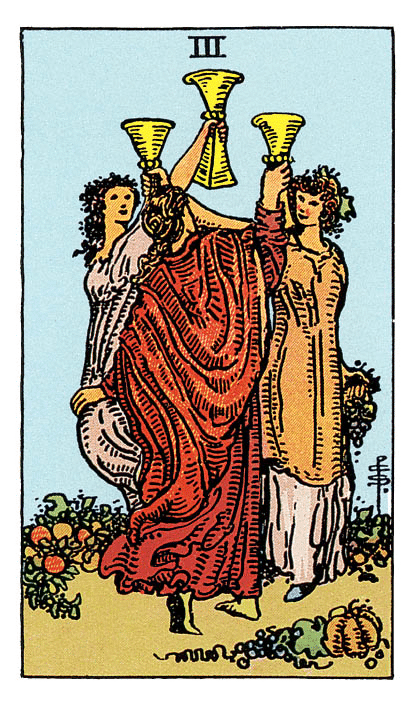

# Trois de Coupe

## Signification

**Type de Carte :** Arcane Mineur de la Suite des Coupes associée aux sentiments, aux émotions et à l'amour
**Élément :** l'Eau
**Numérologie / Rang :** 3, associé à la création, à la collaboration et à l'abondance

## Description

Trois jeunes femmes dansent en cercle et lèvent leur Coupe, en signe de fête et de célébration. Leurs bras s'entrelacent comme pour incarner l'amitié qui les unit, la connexion qui les relie les unes aux autres. Chacune porte également une couronne, symbole de victoire et de réussite. Le sol se couvre de fruits : l'abondance et la joie règnent dans ce jardin. C'est la fête ! L'Energie qui s'en dégage est festive, joviale et solidaire.

## Mots-clés

### À l'endroit
- Allégresse, amitié, appui des proches
- Festivité, célébration
- Réussite, triomphe

### À l'envers
- Absence de soutien
- Se réjouir trop vite, vendre la peau de l'ours avant de l'avoir tué
- Déception, échec, erreurs
- Triangle amoureux

## Interprétation

Peu de Cartes du Tarot mettent en scène une activité de groupe. Le Hiérophante enseigne à une classe, les personnages du Trois de Deniers co-construisent leur projet… et les trois jeunes femmes du Trois de Coupe célèbrent leur amitié dans la joie et la bonne humeur ! Le Trois de Coupe est « la » Carte de la fête et des célébrations : mariage, vacances, festivités et rassemblements joyeux. Son Energie se révèle solidaire, festive, divertissante, voire « décalée ». L'idée est de se trouver dans un moment hors du commun, qui vous relie aux autres, à votre « tribu », votre Communauté… pour renforcer les liens et faire du bien à l'Âme. L'Energie est débordante et le moral au beau fixe. C'est stimulant et grisant ! Plus encore, cette Carte parle d'être et de vibrer ensemble, avec les personnes les plus chères à votre cœur. Le Trois de Coupe évoque donc la solidarité, la communauté, ce fil qui nous relie aux autres, ce qui nous fait dire « On est faits du même bois ! » C'est une Carte de compréhension mutuelle et d'empathie. Si vous vous sentez isolée ou « déconnectée » des autres au moment du Tirage, le Trois de Coupe annonce une période d'ouverture ou une vie sociale plus riche. C'est le moment d'appeler vos ami(e)s – anciens ou nouveaux – et d'organiser une sortie, une fête… Non pas seulement pour vous changer les idées, mais pour retrouver les autres et vous (re)lier au Monde.

## Trois de Coupe et l'Amour

Le Trois de Coupe est une très belle Carte quand il est question d'amour dans un Tirage, car il évoque la compréhension mutuelle, le soutien et des sentiments partagés. Si vous êtes célibataire, vous pouvez vous appuyer sur vos ami(e)s et votre réseau pour faire des rencontres intéressantes. Tous les événements impliquant la notion de groupe ne sont pas à négliger non plus : cours collectif, concerts, réunions… Si vous traversez une période difficile dans votre couple, le Trois de Coupe peut symboliser un triangle amoureux. Quelque chose ou quelqu'un s'immisce dans votre couple et en trouble l'harmonie.

## Trois de Coupe et le Travail

Dans le domaine professionnel, le Trois de Coupe signale qu'il est grand temps de célébrer vos victoires – petites ou grandes – avec vos collègues, vos associés ou vos collaborateurs. Le succès est souvent le fruit d'un travail d'équipe. C'est le moment de remercier ceux qui œuvrent à la réussite et d'apprécier pleinement leur contribution. Le Trois de Coupe indique également qu'au travail comme ailleurs, il faut savoir s'entourer. Si vous cherchez du travail ou de nouvelles opportunités, vous devez vous appuyer sur votre réseau – famille, proches, amis – pour élargir votre champ des possibles.

## Trois de Coupe et les Finances

Le Trois de Coupe est avant tout une Carte d'abondance et de plaisir partagé. De fait, si le Tirage porte sur vos finances, on peut raisonnablement déduire que, si votre situation financière est difficile en ce moment, elle devrait s'améliorer. Le Trois de Coupe rappelle également que, même si « les temps sont durs », se faire plaisir reste une nécessité. Si vous avez tendance à faire passer les besoins des autres avant les vôtres, le Trois de Coupe rappelle que vos besoins sont tout aussi importants que ceux des autres.

## Trois de Coupe et la Guidance

Le Trois de Coupe vous invite à réfléchir aux sources de joie et de plaisir de votre vie, notamment celles partagées avec vos proches. Quelle place vos proches occupent-ils dans vos moments de bonheur ? Comment fêtez-vous vos « victoires » – petites ou grandes ? Le Trois de Coupe suggère que le bien-être passe aussi par l'attachement aux autres, les activités partagées et les moments vécus en groupe. Êtes-vous très présent(e) pour les autres ? Qui, dans votre entourage, se tient là pour vous soutenir, vous ?

---

*Source : [Vivre Intuitif](https://vivre-intuitif.com/apprendre-le-tarot/signification/coupes/trois-de-coupe/)*
*Illustration : Tarot de A.E. Waite — Rider-Waite-Smith*
