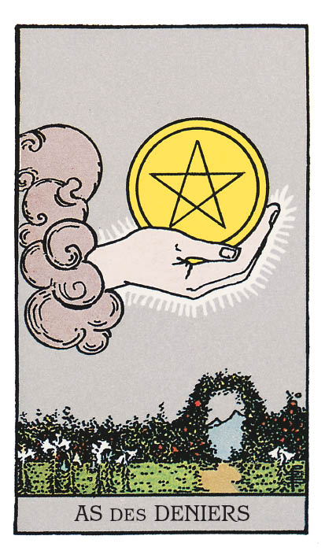

# As de Denier

## Signification

**Type de Carte :** Arcane Mineur de la Suite des Deniers, associée au monde matériel, à l'argent et aux possessions
**Élément :** Terre
**Numérologie / Rang :** 1, associé au commencement, aux nouveaux départs

## Description

À l'image des autres As du Tarot, l'As de Denier représente une main sortant des nuages pour offrir le symbole de sa Suite : une pièce d'or, un Denier. Le paysage de la Carte évoque pour sa part l'Élément rattaché aux Deniers : la Terre. L'abondance de fleurs, la haie, les bosquets et la montagne à l'horizon incarnent la prospérité, l'expansion et l'opulence.

## Mots-clés

### À l'endroit
- Occasion financière inédite
- Hausse, nouveau poste
- Abondance
- Voie nouvelle

### À l'envers
- Débours imprévu
- Cupidité, avarice
- Pénurie de générosité

## Interprétation

L'As de Denier — à l'image de la Suite des Deniers — incarne toutes les formes de richesse, et non les seules richesses matérielles. Il annonce des opportunités dans votre vie : nouvelles possibilités de gain, cadeau, héritage. Plus largement, cette Carte révèle que vous êtes — ou entrez — dans une période d'abondance touchant tous les domaines de votre existence. La loi d'attraction opère : en émettant vers l'Univers de l'Énergie positive, vous recevez en retour.

L'As de Denier évoque aussi la réalisation de vos objectifs et révèle que vous êtes dans un bon état d'esprit pour les concrétiser. Le moment est venu de travailler à rendre « matérielles » et « tangibles » vos bonnes idées, à métamorphoser vos aspirations en réalité. L'As de Denier augure favorablement ce travail de planification et de concrétisation d'un projet, tout particulièrement s'il est professionnel ou lié aux finances.

Pour garantir le succès, l'As de Denier peut également vous suggérer d'ajouter un ingrédient nouveau à la recette. Plutôt que d'attendre le cours naturel des choses, vous êtes invité·e à tenter quelque chose d'inédit, à mettre en œuvre une idée qui n'a rien d'évident… ou qui sort de vos habitudes. Cela peut passer par un cours, la diversification de votre activité, le lancement d'un nouveau produit… Du neuf et du frais sont de mise !

## As de Denier et l'Amour

L'As de Denier symbolise une occasion nouvelle, y compris sur le terrain amoureux. Puisqu'il appartient à la Suite des Deniers, elle pourrait surgir dans l'univers professionnel ou par la rencontre de quelqu'un exerçant le même métier que vous.

L'As de Denier évoque également la concrétisation de vos objectifs personnels. Si vous vous êtes fixé pour but de rencontrer quelqu'un, cela pourrait bien advenir rapidement.

## As de Denier et le Travail

Dans le domaine du Travail, l'As de Denier révèle que des opportunités et/ou des personnes ne devraient plus tarder à croiser votre chemin pour vous aider à progresser dans votre carrière, à trouver un nouvel emploi ou à obtenir une promotion.

Si vous êtes en poste, l'As de Denier peut vous annoncer une promotion, une prime ou un projet important qui vous sera bientôt confié. De nouvelles occasions de briller se profilent, ainsi que les récompenses qui les accompagnent.

Si vous êtes en quête d'un emploi, l'As de Denier est un signe que la recherche ne devrait plus tarder, car des opportunités réelles existent dans ce secteur professionnel.

Enfin, si vous souhaitez lancer votre entreprise ou votre activité, l'As de Denier est d'excellent augure. Vous possédez à la fois les connaissances et les compétences nécessaires, mais surtout l'énergie et l'envie profonde de faire advenir le succès matériel.

## As de Denier et les Finances

L'As de Denier est une Carte de bon augure pour les finances et pour le domaine de l'argent. En règle générale, elle annonce qu'un flux d'argent vient vers vous. Il peut prendre la forme d'une prime, d'un cadeau voire d'un héritage… ou résulter d'un travail ou d'un projet conduit sur la durée dans votre vie.

L'As de Denier peut aussi évoquer un achat ou un investissement conséquent.

## As de Denier et la Guidance

Bien que l'As de Denier soit étroitement lié à la Terre et au monde matériel, cette Carte vous amène à questionner la richesse de votre vie spirituelle et de votre vie relationnelle.

Qu'avez-vous reçu ? Avez-vous ressenti de la gratitude ? L'avez-vous exprimée ?

Qu'est-ce qui comblerait aujourd'hui votre cœur ? Êtes-vous prêt·e à accueillir ce que l'Univers a de meilleur à vous offrir ? Savez-vous « bien » recevoir, ou êtes-vous plutôt toujours du côté de ceux qui donnent ?

---

*Source : [Vivre Intuitif](https://vivre-intuitif.com/apprendre-le-tarot/signification/deniers/as-de-denier/)*
*Illustration : Tarot de A.E. Waite — Rider-Waite-Smith*
