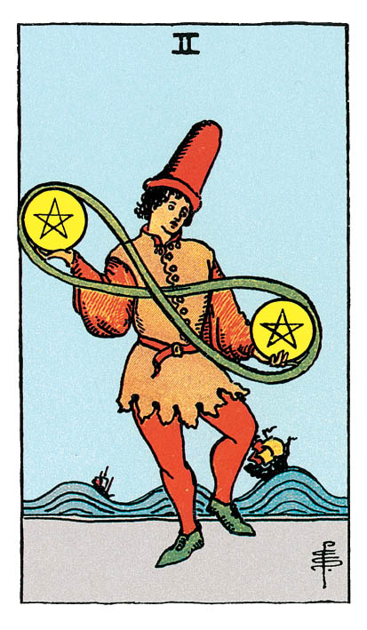

# Deux de Denier

## Signification

**Type de Carte :** Arcane Mineur de la Suite des Deniers, associée au monde matériel, à l'argent et aux possessions
**Élément :** Terre
**Numérologie / Rang :** 2, choix, dualité et couple

## Description

Un personnage vêtu de tons vifs et coiffé d'un chapeau démesuré jongle avec deux Deniers. Sa posture trahit la difficulté de l'exercice : il tient tout juste en équilibre. Les deux Deniers sont reliés par un ruban et dessinent le symbole de l'infini. Au loin, la mer est agitée. Les bateaux subissent les vagues mais conservent leur cap.

## Mots-clés

### À l'endroit
- Jongler avec vos ressources
- Organiser votre temps et/ou votre budget
- Faire face à l'imprévu

### À l'envers
- Vous sentir dépassé·e
- Incapacité à décider, à vous engager
- Difficulté à préserver équilibre et harmonie

## Interprétation

Vos ressources — votre temps, votre argent, votre Énergie — ne sont pas inépuisables. Le Deux de Denier est apparu car vous devez travailler l'équilibre de vos ressources ou trancher quant à leur utilisation.

Si l'As de Denier incarne l'étincelle, le commencement d'un projet destiné à générer de la valeur ou de l'argent pour vous, le Deux de Denier symbolise la nécessité de trouver un équilibre entre ce projet et les autres domaines importants de votre vie — la famille, la santé. Vous êtes peut-être tiraillée entre deux désirs, deux centres d'intérêt. Si pour l'heure vous parvenez à maintenir l'équilibre, c'est au prix d'un effort croissant que vous ne pourrez peut-être pas soutenir encore très longtemps.

Le Deux de Denier est la Carte de l'argent bien budgété, du temps bien employé, de la réussite par une bonne gestion de vos ressources. Cette Carte vous encourage à vous concentrer sur votre quotidien et à instaurer des habitudes qui vous permettront de jongler avec toutes vos activités, sans manque de temps ni stress.

Enfin, le Deux de Denier vous invite à rester attentive à ce qui vous entoure, car le changement est permanent. Vous devez rester apte à vous adapter à cette mutation. Gardez vos priorités bien alignées, hiérarchisez vos activités et votre temps tout en gardant l'esprit ouvert aux opportunités ou aux défis qui pourraient surgir.

## Deux de Denier et l'Amour

Le Deux de Denier révèle que vous jonglez avec différents partenaires ou avec différents projets. Vous souhaitez conserver toutes vos possibilités ouvertes, sans choisir ni vous engager pour l'heure.

Si vous cherchez une relation durable, vous avez les cartes en main pour faire ce choix. Un partenaire n'est pas « meilleur » que l'autre, mais pour avancer, vous devez renoncer à l'un ou à l'autre. Faites votre choix en conscience, soyez au clair sur vos priorités et donnez-vous l'opportunité que « ça marche » vraiment.

Si vous êtes en couple, vous avez peut-être le sentiment que le passé ensemble se raréfie. Les responsabilités, le travail, les tracas quotidiens vous éloignent l'un de l'autre et vous vous sentez mise de côté. La situation ne peut s'améliorer sans une communication ouverte et bienveillante. Chacun doit revoir ses priorités pour accorder plus de temps et d'Énergie à l'autre. Travaillez ce point ensemble, mettez-vous d'accord sur un planning et des activités à partager. Cela peut vous sembler un peu « cadré », mais cela vous remettra sur de bons rails. Vous pourrez ensuite laisser la spontanéité agrémenter votre quotidien.

## Deux de Denier et le Travail

Dans le domaine professionnel, le Deux de Denier révèle que vous êtes très occupée, pour ne pas dire « débordée ». Au travail, vous gérez les urgences. Vous êtes peut-être investie dans plusieurs projets — votre emploi, une création d'entreprise, des responsabilités associatives… Votre défi immédiat est de réussir à jongler avec toutes ces activités sans vous épuiser. Vous devez aussi prioriser les activités qui généreront le plus de valeur ou de revenus à moyen terme.

Si vous cherchez un emploi ou souhaitez changer de voie professionnelle, vous courez probablement trop de lièvres à la fois. Trouver un autre emploi, reprendre une formation, vous concentrer sur votre passion pour en faire votre métier : cherchez-vous en réalité un équilibre entre ce qui vous fait vibrer et la stabilité d'un emploi fixe ? Il existe sans doute un moyen de les concilier.

## Deux de Denier et les Finances

Concernant vos finances et votre argent, le Deux de Denier représente un équilibre à trouver ou un choix à poser. Commencez par faire le point sur vos ressources et vos rentrées d'argent : tous vos œufs sont-ils dans le même panier ? Quelles sont vos marges pour diversifier vos investissements ou vos sources de revenus ? Menez cette réflexion pour vous bâtir la sécurité financière dont vous avez besoin.

Le Deux de Denier est aussi une Carte qui conseille de jongler avec précision entre recettes et dépenses. Si vous traversez des difficultés financières, il est temps d'examiner votre budget de près et de vous engager à respecter votre équilibre recettes/dépenses.

## Deux de Denier et la Guidance

Qu'est-ce qui compte le plus pour vous ? Vivez-vous en accord avec vos valeurs ? Comment utilisez-vous votre temps et votre argent ? Le Deux de Denier vous rappelle que, dans la vie, tout est choix. À tout instant, vous choisissez, à tout instant vous décidez. Ce sont autant d'occasions d'aligner vos actes avec votre Être authentique.

Vous avez peut-être le sentiment que votre cheminement Spirituel est « grignoté » par les tracas du quotidien. La Spiritualité exige effectivement du temps et de l'Énergie, de la disponibilité mentale. Assurez-vous de ménager des pauses, du temps pour vos pratiques intuitives et Énergétiques, pour vous ressourcer et vous connecter à la Nature. Ces activités vous procurent plus de sérénité, ce qui en retour vous aide à gérer les tracas du quotidien. C'est un cercle vertueux « infini », à l'image du symbole des deux Deniers de la Carte, que vous pouvez instaurer pour plus d'harmonie dans votre vie.

---

*Source : [Vivre Intuitif](https://vivre-intuitif.com/apprendre-le-tarot/signification/deniers/deux-de-denier/)*
*Illustration : Tarot de A.E. Waite — Rider-Waite-Smith*
