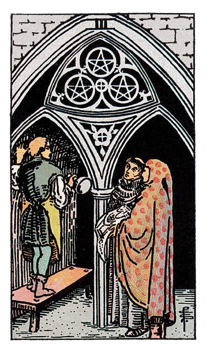

# Trois de Denier

## Signification

**Type de Carte :** Arcane Mineur de la Suite des Deniers, associée au monde matériel, à l'argent et aux possessions
**Élément :** Terre
**Numérologie / Rang :** 3, création, abondance, la réalité, le concret

## Description

Avec le Trois de Coupe, le Trois de Denier est l'une des rares Cartes du Tarot à figurer trois personnages partageant une même activité. Dans une église, les trois font le point sur le chantier de construction. Le jeune sculpteur attend les instructions des deux architectes qui lui présentent un plan. Chacun écoute et respecte l'idée de l'autre. Le Trois de Denier est une Carte qui évoque le travail d'équipe, la réussite collective.

## Mots-clés

### À l'endroit
- Esprit d'équipe, coopération
- Savoir-faire
- S'appuyer sur autrui pour réussir

### À l'envers
- Pénurie de concertation, d'esprit d'équipe
- Réparer les erreurs commises par d'autres
- « Intrigues » dans le milieu professionnel, au bureau

## Interprétation

Après avoir trouvé l'équilibre avec le Deux de Denier, le Trois de Denier représente un premier palier atteint, une première réussite dans un projet de création, d'entrepreneuriat ou de construction. Le Trois de Denier est donc un message d'encouragement à persévérer. Vous avez les compétences nécessaires pour mener à bien ce projet : ne laissez pas le découragement ou le doute vous submerger.

Le Trois de Denier évoque les autres et leur place dans votre succès. Le succès s'obtient rarement en solitaire ; il est le plus souvent le fruit d'une collaboration réussie. Sur quelles personnes pouvez-vous vous appuyer pour avancer ? Qui pourrait vous épauler ? Le Trois de Denier vous invite à élargir votre réseau, y compris au-delà de votre périmètre professionnel ou géographique. Ces nouvelles rencontres peuvent nourrir votre projet d'une Énergie et d'idées nouvelles.

Le Trois de Denier représente aussi une communication et un retour sur vos actions. Parfois, il faut savoir écouter l'avis d'une personne, d'un collègue et prendre en compte ses remarques. Ne vous vexez pas, bien au contraire ! Demandez des retours puis accueillez ces idées comme autant de pistes pour faire encore mieux et vous améliorer.

Enfin, le Trois de Denier peut aussi évoquer des choses très « pratico-pratiques » comme décorer votre maison, rénover une pièce, commencer une activité manuelle.

## Trois de Denier et l'Amour

Si vous pensez que le travail n'est pas le lieu propice pour trouver l'Amour, reconsidérez la question. Chaque collègue, chaque client, chaque fournisseur est susceptible de vous présenter quelqu'un avec qui vous partagez déjà un point commun. Et c'est parfois à force de côtoyer professionnellement une personne tous les jours que naissent les sentiments… Certes, ce n'est peut-être pas l'histoire romantique dont vous rêviez, mais c'est une base solide pour bâtir une relation durable.

Si vous êtes en couple, le Trois de Denier révèle que votre couple possède d'excellents atouts pour durer. Vous « travaillez bien » ensemble, votre communication est honnête et bienveillante. En cas de difficultés, vous vous serrez les coudes, vous vous soutenez mutuellement. Vous pourriez aussi mettre cette belle entente à profit pour collaborer à un projet plus « fun », quelque chose dont vous avez envie tous les deux.

## Trois de Denier et le Travail

Le Trois de Denier est une excellente Carte dans un Tirage éclairant votre domaine professionnel. Cette Carte évoque les compétences, le travail collaboratif, le management et la réussite. Vous êtes en train de bâtir les bases sur lesquelles la suite de votre avenir professionnel se construira. Vos compétences et talents seront reconnus, et récompensés, à leur juste valeur. Le Trois de Denier vous encourage à maintenir ce cap vers le succès.

Ce succès sera le fruit d'une collaboration réussie avec d'autres professionnels : des collègues dans le cadre du travail salarié, des « personnes ressources » dans le cadre de votre entreprise. C'est le moment de rejoindre un réseau professionnel, de vous rendre à des salons, d'aller à cette réunion du Club des Entrepreneurs… afin de nouer des rencontres et d'insuffler du « sang neuf » à vos projets.

## Trois de Denier et les Finances

Le Trois de Denier révèle que le succès matériel est à portée de main, à condition de poursuivre l'effort pour l'obtenir. À l'image du sculpteur qui, petit à petit, taille la pierre, il faut de la patience et un travail régulier pour atteindre l'Abondance et la stabilité financière.

Le Trois de Denier étant une Carte de collaboration, vous pourriez avoir besoin d'aide ou de conseils pour (re)prendre en main votre situation financière ou pour la gérer au mieux. N'ayez pas peur de vous tourner vers des professionnels compétents : notaire, conseiller bancaire, expert-comptable. Chaque point de vue enrichit votre réflexion et vous aidera à instaurer les « bonnes habitudes » propices à une Abondance durable.

## Trois de Denier et la Guidance

Chacun vit sa propre vie et fait ses propres expériences. Nous sommes tous extrêmement différents, nous vivons au quotidien des choses fort différentes, et pourtant, nous sommes des hommes et des femmes, et cette expérience-là a quelque chose d'Universel. Comme Le Fou / Le Mat, nous partons toutes et tous à la découverte de qui nous sommes, même si nous empruntons des chemins fort divergents.

Ainsi, vous n'êtes pas seul dans votre quête spirituelle. Vous êtes accompagnée par toutes les personnes qui vous entourent, même si elles n'en parlent pas. Quelqu'un pourrait bien avoir besoin de vous, de vos conseils, de votre Lumière.

---

*Source : [Vivre Intuitif](https://vivre-intuitif.com/apprendre-le-tarot/signification/deniers/trois-de-denier/)*
*Illustration : Tarot de A.E. Waite — Rider-Waite-Smith*
