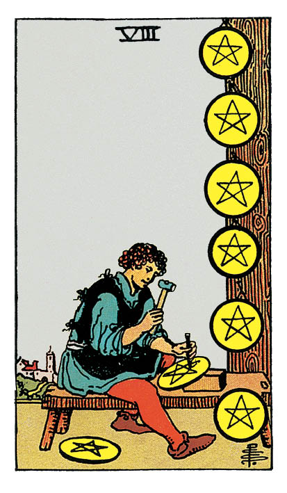

# Huit de Denier

## Signification

**Type de Carte :** Arcane Mineur de la Suite des Deniers, associée au monde matériel, à l'argent et aux possessions
**Élément :** Terre
**Numérologie / Rang :** 8, mouvement, action

## Description

Seul dans son atelier, un personnage s'affaire à graver des pentacles. Six pentacles sont déjà réalisés et exposés au mur. Il travaille sur le septième, tandis que le huitième repose à ses pieds. L'atelier est isolé de la ville et de ses distractions. Ainsi, le personnage peut consacrer toute son attention et toute son Énergie à son projet. Il paraît extrêmement concentré sur sa tâche, comme s'il visait un résultat parfait.

## Mots-clés

### À l'endroit
- Harmonie dans le travail
- Travail soigné et de qualité
- Acquisition de compétences, pratique assidue

### À l'envers
- Perfectionnisme excessif
- Manque d'ambition ou d'orientation
- Résoudre les problèmes des autres

## Interprétation

Le Huit de Denier est une Carte qui incarne le développement des compétences et le travail nécessaire pour maîtriser une discipline. Dans l'Énergie du Huit de Denier, vous êtes en plein essor, vous évoluez vers une version plus compétente de vous-même. Vous accomplissez ce travail naturellement, sans que cela ne vous coûte d'effort particulier. Dans cet apprentissage, rien ne paraît difficile ni rebutant.

Développer vos compétences suppose d'apprendre de nouvelles choses, d'expérimenter de nouvelles approches qui vous permettent d'atteindre vos objectifs avec davantage d'éclat. Vous avez choisi consciemment d'entreprendre ces efforts et vous êtes parfaitement concentré·e sur les tâches à réaliser. Votre persévérance constitue la clé de votre réussite.

Le Huit de Denier valide votre travail et vous encourage ainsi à poursuivre vos efforts et à mener à bien le projet entrepris. Par exemple, si vous avez commencé à apprendre le Tarot, le Huit de Denier vous invite à poursuivre dans cette voie jusqu'au niveau de maîtrise qui vous satisfait pleinement.

À l'image du Sept de Denier, la patience est nécessaire… mais pas suffisante. Continuez à effectuer les ajustements requis, à vous améliorer, à travailler sur votre projet. Bientôt, le succès sera au rendez-vous.

## Huit de Denier et l'Amour

Le Huit de Denier est une Carte de « travail »… ce qui n'est a priori pas associé à l'Amour. Pourtant, pour qu'un couple fonctionne, il arrive parfois que chacun doive travailler sur lui-même et/ou œuvrer à rendre la relation plus satisfaisante.

C'est précisément de cela qu'il s'agit avec le Huit de Denier.

Votre relation représente beaucoup à vos yeux et vous êtes prêt·e à faire tout le nécessaire pour que votre couple soit harmonieux et durable. Vous vous investissez donc fortement pour que votre relation fonctionne, pour que les besoins de votre partenaire soient comblés. Veillez à réaliser ce travail ensemble, à bâtir votre couple et sa réussite à deux par un dialogue ouvert et Authentique.

Si vous recherchez un·e partenaire, vous savez que vous avez besoin de travailler sur vous avant d'être prêt·e à faire des rencontres. Vous souhaitez être dans les meilleures dispositions pour accueillir l'autre dans votre vie. Ainsi, si vous êtes confronté·e à des soucis — financiers, de santé, liés à d'autres relations — vous choisissez de remettre de l'ordre dans ces domaines avant de vous considérer disponible pour une rencontre.

Il est possible également que le Huit de Denier révèle que votre travail et/ou un projet vous occupe tellement en termes de temps et d'Énergie qu'une rencontre n'est pas envisageable pour l'instant.

## Huit de Denier et le Travail

Dans un Tirage de Tarot concernant votre carrière professionnelle, le Huit de Denier révèle que vous aspirez à maîtriser vos domaines de compétences, à être reconnu·e comme Expert·e.

L'acquisition de nouvelles compétences compte plus à vos yeux qu'une augmentation, un nouveau poste ou toute autre « récompense » octroyée par un tiers. À vos yeux, le processus de développement professionnel dans lequel vous êtes engagé·e génère suffisamment de plaisir pour se suffire à lui-même.

Pour cela, vous concentrez vos efforts de façon consciente et travaillez avec acharnement. Dans ces conditions, le succès n'est jamais bien loin. Même si ce n'est pas votre unique but, votre travail opiniâtre et votre implication seront remarqués et récompensés. Ainsi, votre récompense sera double : votre montée en compétences ET la possibilité de les exercer dans un nouveau poste ou dans un cadre encore plus gratifiant.

## Huit de Denier et les Finances

Dans un Tirage concernant l'argent et les finances, le Huit de Denier est une forte indication que l'investissement le plus pertinent que vous puissiez faire est d'investir en vous et dans vos compétences.

Vous devez peut-être conserver ce travail moins rémunérateur… et y acquérir les savoir-faire nécessaires à l'obtention d'un poste plus valorisant.

Pour développer votre entreprise, vous avez sans doute besoin de faire évoluer tel ou tel aspect de votre posture entrepreneuriale.

Avec le Huit de Denier, il s'agit d'envisager le domaine financier à long terme. Votre situation ne va pas s'améliorer du jour au lendemain, mais elle peut tout à fait progresser si vous mettez en place, petit à petit, un plan pour y parvenir. Ce plan passe par l'identification des compétences précises dont vous avez besoin… et par l'acquisition de ces compétences via une formation ou la pratique.

## Huit de Denier et la Guidance

Avec le Sept de Denier, vous avez compris que l'Éveil spirituel et le développement personnel ne sont pas des fins en soi, mais des voyages dont vous devez apprécier chaque étape.

La leçon du Huit de Denier est que ce cheminement est fait d'essais, d'erreurs… et qu'il est parfois nécessaire, comme le dit le proverbe, de remettre cent fois sur le métier son ouvrage.

Le Huit de Denier vous invite donc à vivre votre Éveil comme le travail de toute une vie, à ne pas abandonner trop vite une pratique intuitive, à vous accrocher un minimum pour commencer à ressentir les effets bénéfiques qui porteront votre prochaine étape d'apprentissage.

---

*Source : [Vivre Intuitif](https://vivre-intuitif.com/apprendre-le-tarot/signification/deniers/huit-de-denier/)*
*Illustration : Tarot de A.E. Waite — Rider-Waite-Smith*