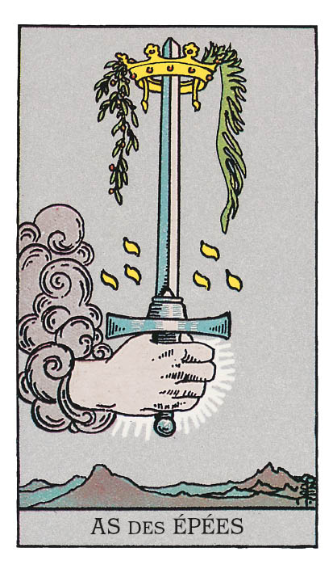

# As d'Épée

## Signification

**Type de Carte :** Arcane Mineur de la Suite des Épées associée aux idées, à la réflexion, au « mental » les grandes étapes ou leçons de la Vie
**Élément :** l'Air
**Numérologie / Rang :** 1, associé au commencement, aux opportunités

## Description

L'As d'Épée représente une main serrant une épée imposante. Main et lame semblent surgir du Ciel « comme par Magie ». C'est l'Univers qui vous tends cette épée, emblème de pensée et de réflexion. La lame porte une couronne de lauriers, gage de succès et de réussite. Comme sur la carte de L'Hermite ou du Huit de Coupe, la montagne est là. Elle évoque le chemin solitaire de la pensée, l'exploration intime qui permet à chacun de choisir sa propre voie.

## Mots-clés

### À l'endroit
- Idée neuve
- Réflexion, clairvoyance
- Force du mental

### À l'envers
- Cécité d'esprit, jugement précipité
- Pensée entravée
- Situation confuse

## Interprétation

Dans le Tarot, les As sont l'Énergie inaugurale des quatre Suites Mineures. Ils incarnent l'amorce d'une voie nouvelle, l'étincelle qui embrase le feu de la nouveauté dans votre existence. Les As annoncent aussi une opportunité inédite ou une personne qui entre avec éclat dans votre vie. L'As d'Épée ouvre le parcours à travers l'Énergie des Épées, soit l'Énergie du raisonnement, de la logique et du « mental ».

À la différence de L'Hermite, l'As d'Épée se révèle une Carte peu contemplative. Sous son Énergie, vous voilà propulsé(e) en pleine action ! Vous reprenez les rênes ! L'As d'Épée conjugue idées nouvelles et démarches innovantes que vous savez déployer pour atteindre vos objectifs.

Lorsqu'il apparaît dans un Tirage, l'As d'Épée traduit ou annonce un instant de grande lucidité au sujet de votre situation, de votre avenir ou de vos aspirations. C'est comme si une ampoule s'allumait au-dessus de votre tête. Qu'il s'agisse d'un objectif à viser, du rôle de quelqu'un dans votre vie ou de votre vision du monde, vous y voyez clair comme en plein jour et vous saisissez bien mieux votre situation. Le moment est donc bien choisi pour mener vos réflexions plus loin, soit pour faire émerger les besoins de votre Être Authentique, soit pour dessiner le chemin à parcourir afin de les combler.

Cette clairvoyance peut se révéler inconfortable… car toutes les vérités ne sont pas plaisantes à découvrir ou à formuler. L'Épée reste une arme, un symbole guerrier. Vous avez peut-être à lutter ou à défendre votre point de vue, vos droits ou votre rêve. Votre lucidité d'esprit face à la situation vous octroie une longueur d'avance sur vos opposants. Usez-en à bon escient.

## As d'Épée et l'Amour

Si vous êtes en quête d'Amour, l'As d'Épée survient pour vous conseiller une démarche réfléchie et rationnelle afin de dénicher la bonne personne. Vous aimeriez sans doute que les choses soient simples, sentimentales et romantiques… et elles le deviendront peut-être ! Mais avant d'y parvenir, mobilisez l'Énergie de l'As d'Épée pour clarifier ce que vous attendez de votre partenaire, le type de personne que vous souhaitez croiser et le trait de caractère que vous voulez fuir. Ces qualités et ces bornes étant fixées mentalement, il vous sera bien plus aisé de repérer la personne qui vous conviendra. Ensuite, toujours dans cette Énergie d'analyse propre aux Épées, demandez-vous où et comment vous pouvez rencontrer des personnes conformes à votre recherche.

Si vous vivez en couple et traversez des difficultés, vous gagnez à renouveler le regard posé sur votre relation. Prenez le temps d'analyser la situation, de méditer votre positionnement dans le couple et celui de votre partenaire. Repérez ce qui ne « colle pas » – ou ne « colle plus » – et imaginez une nouvelle voie pour résoudre ces tensions. Faites preuve de créativité, pensez hors des sentiers battus et n'écarter aucune solution potentielle sous prétexte que votre partenaire n'en voudra jamais. C'est le moment de procéder autrement et de vous montrer inventif(ve). Ouvrez le dialogue avec vos idées et impliquez votre partenaire. Cette réflexion partagée et la mise en pratique des solutions qui en jailliront peuvent fortifier votre couple.

## As d'Épée et le Travail

Dans un Tirage portant sur le travail ou votre avenir professionnel, l'As d'Épée vous pousse à appliquer la formule suivante : idée neuve + focalisation sur sa mise en œuvre = un projet engagé sur la voie de la réussite ! L'As d'Épée révèle que vous possédez la lucidité et la motivation nécessaires pour concrétiser vos excellentes idées professionnelles.

L'As d'Épée peut annoncer un changement prochain de votre situation professionnelle, car vous avez besoin de mieux exploiter votre matière grise. Vos connaissances approfondies dans votre domaine, votre expérience et vos compétences d'analyse et de réflexion sont très recherchées. N'hésitez pas à susciter l'opportunité si elle tarde à se présenter. Poussez les portes. Tenez-vous prêt(e) à exposer de façon claire et structurée ce que vous souhaitez mettre en place, le type de mission que vous aimeriez qu'on vous confie et le plan d'action que vous pourriez déployer.

## As d'Épée et les Finances

Côté finances et argent, l'As d'Épée révèle que vous devez envisager votre situation financière sous un angle neuf. Si vous traversez des difficultés financières, il y a fort à parier que ce que vous faites – ou avez fait jusqu'ici – ne fonctionne pas, ou pas assez. N'en soyez pas blessé(e) ; au contraire, servez-vous de cette prise de conscience pour porter un regard plus lucide sur vos finances et dénicher des solutions qui vous remettront à flot. La démarche s'avère ardue, voire douloureuse, mais les petits pas, les petits changements maintenus dans la durée produiront des résultats notables et pérennes.

## As d'Épée et la Guidance

L'As d'Épée incarne la petite ampoule qui s'illumine au-dessus de votre tête. Dans votre cheminement spirituel, les pièces du puzzle commencent à s'emboîter logiquement. Vous saisissez peu à peu votre place dans l'Univers, vous percevez le fonctionnement des pratiques Intuitives et Énergétiques et ce qu'elles peuvent vous offrir.

C'est un instant magique ! L'étincelle brûle en vous. Qui sait quelle envergure pourrait prendre ce brasier ? Qui sait jusqu'où vous irez dans la découverte de vous-même et des besoins de votre Être Authentique ? Ne vous arrêtez pas en si bon chemin !

L'As d'Épée se révèle aussi une Carte d'action. Profitez de son Énergie pour convertir votre soif de spiritualité en gestes, Rituels et expérimentations au quotidien.

---

*Source : [Vivre Intuitif](https://vivre-intuitif.com/apprendre-le-tarot/signification/epees/as-epee/)*
*Illustration : Tarot de A.E. Waite — Rider-Waite-Smith*
