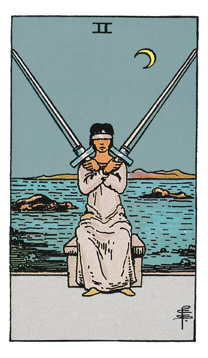

# Deux d'Épée

## Signification

**Type de Carte :** Arcane Mineur de la Suite des Épées associée aux idées, à la réflexion, au « mental » les grandes étapes ou leçons de la Vie
**Élément :** l'Air
**Numérologie / Rang :** 2, associé aux choix, à l'équilibre, au couple

## Description

Le Deux d'Épée se laisse interpréter assez intuitivement, car l'illustration du Tarot de Waite « classique » épouse bien le sens conventionnel de la Carte. Une femme tient dans ses mains deux Épées – autrement dit deux pensées, deux idées, deux possibilités. Ses yeux sont bandés. Elle ne peut donc « voir » quelle possibilité s'avère la meilleure. Elle est assise sous la Lune… Son intuition aurait-elle un rôle à jouer dans sa décision ? En toutes circonstances, il va falloir trancher vite, car elle ne saurait tenir ses Épées à bout de bras indéfiniment…

## Mots-clés

### À l'endroit
- Indécision, blocage
- Réflexion avant l'action
- Compromis à dégager

### À l'envers
- Clairvoyance
- Décision évidente
- « Ça avance » enfin !

## Interprétation

Avec cette Carte, on imagine que vous vous trouvez tiraillé(e) entre deux possibilités ou que vous cherchez à réconcilier deux forces opposées dans votre vie. En tous les cas, la posture se révèle assez inconfortable et une décision s'impose.

La présence de la Lune, symbole de l'intuition, suggère que votre intuition doit être mise à contribution dans le processus de décision. Elle complète les pensées « logiques » et « mentales » incarnées par la Suite des Épées.

Avec le Deux d'Épée, il est conseillé de prendre votre temps, d'éviter toute décision hâtive ou impulsée par un coup de tête. Prenez votre temps ; l'introspection s'avère indispensable.

## Deux d'Épée et l'Amour

En Amour, le Deux d'Épée indique que vous hésitez entre deux personnes ou entre deux possibilités – par exemple « partir » ou « rester » dans votre relation. C'est une décision que vous tentez de prendre depuis « un certain temps » sans y parvenir. Cela commence à vous peser.

Le Deux d'Épée vous dit : « Inutile d'essayer de trancher de façon rationnelle car, en Amour, rien n'est vraiment rationnel ! ». Dans le Domaine Amoureux, votre intuition et votre connaissance intime de vous-même ont toute latitude pour s'exprimer. D'ailleurs, il se peut que vous connaissiez déjà votre réponse dans votre for intérieur.

Si votre relation amoureuse s'est montrée « tendue » ces derniers temps, le Deux d'Épée indique que travailler au compromis pour retrouver l'équilibre demeure une option à explorer, à tenter.

## Deux d'Épée et le Travail

Dans le contexte d'un Tirage sur le Travail, le Deux d'Épée révèle que l'indécision est telle que vous vous en trouvez bloqué(e). Vous êtes pris(e) entre deux feux, incapable de trancher, même si c'est précisément ce qu'on attend de vous.

Si vous ne « sentez pas » les options qui s'offrent à vous, c'est peut-être qu'une troisième voie reste à découvrir. Y aurait-il moyen de mettre tout le monde d'accord ? Quel serait le meilleur compromis ? Quelle solution bénéficierait au plus grand nombre ?

Gare à ne pas « faire l'autruche ». Parfois, une décision se révèle difficile à prendre mais… si c'est la bonne pour votre carrière, votre projet ou votre entreprise… il faut assumer vos responsabilités et endosser votre choix.

## Deux d'Épée et les Finances

Peut-être moins évidente à interpréter dans le Domaine des Finances, il n'en demeure pas moins que le Deux d'Épées vous met en garde contre les décisions hâtives. Dans ce Domaine comme dans les autres, le Deux d'Épée signale le besoin de réfléchir soigneusement aux possibilités qui s'offrent à vous, afin de choisir la meilleure.

Prendre votre temps est conseillé. Se renseigner auprès des experts du Domaine aussi – conseiller bancaire, notaire, expert-comptable, c'est selon… Rien ne presse.

## Deux d'Épée et la Guidance

Le Deux d'Épée symbolise un état d'équilibre bientôt rompu par une prise de décision.

Quelle est cette situation initiale pour vous ? Quel équilibre vous procure-t-elle ?

Quelle est cette décision que vous hésitez à prendre ? Quels bénéfices pourriez-vous trouver dans la nouvelle situation créée ?

Si vous n'êtes pas prêt(e) à trancher, alors il est sans doute plus sage d'attendre encore un peu.

Un signe pourrait venir conforter vos ressentis et vous orienter dans la bonne direction.

---

*Source : [Vivre Intuitif](https://vivre-intuitif.com/apprendre-le-tarot/signification/epees/le-deux-epee/)*
*Illustration : Tarot de A.E. Waite — Rider-Waite-Smith*
