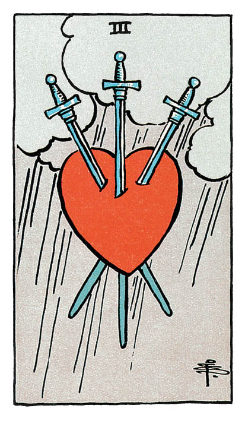

# Trois d'Épée

## Signification

**Type de Carte :** Arcane Mineur de la Suite des Épées associée aux idées, à la réflexion, au « mental » les grandes étapes ou leçons de la Vie
**Élément :** l'Air
**Numérologie / Rang :** 3, se confronter à la réalité

## Description

Le Trois d'Épée figure un cœur, comme suspendu dans les airs et transpercé par trois épées. Le cœur incarne l'amour et la sensibilité. Les Épées renvoient au pouvoir de la logique ou du mental de blesser le corps ou les émotions d'une personne. Le ciel se révèle couvert ; la pluie tombe en un rideau épais, comme pour figurer un « coup dur ».

## Mots-clés

### À l'endroit
- Rupture douloureuse
- Chagrin, douleur, peine de cœur
- Sentiment de rejet, de décalage

### À l'envers
- Se reconstruire après une épreuve douloureuse
- Lâcher prise sur la douleur
- Pardonner, se réconcilier

## Interprétation

Le Trois d'Épée se révèle une Carte douloureuse qui évoque la solitude, la tristesse, une peine de cœur ou encore une trahison.

Ces moments difficiles et les émotions douloureuses associées font malheureusement partie intégrante de la vie. La douleur ouvre la voie à l'apprentissage, à la croissance et à la non-répétition des mêmes erreurs. Elle peut aussi servir de moteur. Le Trois d'Épée rappelle que si vous parvenez à percevoir ce moment comme une opportunité de développement personnel, vous traverserez cette épreuve plus aisément, en lui donnant du sens.

Le Trois d'Épées exprime également la nécessité pour vous de lâcher prise. Vous venez de vivre une perte ou une déconvenue majeure. Le temps est venu de pleurer, de ressentir pleinement la douleur, pour pouvoir la relâcher et avancer. Exprimer votre tristesse aide à « tout sortir » et à alléger votre cœur. Veillez à ne pas vous enfermer dans votre douleur et faites tout votre possible pour favoriser votre guérison émotionnelle.

## Trois d'Épée et l'Amour

Dans un Tirage portant sur l'Amour, le Trois d'Épée représente en général une peine de cœur. Vous avez « le cœur qui saigne » ; vous ressentez une grande douleur émotionnelle et de la déception. Il se peut aussi que vous soyez à l'origine de cette douleur chez votre partenaire, par exemple en déclenchant la rupture.

Si vous êtes en quête d'Amour, le Trois d'Épée indique que vous demeurez en prise avec vos peines de cœur passées. Cela vous empêche d'avancer sereinement et de trouver l'amour aujourd'hui. Le Trois d'Épée conseille de guérir émotionnellement de ces relations antérieures avant d'espérer entamer une relation à la hauteur de vos attentes.

Si vous êtes actuellement en couple, le Trois d'Épée annonce une rupture, une « coupure ». Des mots durs ont été échangés, l'un a fait souffrir l'autre. La confiance se trouve mise à rude épreuve au sein du couple. Le résultat ? Une grande douleur morale qui exige une guérison préalable à toute décision ou action.

## Trois d'Épée et le Travail

Dans le domaine professionnel, le Trois d'Épée signale une « perte » : perte d'emploi, baisse de salaire, projet raté ou encore opportunité non concrétisée. Vous vivez mal cette défaite personnelle et vous sentez fortement dévalorisé(e). Le Trois d'Épée conseille de prendre du recul et d'envisager comment rebondir. Le travail constitue un élément – certes important – de la vie, mais vous pouvez aussi compter sur votre famille, vos proches, votre vie personnelle pour vous rebooster et vous sentir aimé(e) et/ou utile.

## Trois d'Épée et les Finances

S'agissant de l'argent et des finances, le Trois d'Épée peut représenter ou vous mettre en garde contre une perte d'argent imprévue et soudaine. Des actions qui perdent de leur valeur, un vol ou des dettes qui s'accumulent mettent votre budget à rude épreuve. Le Trois d'Épée conseille de vérifier que vos possessions matérielles soient bien sécurisées et assurées.

## Trois d'Épée et la Guidance

Vous traversez une période difficile et douloureuse. Quelqu'un ou quelque chose vous manque pour vous sentir épanouie et heureuse. Faites de cette douleur une opportunité de mieux vous connaître et de grandir spirituellement. Le moment est ardu mais il ne durera pas éternellement. Une fois cette période traversée, vous vous sentirez plus forte, encore plus à même d'affronter les tempêtes de la vie. Qu'est-ce qui, ici et maintenant, pourrait vous faire du bien ? Prenez du temps pour vous, pour ressentir du bien-être, pour guérir émotionnellement. Au besoin, confiez votre tristesse et ce qui vous fait mal à un proche de confiance.

---

*Source : [Vivre Intuitif](https://vivre-intuitif.com/apprendre-le-tarot/signification/epees/le-trois-epee/)*
*Illustration : Tarot de A.E. Waite — Rider-Waite-Smith*
