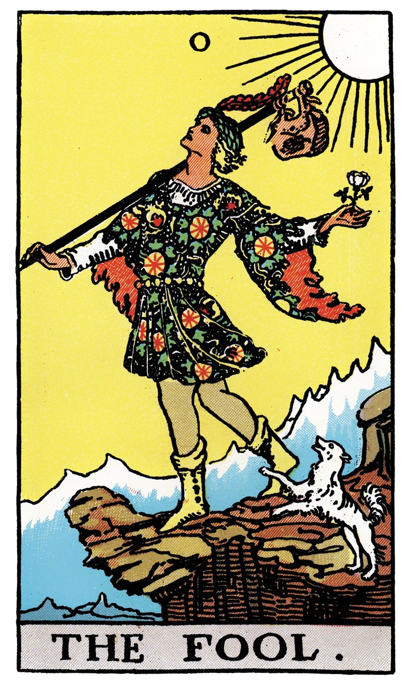

# 0 — LE MAT / LE FOU

## Signification

**Type de Carte :** Arcane Majeur — les grandes étapes ou leçons de la Vie
**Élément :** Air
**Numérologie / Rang :** 0 (ou pas de numéro attribué)
**Planète :** Uranus
**Pierre / Cristal :** Aventurine verte
**Plante :** Ginseng

## Description

Un jeune homme, avec en guise de bagage son petit baluchon, se met en route pour un voyage… Le sourire aux lèvres, il regarde le Soleil. Il fait beau, il a toute confiance dans le Destin qui conduit ses pas vers… l'inconnu !

Le petit chien blanc, symbole d'Amitié, l'accompagne… ou cherche à le mettre en garde. Dans son exaltation, Le Fou ne se rend pas compte qu'il est si proche du vide. Va-t-il s'en apercevoir à temps ?

## Mots-clés

### À l'endroit
- Nouveau départ ou opportunité
- Voyage
- Faire le « fou-fou »
- Innocence, insouciance, liberté

### À l'envers
- Inconscience, actes non réfléchis
- Être mal préparé, danger possible
- Se comporter comme un gamin

## Interprétation

Le Fou porte soit le numéro zéro, soit le numéro XXII. À ce titre, Le Fou est considéré comme la première et la dernière Carte des Arcanes Majeurs et il représente à la fois le début du cheminer spirituel et la personne que vous êtes devenue à la fin de ce chemin.

Dans le Tarot de Marseille, le Fou est appelé Le Mat et sa Carte n'est pas numérotée du tout comme pour signifier son statut particulier parmi les Lames Majeures.

Les Arcanes Majeurs symbolisent les grandes étapes de la vie de tout homme, les phases de son cheminement spirituel et de l'accomplissement de soi. En ce sens, le Fou est à la fois la Carte de « départ » car il faut être un peu "fou" pour se lancer dans une telle Aventure… et la Carte "d'arrivée" car si je me suis découverte pendant ce voyage, je suis aussi restée moi-même. Sur ce chemin initiatique, on part bien de soi pour revenir… à soi, avec une meilleure compréhension de soi-même, des autres et du monde.

Le Fou est donc un aventurier, un pionnier, qui part dans une nouvelle aventure, enthousiaste, avec l'espoir que sa quête soit fructueuse. Il n'a pas pris grand chose avec lui – un petit baluchon – et il n'a pas l'air de savoir vraiment où ses pas vont le mener.

Cette Carte dégage une Énergie exaltante. Un nouveau départ se profile, êtes-vous prêt.e à faire le grand saut ? Qu'est-ce qui vous retient ? L'optimisme est de rigueur, foncer est permis ! Vos idées sont originales, alors, certains peuvent jouer les rabat-joie. Mais nul n'est obligé de les écouter, encore moins de les croire ! La confiance en l'avenir rayonne de cette Carte.

Le revers de cet enthousiasme est l'immaturité dont peut faire preuve Le Fou, son inclinaison à se « faire des idées », son manque de préparation et son incapacité à voir le danger. Le Fou peut se révéler être un « casse-cou », un « risque-tout » qui ne réfléchit pas avant d'agir et qui subit ensuite les conséquences de ses actes.

## Le Fou et l'Amour

Le Fou et l'Amour ou l'Amour Fou ? L'Énergie du Fou est orientée vers le plaisir, le jeu, les rencontres.

Si vous cherchez l'Amour, le Fou vous conseille de foncer, et de vous lancer pleinement dans l'aventure de la découverte de l'Autre. L'idée est de garder cette légèreté qui caractérise Le Fou et de ne pas (trop) se poser de questions.

Si vous interrogez votre relation actuelle dans un Tirage, alors Le Fou peut signifier l'inexpérience ou l'immaturité d'un des deux partenaires.

La Carte du Fou peut aussi vous éclairer sur l'état de la relation. Celle-ci manque peut-être de « fun » ; votre dynamique de couple s'est peut-être endormie. Puisez dans l'Énergie du Fou, insouciante et légère, pour réveiller votre couple, surprendre l'autre et repartir.

## Le Fou et le Travail

Dans le domaine du Travail, Le Fou est de bon augure pour un nouvel emploi, un changement professionnel ou un nouveau projet. Puisque cette Carte évoque un nouveau cycle de votre vie, Le Fou peut aussi présager d'un déménagement ou d'une promotion. Sa présence indique qu'il est temps de tenter quelque chose d'inhabituel, de sortir de votre zone de confort : prendre plus de responsabilités, demander un « gros » dossier à gérer ou développer une nouvelle compétence.

## Le Fou et les Finances

Quand on parle Argent et Finances, Le Fou amène là aussi son Énergie enthousiaste et aventurière, indiquant qu'il est temps de « prendre des risques. » Prudence ! Si l'opportunité parait trop belle pour être vraie… c'est très probablement le cas.

Le Fou peut aussi indiquer que dépenser de l'argent pour vous faire plaisir à vous est le meilleur investissement possible en ce moment.

## Le Fou et la Guidance

Sur le chemin spirituel, Le Fou est une présence rassurante. Il est comme nous, il est nous : en recherche et en construction. Lui non plus ne sait pas où ce processus de découverte de lui-même l'emmène… mais il est heureux d'y aller. Il sait d'instinct que ce n'est pas la destination qui compte mais le voyage.

L'Énergie du Fou vous invite à oser, l'essentiel est d'essayer, d'apprendre et de cheminer vers soi.

## Affirmation

> « Le Passé n'a pas de prise sur moi car je suis prêt.e à apprendre et à changer. » — Louise Hay

---

