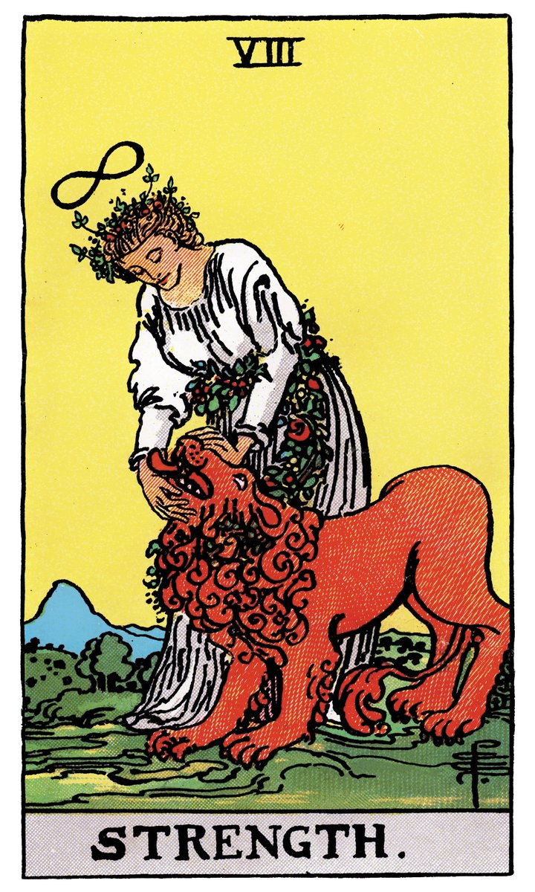

# VIII — LA FORCE

](a_08_Force.jpg)

## Signification

**Type de Carte :** Arcane Majeur — les grandes étapes ou leçons de la Vie
**Élément :** le Feu
**Numérologie / Rang :** 8 associé à l'équilibre, dans le Rider-Waite et les Tarots de cette famille ; 11 associé à la volonté et au courage, dans le Tarot de Marseille. A noter : Dans son Tarot, Waite a privilégié la correspondance astrologique entre les Arcanes Majeurs et le Zodiaque plutôt que la correspondance numérologique entre les Arcanes Majeurs et les chiffres. Ceci explique pourquoi dans le Rider-Waite et tous les Tarots qui se basent sur son système, La Force et La Justice sont interverties par rapport au Tarot de Marseille. Dans le Rider-Waite, La Force est l'Arcane 8 pour être associée au Lion. La Justice est l'Arcane 11 pour être associée à la Balance. Cela ne modifie pas la signification de la Carte.
**Planète / Constellation :** Lion
**Pierre / Cristal :** Oeil de Tigre
**Plante :** Piment de Cayenne

## Description

La Carte de la Force est illustrée par une jeune femme qui dompte un lion. Elle le regarde avec douceur. Le lion se soumet à son toucher sans difficulté. La femme et la bête semblent liés de façon inextricable. Dans le Tarot de Marseille, le corps du lion se perd dans la robe de la jeune femme. Dans le Rider-Waite, une couronne de fleurs les enlace.

Le lion représente les désirs, les pulsions humaines et leur puissance. Il représente ce qui est capable de jaillir de nous même quand nous cherchons à le refouler. La jeune femme, dans sa robe blanche, symbolise la pureté. Les notions pulsion / pureté, les polarités sont inextricablement liées. La pulsion "animale" émane de la jeune femme. Si elle parvient à dompter le lion, ses pulsions, ce n'est pas avec force physique mais avec sa force de caractère. La Carte de La Force est une représentation de la force d'Ame, *fortitudo*, la vertu cardinale qui s'oppose à la peur, à la paresse et qui permet de surmonter les obstacles et les aléas de la vie.

## Mots-clés

### À l'endroit
- Motivation, concentration
- Contrôle, confiance en soi
- Endurance

### À l'envers
- Peur, anxiété
- Abandonner, laisser tomber
- Perdre le contrôle

## Interprétation

**Dans le Tarot, la Carte de La Force représente toutes les qualités intérieures nécessaires à votre succès et à l'atteinte de vos objectifs.**

Dans l'Energie des Amoureux, vous avez fait votre choix. Le Chariot vous a appris que, même sur la bonne voie, vous pouvez douter, hésiter voire stopper votre cheminement. La Force arrive comme pour vous dire : "Reprends le contrôle, résiste et accroche-toi !" La Force résonne avec votre sentiment intime que les obstacles sur votre route peuvent être surmontés grâce à votre force intérieure.

Vous possédez les qualités requises pour mener vos projets à bien. Endurance, ténacité et calme devant l'adversité ne demandent qu'à faire surface. Pour cela, vous devez travailler les émotions qui, à ce moment précis, vous barrent encore la route. Il peut s'agir de peur, de colère… de toute émotion qui ne vous permet pas de reprendre votre chemin vers l'accomplissement de soi sereinement. Une fois ces émotions domptées, vous êtes à nouveau en mesure d'écouter votre sagesse intime et votre Intuition.

Etre maître de ses émotions, de son impulsivité, ne pas perdre courage ni patience : voilà le message de La Force.

## La Force et l'Amour

Clé de voûte de l'accomplissement de soi, l'Amour est essentiel pour faire preuve de courage et de force d'Ame, c'est-à-dire pour cheminer vers l'accomplissement de soi.

En Amour, la Carte de la Force indique que vous êtes bien dans votre peau, heureux ou heureuse de votre situation. En couple, vous êtes satisfait.e de la façon dont votre histoire progresse. La relation permet aux deux partenaires de s'épanouir, de révéler qui ils sont. Vous vous épanouissez de jour en jour et montrez une forme de vulnérabilité inhérente à l'Authenticité.

Si vous recherchez l'Amour, la Force vous invite à continuer vos recherches car vous êtes dans de bonnes dispositions pour rencontrer quelqu'un. Vous parvenez à faire abstraction de vos défauts – réels ou supposés – pour aller Authentiquement à la rencontre de l'autre et vous vous présentez aux autres avec confiance en soi. Cela est plutôt prometteur pour la suite.

## La Force et le Travail

Dans un Tirage concernant le travail, La Force indique que vous êtes sur la bonne voie pour obtenir l'emploi, la promotion ou encore le "gros dossier" que vous souhaitez vous voir confier. Vous avez l'énergie, l'envie et les idées pour réussir. Il reste à prendre courage, à oser postuler ou créer le poste qui vous fait vibrer… c'est-à-dire oser formuler vos ambitions et agir en conséquences.

Vous avez la main pour fixer les règles du jeu notamment si vous êtes actuellement malmené.e par votre environnement professionnel (collègue, client, manager…). Avec calme et diplomatie, recadrez les choses et les relations professionnelles, posez les limites.

Si vous êtes à la recherche d'une opportunité, persévérez dans vos efforts et vos recherches. L'opportunité se présentera le moment venu. Utilisez ce temps pour identifier vos forces et vos faiblesses quant à ce que vous désirez réaliser professionnellement. Il est possible que vous ayez besoin d'un complément de formation ou de pratiquer davantage avant d'y parvenir.

## La Force et les Finances

Dans un Tirage de Tarot concernant l'Argent et les Finances, la Force préconise de tenir bon, de garder ses bonnes habitudes et de ne pas désespérer. La situation est certes difficile mais vous avez plus de contrôle que vous ne le pensez sur vos choix et vos actions vis-à-vis de votre situation financière.

La Force peut donc indiquer la fin prochaine des difficultés financières, notamment si vous avez mis en oeuvre un "plan de sortie de crise" et que vous l'avez suivi scrupuleusement.

## La Force et la Guidance

La Force vous invite à vous connecter à votre source intérieure de calme et de force. Ressentez-vous de la confiance en soi ? Vous présentez-vous aux autres comme une personne forte et persévérante ?

Pour être réellement fort.e, c'est-à-dire faire preuve de persévérance dans l'accomplissement de soi, votre Ame, votre Corps et votre Esprit doivent travailler harmonieusement. Vous prenez de plus en plus conscience de cette nécessité dans votre vie et vous arrivez de mieux en mieux à intégrer les trois dimensions de votre Etre.

Continuez sur cette voie.

Intégrez Spiritualité et Intuition à votre quotidien pour vivre pleinement dans l'incroyable Energie de La Force… et déplacez des montagnes ! 😉

## Affirmation

> "Utilise la Force, Luke." – Maître Yoda (Star Wars)

---

*Source : [Vivre Intuitif](https://vivre-intuitif.com/apprendre-le-tarot/signification/majeures/la-force/)*
*Illustration : Tarot de A.E. Waite — Domaine public*