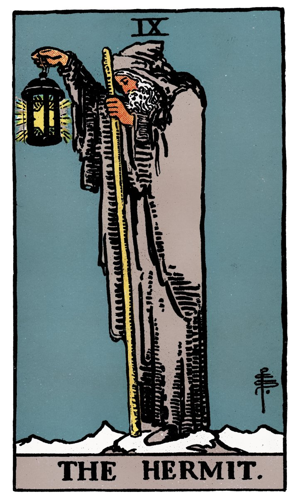

# IX — L'HERMITE

](a_09_Hermite.jpg)

## Signification

**Type de Carte :** Arcane Majeur — les grandes étapes ou leçons de la Vie
**Élément :** [Non spécifié sur la page]
**Numérologie / Rang :** 9, associé à l'accomplissement et à l'atteinte de l'objectif
**Planète / Constellation :** Vierge
**Pierre / Cristal :** Péridot, Jaspe Héliotrope
**Plante :** la Réglisse

## Description

La Carte de l'Hermite – parfois écrit l'Ermite – représente un vieil homme appuyé sur son bâton de pélerin et levant devant ses yeux une lanterne. Au sommet de la montagne, il est arrivé à la fin de son cheminement Spirituel. Il se connait lui-même, il connait les hommes et le monde.

Il tient son bâton de la main gauche, la main de l'Intuition et de l'Inconscient. Cela signifie que son voyage a d'abord été un voyage intérieur, la quête dans laquelle s'est lancée le Fou / Mat. Il porte sa lanterne de la main droite, la main qui représente l'intelligence et la Conscience. L'Hermite est donc le premier indice explicite du Tarot que le voyage vers l'accomplissement de soi nécessite l'intégration dans le Conscient d'éléments Inconscients.

Comme sur la Carte de La Force, le regard du personnage est dirigé vers le bas. Cela signifie l'intériorité et l'introspection.

## Mots-clés

### À l'endroit
- Sagesse intérieure, recherche spirituelle
- Solitude, calme, mise en retrait
- Enseignement, enseignant

### À l'envers
- Répétitions des mêmes erreurs
- Manque de discernement
- Solitude trop pesante

## Interprétation

**Dans un Tirage de Tarot, la Carte de l'Hermite indique que vous êtes dans une période de questionnement et d'introspection.** Vous recherchez intérieurement les réponses aux questions fondamentales, questions que vous vous posez depuis longtemps et dont les réponses sont devenues essentielles à votre cheminement. Vous vous posez la question du sens. Vous vos questionnez sur vos motivations et vos valeurs Authentiques, sur votre Mission de Vie.

Ces réflexions nécessitent une prise de recul parce qu'il est impossible d'y répondre dans le tumulte du monde et du quotidien. Ainsi, vous vous sentez sans doute coupé du monde, en décalage avec son entourage. Il est possible de vos questionnements vous pèsent et vous amènent à une forme de repli sur soi.

Dans votre quête de sens, L'Hermite est une présence rassurante. Cet homme a réussi à trouver les réponses qu'il cherchait. C'est donc à la portée de tous ! D'ailleurs, la sagesse populaire dit bien "Quand on cherche, on trouve !"

Alors, continuez de chercher. De toutes les manières possibles. Le fait même d'être en quête de réponses montre que vous êtes sur votre chemin de Spiritualité et d'accomplissement de soi. Vous cherchez parce que vous avez compris que votre existence a un sens profond et une reliance au Divin. Vous apprendrez dans la suite du voyage que ce sens et cette reliance se manifestent dans la place Authentique que vous prenez dans le monde.

## L'Hermite et l'Amour

L'Hermite est une Carte solitaire. Dans un Tirage Amoureux, la Carte de l'Hermite indique le plus souvent que vous n'êtes pas prêt.e à vivre pleinement l'histoire d'Amour que vous attendez. Il est possible que des événements du passé soient encore trop présents pour que votre Coeur soit pleinement libre, capable d'aimer à nouveau. Il est possible également que les histoires passées se soient soldées par des échecs parce que vous ne saviez pas ce qui est Authentiquement important pour vous dans une relation. L'Hermite vous conseille de chercher en vous ce qui pourrait être la cause de ces échecs relationnels et surtout ce que vous attendez chez votre partenaire.

Si vous êtes en couple, la Carte de l'Hermite indique le besoin de prendre du recul. Quel avenir envisagez-vous avec votre partenaire ? Qu'est-ce qui vous satisfait dans votre relation ? Qu'est-ce qui ne vous satisfait pas ou moins ? L'Hermite conseille de braquer cette lanterne de sagesse vers vous et de regarder vos souhaits et désirs avec la plus grande honnêteté possible.

Si votre couple connait des difficultés, que votre partenaire s'éloigne, il ou elle a sans doute besoin de faire le point. Cela ne veut pas dire que toute communication doit être coupée, surtout si cette prise de recul vous est douloureuse ou vous inquiète. Cette pause est essentielle pour votre partenaire. Laissez lui le temps nécessaire à son travail d'introspection.

## L'Hermite et le Travail

Quelle que soit votre situation professionnelle, la Carte de L'Hermite vous conseille de prendre du recul pour analyser votre situation. Vous devez vous positionner comme un observation extérieur pour comprendre la situation avec lucidité et trouver la solution à votre problème. Accordez-vous du temps et du calme pour laisser votre Etre Authentique trouver la solution et votre Intuition vous mettre sur la voie.

L'Hermite indique également que vous prenez conscience de tout ce que vous êtes capable d'accomplir. Vous êtes prêt.e à prendre la main seul.e sur un projet ou un dossier d'envergure, voire une création d'activité. Travailler seul.e vous convient mieux et vous serez plus productif.ve si vous parvenez à vous extraire du tumulte des objectifs et des intentions des autres.

## L'Hermite et les Finances

Dans un Tirage concernant l'Argent ou les Finances, l'Hermite indique que vous vous déintéressez des affaires matérielles. Acheter, consommer, paraître ne sont pas si important au final. Gagner de l'argent n'est peut-être pas la priorité ou du moins, gagner de l'argent n'est pas ou plus la priorité n°1 dans votre vie. Votre Energie est tournée vers l'immatériel, le Spirituel et votre cheminement. Attention toutefois à ne pas saboter votre situation financière. Quel que soit le rapport que vous entretenez avec l'argent, il est, dans notre société, la monnaie d'échange de votre temps et de vos compétences.

Si vous souhaitez investir sur vous-même – formation, développement personnel… – la présence de l'Hermite dans votre Tirage valide l'intérêt de la démarche et la dépense associée.

## L'Hermite et la Guidance

L'Hermite représente une pratique essentielle dans l'accomplissement de soi : l'introspection.

L'Hermite vous invite à la prise de recul, à une réflexion profonde sur votre vie, ce que vous voulez accomplir, ce qui est le plus important pour vous.

Vieil homme, l'Hermite a compris que le temps est compté. Alors, l'accomplissement de soi doit commencer "ici et maintenant".

Si gravir la montagne représente l'accomplissement de soi, quelle est votre montage ? Où en êtes-vous de votre ascension ? Qui est à vos côtés pour vous encourager, vous soutenir quand le chemin est difficile ? Est-ce que ces personnes, est-ce que vos choix vous aident à monter ou au contraire est-ce qu'ils vous tirent vers le bas ?

Il n'y a pas de bonnes ou de mauvaises réponses… il n'y a que les vôtres. Vous vous devez de les mettre à jour en toute transparence avec vous-même.

## Affirmation

> "La solitude est le nid des pensées." Proverbe Kurde

---

*Source : [Vivre Intuitif](https://vivre-intuitif.com/apprendre-le-tarot/signification/majeures/l-hermite/)*
*Illustration : Tarot de A.E. Waite — Domaine public*