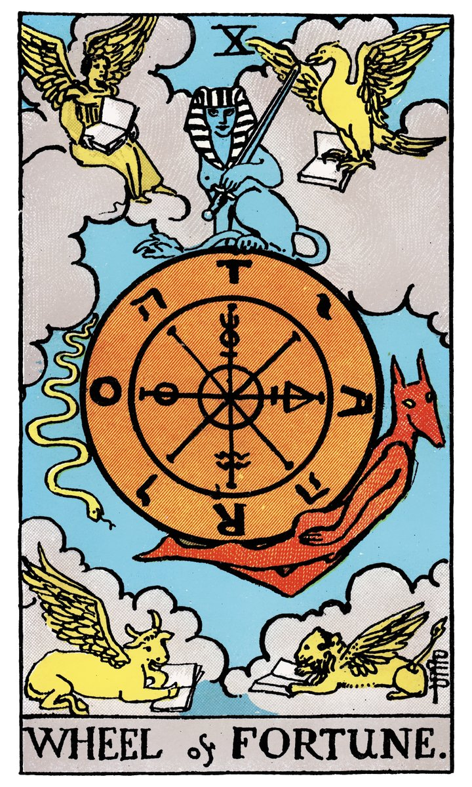

# X — LA ROUE DE FORTUNE

](a_10_Roue_de_Fortune.jpg)

## Signification

**Type de Carte :** Arcane Majeur — les grandes étapes ou leçons de la Vie
**Élément :** Feu
**Numérologie / Rang :** 10, associé au dépassement, à un nouveau cycle qui commence
**Planète / Constellation :** Jupiter ; les 4 signes fixes du Zodiaque Scorpion, Verseau, Lion et Taureau
**Pierre / Cristal :** le Jade
**Plante :** l'Orme Rouge

## Description

La Roue de Fortune et La Lune sont les deux seuls Arcanes Majeurs du Tarot qui ne sont pas illustrés par un personnage… Pourtant, Fortune est une déesse de la mythologie romaine dont les représentations sont nombreuses de l'Antiquité au Moyen-Age. Déesse de la Chance, Fortune représente le destin des Hommes et toutes ses incertitudes. Son attribut, la roue, symbolise les hauts et les bas de l'existence. "La roue tourne !" dit l'expression populaire comme pour souligner que le destin peut se montrer capricieux, tantôt favorable, tantôt défavorable.

Le Tarot de Marseille illustre parfaitement la nature cyclique du destin. L'animal de droite est entrainé vers le haut par la Roue. Il monte vers sa bonne fortune. Le singe est quant à lui entrainé vers le bas par la Roue. Il descend vers sa mauvaise fortune. Le Sphinx, assis sur une plateforme stable, est épargné par ce mouvement. Dans la mythologie classique, le Sphinx connait la réponse à l'énigme. Il sait que sur le chemin vers l'accomplissement de soi, il ne faut pas se laisser déstabiliser par sa bonne ou sa mauvaise fortune car la nature même de l'existence est cyclique.

Dans le Rider-Waite, il semble que A.E. Waite ait voulu donner une dimension très ésotérique à cette Carte en mêlant à la fois des symboles Astrologiques, Egyptiens et Chrétiens.

Ainsi, les quatre signes fixes du Zodiaque ornent les quatre coins de la Carte. L'homme/Angel est le Verseau, l'Aigle est le Scorpion puis on reconnait le Lion et le Taureau. Ces créatures sont aussi les quatre "créatures vivantes" de la vision d'Ezékiel, le tétramorphe, à qui la tradition a associé les Apôtres Matthieu, Jean, Marc et Luc.

La Roue est portée par Anubis / Hermès, le messager des Dieux. Sur la Roue, les lettres R, O, T et A écrivent *rota* (la roue en Latin) mais aussi "TARO" ou "TORA". Les symboles alchimiques du mercure, du soufre, de l'eau et du sel sont également présents.

## Mots-clés

### À l'endroit
- Chance, karma
- Changement, améliorations
- Destin, cycles de la Vie

### À l'envers
- Malchance
- Forces négatives à l'œuvre

## Interprétation

**Dans le Tarot, la Carte de la Roue de Fortune symbolise la nature cyclique de la vie. Hauts et bas, joies et peines : une partie de notre existence échappe à notre contrôle et à notre volonté.** Selon vos croyances, vous pouvez y voir la main d'une puissance supérieure, du Divin, du hasard ou encore du déterminisme de la Nature… La succession des cycles de la vie est un vécue par tous les Hommes. Vous n'y pouvez rien. La leçon de la Roue de Fortune est d'accepter cet état de fait ; accepter qu'il y a des choses qui vous échappent. Si vous reconnaissez que les mauvais moments contrastent avec les bons, vous êtes capable de les apprécier à leur juste valeur… et à leur pleine saveur quand ils se présentent.

Dans un Tirage, La Roue de Fortune indique que votre vie est influencée par des forces extérieures. Vous n'avez pas ou peu de prise sur les choses. Vous avez probablement du mal à vous projeter dans l'avenir avec sérénité puisque celui-ci vous parait incertain et hors de votre champ d'action.

Ces moments – qui sont difficiles – sont inévitables. La Roue de Fortune indique que même si vous avez du mal à accepter ce changement, cette mauvaise passe, tout arrive dans votre vie pour une bonne raison. L'Univers a un plan. Chaque porte qui se ferme, chaque porte qui s'ouvre vous emmène exactement là où vous devez aller. Inutile de résister au mouvement de la Roue car cela est inutile. Il est préférable de s'adapter autant que possible au changement induit par son mouvement.

Même si elle possède une composante fataliste, La Roue de Fortune du Tarot vous rappelle que vous gardez la main dans ce qui reste de votre ressort. Vous gardez également la responsabilité de vos choix et de vos actions pour changer ce qui ne vous convient pas ou limiter l'impact négatif d'un "coup du sort". Vous pouvez travailler activement à améliorer la situation. Si les difficultés sont inévitables, votre état d'esprit et votre résilience feront la différence. La Roue de Fortune est une Carte qui invite à l'optimisme et aux pensées positives. Grâce aux pratiques méditatives et intuitives, il vous est possible de renforcer votre intention et de manifester dans votre vie joie, abondance et bonne fortune.

## La Roue de Fortune et l'Amour

Si vous recherchez l'Amour, La Roue de Fortune indique un tournant positif. C'est le moment de sortir, de faire des rencontres. L'Ame soeur ne va pas sonner à votre porte un bouquet de fleurs à la main, alors, il faut faire quelques efforts de votre côté pour que le Destin vous amène au point de rencontre.

Si vous êtes en couple, la Roue de Fortune indique que votre relation est cyclique, avec des hauts et des bas, des ruptures et des réconciliations. Vous ne savez jamais vraiment à quoi vous attendre avec votre partenaire et cela vous épuise à la longue… Le point de rupture est peut-être atteint. Il est temps d'ouvrir une discussion franche et profonde sur les attentes de chacun. La relation peut encore se remettre sur des rails constructifs à condition que chacun exprime ce qui doit changer et y travaille.

## La Roue de Fortune et le Travail

Dans un Tirage concernant le travail, La Roue de Fortune met l'accent sur les hauts et les bas, sur vos succès et vos "flops" dans votre environnement professionnel. Il est temps de prendre un peu de recul, d'analyser la situation et surtout ne pas reproduire les mêmes erreurs. Si vous êtes plutôt dans une phase de succès dans votre travail, prudence, la Roue pourrait tourner. Vous pourriez commettre une erreur, le contexte favorable pourrait changer… N'attendez pas d'être tout à fait en haut de la Roue pour anticiper un changement de fortune.

A l'inverse, si vous êtes dans une phase difficile, il est temps de remettre l'accent sur les dossiers bien gérés, vos succès professionnels qui ne sont pas si lointains afin de vous remettre dans une bonne dynamique.

Si vous recherchez du travail ou une opportunité, la Roue de Fortune annonce un grand changement. La chance va enfin tourner ; une opportunité va enfin se présenter. Il s'agit de laisser entrer ce changement dans votre vie sans crainte.

## La Roue de Fortune et les Finances

Dans un Tirage concernant l'Argent ou les Finances, La Roue de Fortune indique un changement de situation. Si vous connaissez des difficultés financières, la chance est plutôt de votre côté et les choses devraient s'améliorer.

Si vous êtes plutôt dans une période faste, prudence, la Roue peut indiquer une baisse prochaine de vos revenus ou un impact négatif sur votre budget.

La meilleure attitude à adopter est de votre préparer à ces hauts et ces bas financiers, en mettant de l'argent de côté par exemple.

Et même si nous aimerions tous que la Roue de Fortune annonce une chance inouïe aux jeux de hasard… ce n'est malheureusement pas le cas. Avoir de la chance, oui. Gagner le gros lot, pas sûr !

## La Roue de Fortune et la Guidance

La Roue de Fortune représente les cycles de la vie et le Karma. Elle vous parle de l'équilibre entre deux forces :

- Les forces extérieures – l'Univers, le Divin, le hasard – tout ce sur quoi vous n'avez pas prise.
- La force de vos pensées (Loi de l'Attraction) et de vos actions quotidiennes – qui impactent votre vie et celle de vos proches.

La Roue de Fortune vous interroge sur votre conception du Destin et du coup, sur votre responsabilité à transformer ce qui est à votre portée dans votre vie pour la vivre à son plein potentiel.

Pensez-vous avoir une part de responsabilité dans votre situation actuelle ? Pensez-vous que vous puissiez changer les choses ? Et si oui, comment ?

## Affirmation

> "On ne peut rien changer à son destin." Esope

---

