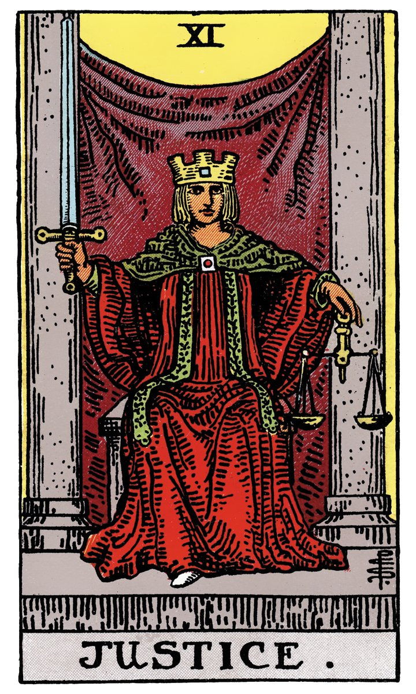

# XI — LA JUSTICE

](a_11_Justice.jpg)

## Signification

**Type de Carte :** Arcane Majeur — les grandes étapes ou leçons de la Vie
**Élément :** l'Air
**Numérologie / Rang :** 11, associé à la volonté et au courage, dans le Rider-Waite et les Tarots de cette famille ; 8 associé à l'équilibre dans le Tarot de Marseille. Dans son Tarot, Waite a privilégié la correspondance astrologique entre les Arcanes Majeurs et le Zodiaque. Ceci explique pourquoi dans le Rider-Waite et tous les Tarots qui se basent sur son système, La Force et La Justice sont interverties par rapport au Tarot de Marseille. La Force correspond ainsi au Lion, l'Hermite à la Vierge, la Justice à la Balance. L'ordre du Zodiaque est ainsi respecté.
**Planète / Constellation :** Balance
**Pierre / Cristal :** Le Bois Fossile
**Plante :** Le Plantain

## Description

L'illustration de la Carte de la Justice du Tarot rappelle l'illustration de La Papesse / La Grande Prêtresse. Sur ces deux Cartes, une jeune femme est assise entre deux piliers de pierre et tient à la main ses attributs. Les deux piliers derrière la jeune femme symbolisent les limites dans lesquelles la justice s'exerce. Drapée dans un riche vêtement rouge, la Justice porte une couronne dont la forme carrée indique que ses pensées sont bien ordonnées. Elle tient dans la main droite un glaive levé vers le ciel en signe de victoire car la Justice tranche. Dans la main gauche, la main de l'Intuition, elle tient une balance, indiquant que la pensée logique doit être contre-balancée par l'Intuition pour rendre un jugement juste et impartial.

## Mots-clés

### À l'endroit
- Honnêteté, vérité
- Justice, peser le pour et le contre
- Equité

### À l'envers
- Injustice
- Préjugés
- Se "faire avoir"

## Interprétation

**De façon assez littérale, la Carte de La Justice symbolise tout ce que son nom évoque : la loi, l'équité et la vérité.** La présence de La Justice dans un Tirage indique que, dans votre vie, tout est en ordre et à sa place. Vous vivez actuellement les conséquences que vos décisions et actions passées ont engendrées, ni plus ni moins. Vous êtes donc amené.e à répondre de vos actions, à être « jugé.e » pour ces actions – par vous-même ou par des personnes de votre entourage. Ce jugement est juste et équilibré.

La Justice peut indiquer également qu'une décision doit être prise dans votre vie. Quelque chose doit être « tranché », une solution doit être trouvée… en pesant bien le pour et le contre. De fait, les autres Cartes du Tirage peuvent représenter les forces en présence, l'énergie du « pour » et celle du « contre ». La Carte de la Justice vous invite à rester le plus objectif possible dans votre processus de décision et à rechercher la solution juste pour toutes les personnes impliquées.

Enfin, la Carte de La Justice vous parle de toutes les questions d'ordre juridique – mariage, divorce, succession, procès – et des professionnels associés : juge, avocat, notaire, huissier. Si votre question porte justement sur ce domaine, vous pouvez vous attendre à une décision juste – ce qui ne veut pas dire une décision qui va dans votre sens. La Carte de la Justice indique que les responsabilités seront identifiées et les coupables punis.

## La Justice et l'Amour

Dans le domaine de l'Amour, la Carte de la Justice évoque tout ce qui « formalise » une relation : un contrat de mariage ou de PACS, l'achat d'une maison ou d'un appartement en commun, une « présentation officielle » de l'être aimé. La Justice peut aussi indiquer la dissolution de ces liens administratifs et relationnels par le biais d'un divorce ou de toute démarche qui acte la séparation.

La Carte de la Justice peut aussi indiquer que les relations – amoureuses, familiales ou amicales – sont équilibrées et justes dans votre vie. Si beaucoup de temps et d'énergie ont été investis pour « construire » une relation, le juste retour des choses est assuré. A l'inverse, si vous ne faites pas preuve d'amour, d'écoute ou de respect envers votre partenaire, il ne faut pas s'attendre à ce que le partenaire en fasse preuve non plus !

Si votre couple traverse une période difficile, La Justice peut très bien indiquer que vous êtes déjà dans un processus de « peser le pour et le contre » – rester ou partir ? Dans ce cas, La Justice vous invite à poser un jugement objectif sur la situation, à garder coeur et esprit ouverts. Vous devez rester en capacité de vous remettre en question et d'analyser en quoi votre attitude contribue à la situation actuelle.

## La Justice et le Travail

En ce qui concerne le domaine professionnel, la Carte de La Justice indique que vous tentez de faire ce qui est juste. Vous suivez les règles et les procédures ; vous avez une attitude éthique. S'il s'agit par exemple de trouver du travail, vous suivez les conseils et les « bonnes pratiques » de la recherche d'emploi, sans pour autant transiger sur vos principes ni vos envies profondes. La Carte de La Justice peut aussi indiquer que des opportunités s'ouvrent dans le champ professionnel du Droit au sens large.

Au travail, La Justice indique que ce n'est pas le moment de se reposer sur ses acquis ou d'en faire le minimum. Au contraire ! La Justice vous conseille un positionnement loyal, sinon les conséquences pourraient rapidement vous rattraper. Si vous avez commis une erreur, il vaut mieux en parler ouvertement, s'en excuser et trouver une solution plutôt que de la cacher.

## La Justice et les Finances

En ce qui concerne l'argent et les finances, la Justice du Tarot vous conseille de bien gérer votre budget en planifiant vos dépenses et en restant bien « dans les clous. » Cette Carte annonce que vous allez recevoir exactement ce que vous méritez : soit vos économies et investissements vont porter leurs fruits, soit vos dépenses vont vous rattraper.

## La Justice et la Guidance

Comment bien équilibrer tous les aspects de sa vie ? Voilà la question existentielle que vous pose La Justice. Ressentez-vous un déséquilibre entre votre vie professionnelle et votre vie personnelle ? Donnez-vous trop – de temps, d'énergie – aux autres et pas assez à vous-même ? Quel domaine de votre vie est en train de pâtir du trop-plein d'énergie donné à un autre ? Et surtout, comment rééquilibrer les forces ?

La Justice vous rappelle que vivre en ligne avec ses valeurs et son être authentique est source de bien-être. Les aléas et les contraintes du quotidien nous font parfois perdre de vue l'essentiel… La Justice vous invite à porter une attention particulière à « votre essentiel » et à le replacer au centre de vos projets de vie.

## Affirmation

> "On ne peut être juste si l'on n'est humain." – Vauvenargues

---

*Source : [Vivre Intuitif](https://vivre-intuitif.com/apprendre-le-tarot/signification/majeures/la-justice/)*
*Illustration : Tarot de A.E. Waite — Domaine public*