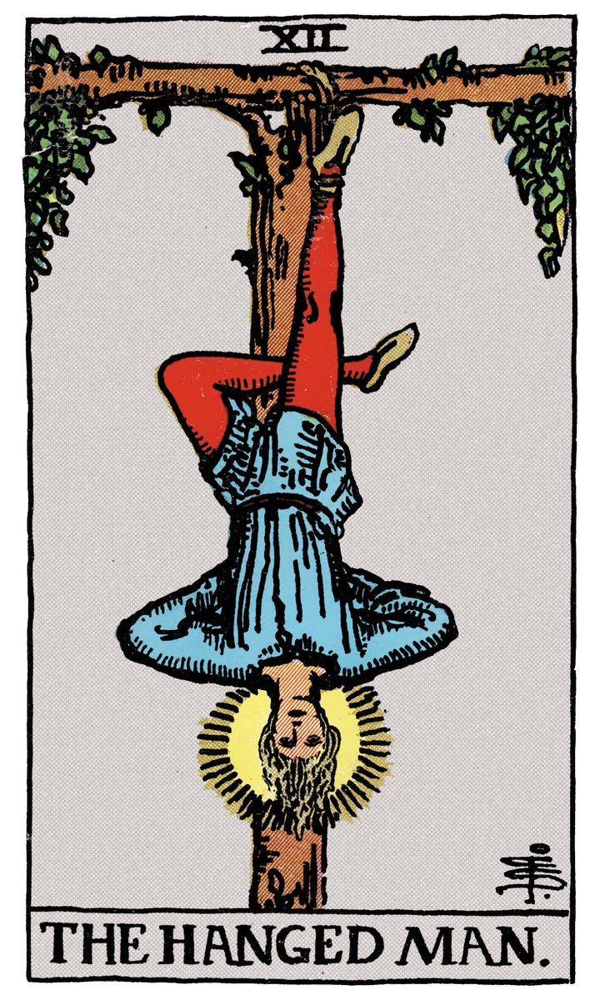

# XII — LE PENDU

](a_12_Pendu.jpg)

## Signification

**Type de Carte :** Arcane Majeur — les grandes étapes ou leçons de la Vie
**Élément :** l'Eau
**Numérologie / Rang :** 12 associé au développement spirituel
**Planète / Constellation :** Neptune
**Pierre / Cristal :** L'Agate mousse
**Plante :** L'Algue brune

## Description

La Carte du Pendu nous montre un homme pendu par un pied à un arbre. La Justice étant passée, voilà notre homme condamné. Sa jambe gauche est pliée, formant un triangle avec sa jambe droite. Il a les mains liées dans le dos. Un halo de lumière encadre son visage. Quelque part entre le châtiment réservé aux pires des voleurs au Moyen-Age et une posture rappelant le Yoga, Le Pendu oscille, recueilli, concentré. Il attire… et dérange. Il est peut-être la Carte la plus paradoxale de tout le Tarot… En fâcheuse posture, Le Pendu n'a pourtant pas l'air de souffrir. Il semble en paix. Il ne se débat pas, il n'est ni triste ni en colère. Il a lâché prise face aux circonstances qu'il ne peut pas changer et accepte sereinement son sort.

## Mots-clés

### À l'endroit
- Lâcher-prise
- Foi
- Capitulation
- Suspension, attente

### À l'envers
- Se sentir – ou être – piégé
- Absence de lâcher-prise
- "Prises de tête" et ressentiments

## Interprétation

Le Pendu représente la nécessité de suspendre votre action pour l'instant. **Même si un sentiment d'urgence émane de la situation, Le Pendu indique que le moment n'est pas propice à la prise de décision et que si possible,vous devez prendre le temps de réfléchir avant d'agir.** Mettez les choses pour laisser le temps à de nouvelles opportunités de se présenter, à de nouvelles possibilités et idées d'émerger. Utilisez ce temps pour sonder profondément votre Etre Authentique et ressentir quelle voie est à suivre.

**Le Pendu peut également indiquer que vous vous sentez coincé.e, emprisonné.e, bloqué.e dans votre vie.** Le Pendu vous invite alors à découvrir la cause de ce ressenti afin de débloquer la situation. Il est peut-être nécessaire d'accepter la situation, d'accepter de ne pas avoir le contrôle sur tout et… de lâcher-prise ! Le lâcher-prise permet de s'affranchir des soucis du quotidien, des tracas et des pensées limitantes pour faire émerger en vous la solution, le chemin qui permet de sortir de l'ornière.

**Enfin, Le Pendu vous conseille de regarder votre situation avec un regard neuf.** Enfant, quand on joue au "cochon pendu" et qu'on s'accroche par les jambes à une branche, le monde se révèle dans une toute autre perspective. C'est ce regard que le Pendu vous propose d'adopter… un regard différent sur vous-même, sur votre environnement, sur vos problèmes. En faisant cet exercice, vous pouvez trouver une réponse pertinente à votre questionnement… Il est possible – peut-être souhaitable – que cet exercice d'introspection vous amène à questionner vos habitudes et vos croyances, à abandonner celles qui aujourd'hui ne servent plus vos objectifs de vie Authentiques. En ce sens, Le Pendu est une Carte de sacrifice : sacrifier l'ancien fonctionnement, les anciennes idées et habitudes pour laisser place au renouveau.

## Le Pendu et l'Amour

Si vous recherchez l'Amour, Le Pendu vous indique… de vous y prendre autrement ! Il est temps d'essayer de nouvelles méthodes pour rencontrer celui ou celle qui fera chavirer votre coeur. Changer d'habitudes, changer de lieux pour les rencontres voire changer de tête : Le Pendu vous invite à repenser votre stratégie et à innover.

Il est possible également que Le Pendu vous mette en alerte sur vos attentes quant à la relation avec l'autre. Vous avez certainement à l'esprit une version plus ou moins idéalisée de la relation de couple, du bonheur à deux. Est-ce que votre vision est réaliste ? Si vous êtes en couple, est-ce que cette version est partagée ? Le Pendu questionne sur ce qui est le plus essentiel à trouver chez son partenaire et dans la relation d'amour. Dans cette réflexion, vous pourriez être amené.e à sacrifier certaines de vos exigences pour trouver votre Ame soeur.

Si vous êtes en couple, Le Pendu indique que les choses sont "suspendues", en pause… notamment si vous traversez des difficultés. Vous pesez "le pour et le contre". On arrête ? On continue ? Suis-je heureux / heureuse dans cette relation ? Est-ce que la relation est ce que je veux vraiment ou est-ce que je reste parce que j'ai déjà beaucoup sacrifié pour en arriver là ? Le Pendu invite au dialogue et à l'écoute de l'autre mais surtout à l'écoute de votre boussole intérieure, de votre Intuition afin de prendre la bonne décision pour votre bonheur.

## Le Pendu et le Travail

Quand le Tirage porte sur le travail, Le Pendu indique que votre situation professionnelle est en pause. Par exemple, une promotion ou une évolution professionnelle attendue ne se matérialise pas. Vous restez dans l'attente et espérez ce changement mais il se fait attendre.

Il est possible également que vous mettiez votre vie professionnelle en pause pour consacrer plus de temps à votre famille, à vos projets personnels ou à votre développement spirituel… ou que vous ayez grand besoin de le faire !

Si vous recherchez un emploi, Le Pendu annonce un délai, une réponse qui se fait attendre. Il est possible que pour trouver le bon emploi, vous deviez renoncer à certaines exigences (salaire, proximité géographique…) ou faire des concessions.

## Le Pendu et les Finances

Dans le domaine des Finances, Le Pendu vous indique de "mettre en veille" vos projets et dépenses. Cette pause doit servir à changer votre regard sur votre situation financière et à l'évaluer votre situation financière. Il est probablement temps d'ouvrir les yeux sur les paramètres de votre budget et de modifier vos habitudes de dépenses et d'épargne.

Le Pendu peut aussi indiquer que vos finances sont "bloquées", que les fonds ne sont pas accessibles de suite. Il peut s'agir de placements à long terme, de tracas administratifs ou d'une rentrée d'argent attendue mais reportée. Du temps est nécessaire pour que votre situation se débloque.

## Le Pendu et la Guidance

Le Pendu représente le besoin que nous avons tous de lâcher-prise et d'atteindre l'éveil spirituel. Comment devenir un être plus spirituel ? Comment rester sur le chemin de l'accomplissement de soi ? Quels sacrifices faut-il faire, éventuellement, pour y parvenir ? Pourquoi est-ce si difficile puisque vous avez tout à y gagner ? Voilà les questions que Le Pendu a résolues et que sa présence vous invite à contempler.

## Affirmation

> "Lâcher prise, c'est craindre moins et aimer davantage".

---

