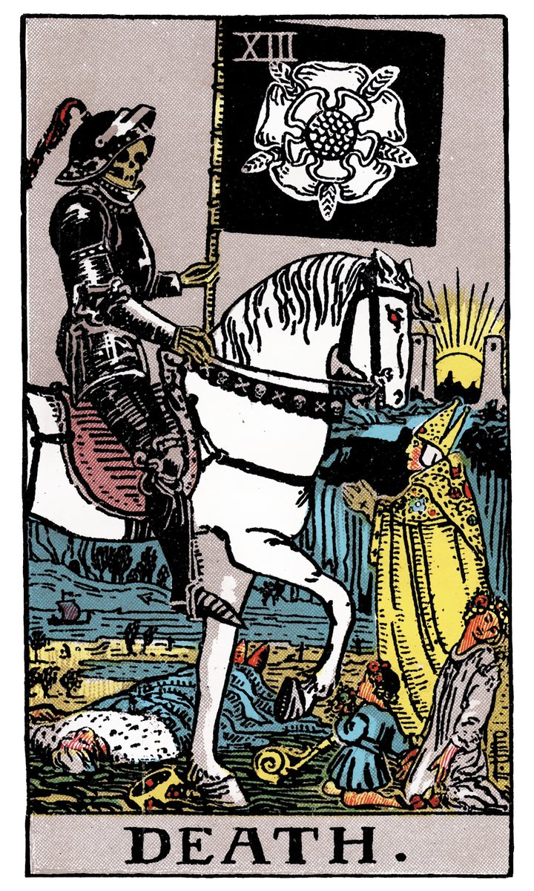

# XIII — LA MORT — L'ARCANE SANS NOM

](a_13_Mort.jpg)

## Signification

**Type de Carte :** Arcane Majeur — les grandes étapes ou leçons de la Vie
**Élément :** l'Eau
**Numérologie / Rang :** 13 associé à la chance… ou à la malchance
**Planète / Constellation :** Scorpion
**Pierre / Cristal :** L'Obsidienne
**Plante :** Le Sureau

## Description

Dans le Tarot de Marseille, La Carte de L'Arcane sans Nom / La Mort est illustrée par une "faucheuse". Cette représentation classique montre un squelette armé d'une grande faux sillonnant villes et campagnes et frappant à l'aveugle ses victimes.

Dans le Rider-Waite, La Mort est illustrée par un squelette en armure qui monte un grand cheval blanc et qui tient à la main une grande bannière noire. L'armure portée par cet étrange cavalier indique que la mort est invincible, personne n'ayant jamais réussi à lui échapper. La présence d'hommes, de femmes et d'enfants sur la Carte rappelle les Danses Macabres et symbolise l'universalité de la Mort. Elle frappe indifféremment de l'âge, du sexe ou de la religion.

**Malgré son nom et son illustration évocateurs, L'Arcane sans Nom du Tarot ne signifie pas la mort physique d'un être ou d'une chose. La Carte de La Mort évoque le changement, la transformation et la renaissance**… mais il faut savoir en lire les symboles.

Dans le Tarot de Marseille, le sol noir est la "matière noire" des Alchimistes, le produit de la première transformation Alchimique qui appelle nécessairement les suivantes. La transformation est donc en cours et n'est pas terminée. Dans le Rider-Waite, le Soleil se lève à l'arrière-plan entre les deux tours de l'Arcane La Lune, preuve que le cheminement n'est pas terminé ou "mort" non plus.

## Mots-clés

### À l'endroit
- Fin
- Changement, transition
- Libération

### À l'envers
- Stagnation
- Résistance au changement
- Incapacité à aller de l'avant

## Interprétation

La Mort ! Qui peut contempler cette silhouette squelettique sans ressentir un certain malaise ? Nous voici confrontés à notre peur la plus ancrée, à l'Inconnu le plus profond. L'Arcane sans Nom est probablement la Carte la plus mal comprise de tout le Tarot car malgré son illustration et son nom, l'Arcane sans Nom ne nous parle que très rarement de la mort physique.

L'Arcane sans Nom symbolise la fin, certes, mais uniquement dans le sens où cette fin permet à un nouveau chapitre de s'écrire… un chapitre plus important et plus bénéfique. Il faut être en capacité de mettre le passé derrière soi afin d'accepter ces nouvelles opportunités. Si l'exercice n'est pas simple, il est indispensable pour que le renouveau et la transformation entrent dans votre vie. Résister aux changements, ne pas accepter « la fin » peut causer plus de souffrance émotionnelle que d'envisager ces nouvelles possibilités. Quand La Mort – L'Arcane sans Nom apparaît dans un Tirage de Tarot, elle est accompagnée de solutions constructives pour vous aider à passer ce cap. Regardez les autres Cartes et demandez-vous en quoi elles peuvent être des "panneaux indicateurs" vers la transformation de soi.

Parfois, La Mort indique que vous devez vous départir d'une ancienne habitude ou couper un lien toxique afin de vivre de façon plus épanouie. Dans ce cas, La Mort vous invite à vous détacher des mauvaises habitudes, des excès, des vieux souvenirs… tout ce qui « encombre » inutilement votre vie, votre esprit et vous empêche d'avancer. Le but ici est de cheminer vers plus d'accomplissement de soi, d'être mieux dans sa peau et dans sa vie. Le passé, loin d'être renié, reste bien à sa place : derrière soi.

## La Mort — L'Arcane Sans Nom et l'Amour

Si vous recherchez l'Amour, L'Arcane Sans Nom vous questionne sur un point crucial de votre recherche : est-ce que vos relations précédentes sont bien « digérées » ? Avez-vous le coeur et l'esprit véritablement libres pour accueillir une nouvelle histoire ? Avez-vous effectivement fait votre deuil de vos relations passées ou reste-il des sentiments, des contacts, des espoirs ? La Mort indique que le Consultant doit avoir réellement mis son passé amoureux derrière lui avant de pouvoir vivre une nouvelle histoire d'amour.

Si vous êtes en couple, La Mort indique qu'un changement est nécessaire et ce changement passe par la mise à distance du passé. Si vous avez décidé de tourner la page et de redémarrer ensemble, laissez le passé derrière vous, ne remuez pas les vieilles rancoeur. Cela doit vous permettre d'avancer ensemble avec une meilleure communication et plus de compréhension mutuelle.

Il est possible également que vous ayez l'impression que votre relation amoureuse difficile ne changera jamais. Dans ce cas, La Mort peut évoquer un break ou une rupture et le Tirage de Tarot peut servir à identifier ce qui pourrait être positif et bénéfique dans cette perspective, à court terme et à long terme.

## La Mort — L'Arcane Sans Nom et le Travail

La Mort est une Carte de changement alors : il faut se préparer à toutes les éventualités ! Des changements majeurs dans l'environnement de travail pourraient affecter votre vie. Restructuration, nouvelle organisation, nouveau projet : un virage s'annonce. Si le changement annoncé par la Carte est de moindre importance, il est possible qu'un collègue parte ou qu'un projet significatif se termine ou s'arrête. Ces changements sont probablement source de stress – voire de peur – pour vous. Gardez à l'esprit que si vous n'avez pas la main sur ces changements, vous avez la main sur votre façon de les accueillir et de vous y adapter. Ces changements peuvent vous apporter des choses positives sur le long terme… même si c'est difficile voire impossible de l'imaginer pour l'instant.

Si vous envisagez de changer de voie professionnelle, c'est le moment ! L'Arcane Sans Nom du Tarot est alors de bon augure. Vous êtes prêt.e pour ce changement, impatient.e d'entrer dans cette nouvelle phase de votre vie. Bravo ! La transformation et la renaissance se profilent.

## La Mort — L'Arcane Sans Nom et les Finances

Dans un tirage de Tarot concernant votre argent et vos finances, l'Arcane sans Nom évoque des changements qui peuvent impacter fortement votre situation financière. Le risque est celui d'un impact négatif bien sûr avec une perte de revenus ou de capitaux. Dans ce cas, La Mort – L'Arcane Sans Nom vous invite à ne pas vous voiler la face et à bien évaluer votre situation financière, les risques que vous êtes prêt.e à prendre. Ensuite, il vous faut prendre les mesures qui s'imposent. Vous en êtes capable et l'impact négatif potentiel en est atténué.

## La Mort — L'Arcane Sans Nom et la Guidance

Comment vivez-vous le changement ? Est-ce que vous l'accueillez à bras et à coeur ouverts ? Est-ce que le changement est générateur de stress voire d'anxiété, pour vous ?

Et si vous pouviez changer quelque chose en vous, d'un coup de baguette magique, que changeriez-vous ?

La Mort interroge sur le changement personnel, la transformation… Se départir de ce qui n'est pas utile au développement spirituel, laisser derrière soi les bagages encombrants pour avancer plus vite et plus loin sur le chemin de l'accomplissement de Soi. Le changement est une opportunité de faire mieux, d'être plus en adéquation avec vos besoins Authentiques et de vous mettre en adéquation avec le bonheur. Profitez-en !

## Affirmation

> "Un changement en prépare un autre." – Nicolas Machiavel

---

