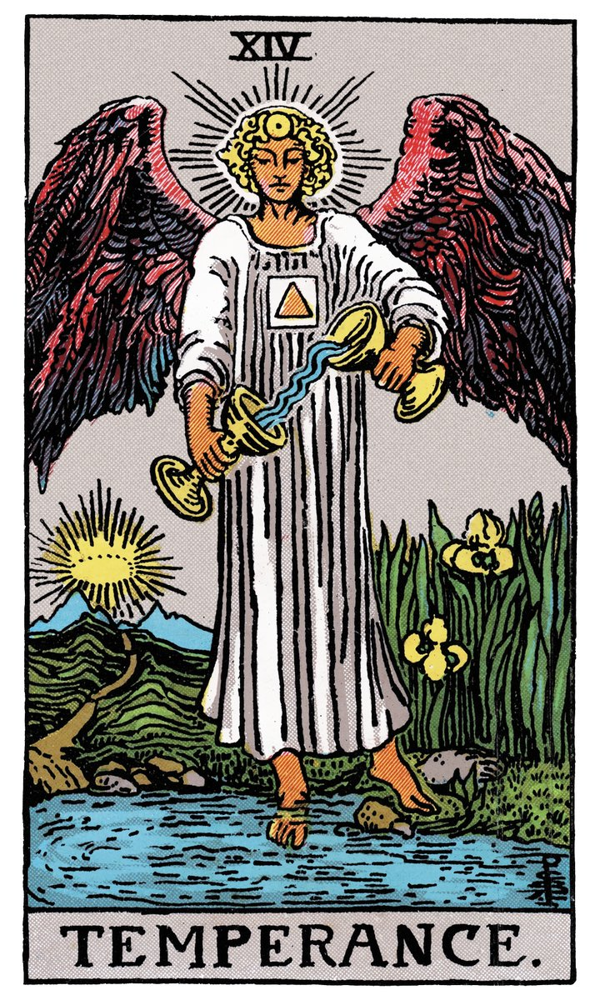

# XIV — LA TEMPERANCE

](a_14_Temperance.jpg)

## Signification

**Type de Carte :** Arcane Majeur — les grandes étapes ou leçons de la Vie
**Élément :** l'Eau
**Numérologie / Rang :** 5 (1+4) associé aux changements brusques et aux épreuves dont la Tempérance est l'antidote
**Planète / Constellation :** Sagittaire
**Pierre / Cristal :** Kunzite, Unakite
**Plante :** Echinacée

## Description

La Tempérance représente l'Archange Michel tenant une Coupe dans chaque main et mélangeant le contenu de ses deux Coupes. L'opération n'a pas l'air aisée : l'Eau semble remonter d'une Coupe à l'autre, dans un mouvement impossible pour les Lois de la Nature. Le visage de l'Ange est fermé, concentré, comme si maintenir ce flot en continu entre les deux Coupes lui demandait toute son attention, toute son Energie.

L'Ange a un pied dans l'Eau et l'autre sur la Terre. Il est donc entre deux mondes, entre deux polarités, l'une Intuitive et l'autre matérielle. Les autres Eléments sont présents aussi. L'élément Feu est représenté par la Couronne et les ailes incandescentes ; l'Elément Air est présent tout autour de l'Ange.

Malgré la tension du liquide entre les deux Coupes, il se dégage de la Carte un sentiment d'équilibre et d'apaisement. Par son action, Tempérance parvient à concilier des forces a priori irréconciliables : le Conscient et l'Inconscient, les émotions positives et les émotions négatives, l'Eau et le Feu, le Corps et l'Esprit.

## Mots-clés

### À l'endroit
- Modération
- Equilibre
- Guérison
- Patience

### À l'envers
- Déséquilibre
- Chaos
- Anxiété
- Dispute

## Interprétation

**La Tempérance symbolise l'union et l'harmonie entre deux forces a priori contradictoires.** Elle est une des quatre vertus cardinales, la "voie du milieu" prônée par le Bouddha.

Dans votre vie, vous parvenez à réconcilier différentes envies et besoins comme par exemple les contraintes du quotidien et les aspirations de votre Etre Authentique. Vous faites également preuve de patience et de modération ; vous travaillez "en profondeur" sur l'atteinte de vos objectifs plutôt que par à-coups.

La Tempérance indique également que vous possédez de belles qualités d'adaptation à votre environnement et aux circonstances de votre vie. Vous êtes une personne constructive qui adopte toujours une posture aidante et collaborative vis à vis des autres. Vous êtes un trait d'union qui met en relation les uns et les autres au moment opportun pour faire avancer les projets.

Enfin, la Tempérance indique vous savez aussi faire la part des choses et vous montrer juste dans vos jugements… y compris sur vous-même ou votre situation. Vous avez tous les éléments en votre possession pour prendre la meilleure décision, l'assumer et l'incarner complètement.

## La Tempérance et l'Amour

Si vous recherchez l'Amour, la Tempérance indique que vous mettez en œuvre une stratégie sur le long-terme pour faire entrer l'Amour dans votre vie. Vous avez entamé un travail sur vous-même, un travail de guérison émotionnelle pour permettre à une nouvelle histoire d'advenir. Vous avez aussi réfléchi à ce que vous souhaitez trouver chez l'Autre et au projet de vie que vous voulez construire à deux. Pas d'empressement, ce qui compte ici n'est pas la quantité des rencontres mais leur qualité.

Si vous êtes en couple, la Tempérance est généralement un signe d'harmonie et de compréhension mutuelle. Si vous traversez des difficultés, Tempérance rappelle qu'elles ne peuvent se résoudre que si chacun communique et fait un vers l'autre. Le désir vrai des deux partenaires de retrouver une relation harmonieuse est présent. Chacun doit se montrer patient avec l'autre et tenter de comprendre son point de vue.

## La Tempérance et le Travail

Dans un Tirage concernant l'avenir professionnel, La Tempérance indique que vous êtes en proie à une frustration et un manque de sérénité. Il vous est demandé de vous adapter à des changements dans votre environnement de travail : nouvelles tâches données, nouveau chef, collègues agaçants… Pour compliquer encore la chose, vous devez faire ce qui est attendu de vous tout en ayant d'autres aspirations. La situation peut vous exaspérer et devenir franchement difficile à supporter.

Vous devez retrouver votre équilibre et développer une certaine forme de patience pour tenir le coup et ne pas risquer l'épuisement. Remettez autant que possible les choses en perspectives. Tentez de comprendre que ce qu'il vit se joue dans la situation de façon très large, là où vous ne contrôlez pas tout.

La Tempérance questionne vos difficultés, votre mal-être au travail et indique qu'il est possible d'en sortir. Il est temps de vous poser les bonnes questions : quel est votre objectif professionnel ? D'où vient votre frustration ? Si vous souhaitez changer de voie, vers quelle carrière ou projets souhaitez-vous aller ?

## La Tempérance et les Finances

Dans un Tirage de Tarot concernant l'Argent et les Finances, La Tempérance conseille prudence et modération. Les investissements rentables sur le long terme sont à privilégier, même si la patience est de mise pour en récolter les fruits. S'il vous est possible de décaler les décisions financières dans le temps pour y réfléchir encore, c'est également une bonne approche. La Tempérance indique qu'il n'est pas souhaitable de prendre une décision relative à l'argent sous le coup de l'émotion mais attendre d'avoir à nouveau "la tête froide".

## La Tempérance et la Guidance

La Tempérance vous invite à réfléchir à ce que les mots "Equilibre", "Ancrage" et "Accomplissement de Soi" veulent dire pour vous. Quel rôle joue votre Intuition dans votre cheminement ? Comment ressentez-vous que vous êtes "sur le bon chemin" ?

La Tempérance est une qualité unique : elle permet d'intégrer à soi les éléments de son passé aussi difficiles et traumatiques soient-ils pour ressentir Equilibre et Paix intérieure. Il s'agit de construire le bonheur d'être soi, en acceptant ses défauts et ses qualités, en intégrant son passé pour construire l'avenir. Continuez à faire connaissance avec tous ces aspects de vous-même et à mettre en lien les différentes pièces du puzzle. Vous trouverez en vous des trésors de talents et des qualités insoupçonnées. 😉

## Affirmation

> "La tempérance est un arbre qui a pour racine le contentement de peu et pour fruits le calme et la paix." – Ferdinand Denis

---

*Source : [Vivre Intuitif](https://vivre-intuitif.com/apprendre-le-tarot/signification/majeures/la-temperance/)*
*Illustration : Tarot de A.E. Waite — Domaine public*