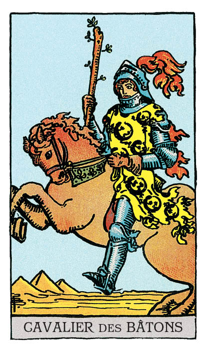

# Cavalier de Bâton

## Signification

**Type de Carte :** Suite : Bâtons, associée à la motivation, à la créativité, au mouvement et aux réalisations
**Élément :** le Feu
**Numérologie / Rang :** Dans les Cartes de Cour, le Cavalier est l'adolescent excessif. Il incarne les qualités de sa Suite en mode "tout ou rien". Ces émotions ou ces comportements extrêmes peuvent être positifs ou négatifs, selon les circonstances. Comme le Valet, le Cavalier ne maîtrise pas non plus les qualités de sa Suite mais il les manipule avec un enthousiasme débordant et de façon débridée. Le Cavalier, comme Le Chariot dans les Cartes Majeures, est un symbole de changement, de mouvement et d'action.
**Caractéristiques :** Dans un Tirage, les Cartes de Cour ou Honneurs peuvent représenter des personnes dans la vie du Consultant. Associées à la Suite des Bâtons, ces personnes peuvent être Bélier, Lion ou Sagittaire – les Signes de Feu. Ces personnes peuvent avoir les cheveux auburn ou roux, les yeux verts ou marron. Ces personnes sont fougueuses, fonceuses et motivées.

## Description

Un cavalier est lancé au galop en plein désert, dans un paysage plombé par le soleil et la chaleur. Les tons rouges et orangés de la Carte – le cheval, la plume du Cavalier – et les salamandres sur le vêtement du Cavalier évoquent le feu et la fougue. Ce Cavalier est déterminé. Il est passionné par ce qu'il a entrepris et il se donne à 100% pour réussir.

## Mots-clés

### À l'endroit
- Passion et désir
- Motivation, dynamisme
- Aventure, déménagement, voyage
- Personne que l'on remarque, qui ose

### À l'envers
- Energie mal canalisée
- Mauvais résultats
- Problèmes de libido

## Interprétation

Le Cavalier de Bâton fonce tête baissée et aime être dans le feu de l'action. Il a pris l'étincelle initiale du Valet de Bâton et travaille d'arrache-pied à la mise en œuvre concrète de cette idée. Impulsif, impatient, il en oublie de mettre en œuvre un plan d'action réaliste qui lui garantirait le succès à moyen ou long terme. Ce qui compte pour lui, c'est de réussir et de réussir maintenant. Il faut y aller, il faut foncer. Etre le meilleur. Gagner.

Le Cavalier de Bâton signifie que votre confiance en soi devient de plus en plus forte. Vous avez une motivation à toute épreuve et une Energie débordante pour mener à bien votre projet. Cette Energie insistante et déterminée est une vraie richesse ! Entretenez-la le plus longtemps possible parce l'Energie débordante des débuts est par nature… de courte durée.

Cependant, ne vous laissez pas emporter "trop loin" par la fougue du Cavalier de Bâton. Vous pourriez paraître prétentieuse, trop pugnace et ambitieuse. Vous pourriez irriter autour de vous ou susciter des jalousies. Tempérez votre enthousiasme et votre ambition avec une approche réfléchie et rationnelle.

Enfin, comme toutes les Cartes de Cour, le Cavalier de Bâton peut représenter une personne "de la vraie vie" dans votre entourage ou une personne que vous allez bientôt rencontrer. Le Cavalier de Bâton représente alors une personne charismatique, spontanée et passionnée. Si votre intérêt rencontre le sien, son aide peut vous aider à soulever des montagnes. Si la rencontre est romantique, elle sera torride ! Mais ce Cavalier pourrait sortir de votre vie aussi vite qu'il y est entré…

## Cavalier de Bâton et l'Amour

En Amour, le Cavalier de Bâton est une Carte torride ! De ce Cavalier émane une Energie sensuelle, spontanée, qui aime flirter, draguer et faire craquer son partenaire.

Si vous recherchez l'Amour, ouvrez l'œil et repérez les personnes qui vous attirent comme un aimant, que vous trouvez bien dans leur peau, sans complexe, passionnées. Le Cavalier de Bâton peut annoncer une romance aussi brève qu'intense. Si c'est ce que vous recherchez, c'est parfait ! Profitez-en.

Si vous êtes en couple, attention aux Sirènes ! Il est facile de succomber à l'appel sensuel d'un autre partenaire si votre vie intime s'essoufle à la maison. Plutôt que de craquer, pourquoi ne pas canaliser cette Energie, cette libido, vers votre partenaire actuel pour réveiller le désir ? Mettez-vous dans la posture du Cavalier de Bâton et exprimez votre désir. Soyez claire et honnête. Osez !

Si vous êtes en couple, le Cavalier de Bâton peut aussi symboliser l'excellente alchimie qui existe entre vous et votre partenaire au niveau sexuel. Est-ce suffisant pour cimenter votre couple ?

## Cavalier de Bâton et le Travail

Une nouvelle idée ? Un nouveau projet ? Vous voilà embarquée avec enthousiasme à la poursuite de cet nouvel objectif et vous êtes lancée à pleine vapeur ! Vous avez pris votre décision et libérée de ce dialogue interne et de ces réflexions sans fin, vous foncez enfin ! Bravo !

Si vous recherchez un emploi, le Cavalier de Bâton indique que le moment est venu de pousser les portes, de vous montrer insistante et de ne pas baisser les bras. N'attendez pas qu'une occasion se présente… Allez la décrocher !

Parfois, l'Energie du Cavalier de Bâton va "trop vite". Au plus les projets professionnels que vous mettez en œuvre sont importants, au plus vous devez "temporiser", calmer vos ardeurs pour garder la tête sur les épaules. Cela ne veut pas dire que vous ne devez pas avancer, au contraire, mais, dans l'enthousiasme, il ne faut pas qu'un élément décisif vous échappe.

## Cavalier de Bâton et les Finances

Du côté de vos finances, le Cavalier de Bâton indique que vous recherchez par tous les moyens une façon de reprendre la main sur vos finances et d'assurer des fins de mois moins difficiles. Vous avez la détermination qu'il faut pour réussir. Ce changement positif commence dès aujourd'hui et vous êtes prête à relever le défi.

Le Cavalier de Bâton peut aussi représenter une opportunité innovante et audacieuse qui vous est proposée pour gagner de l'argent. Tout cela a l'air prometteur mais assurez-vous que le projet "tienne bien la route" et ne foncez pas tête baissée sans vous documentez sur le sujet.

## Cavalier de Bâton et la Guidance

Le Cavalier de Bâton est apparu pour questionner sur ce qui vous donne envie de foncer dans la vie. Pour qui iriez-vous "au bout du monde" sans y réfléchir à deux fois ? Pour quelle idée ou cause seriez-vous prête à prendre des risques, à défendre votre point de vue, à vous engager personnellement ?

Avoir des idées, c'est bien. Les mettre en œuvre, c'est mieux !

Le Cavalier de Bâton vous demande de traduire en actions concrètes, en "petits pas au quotidien", les valeurs qui vous sont chères. Il vous demande de montrer à ceux que vous aimez, par vos gestes et vos paroles, qu'ils comptent plus que tout pour vous.

---

