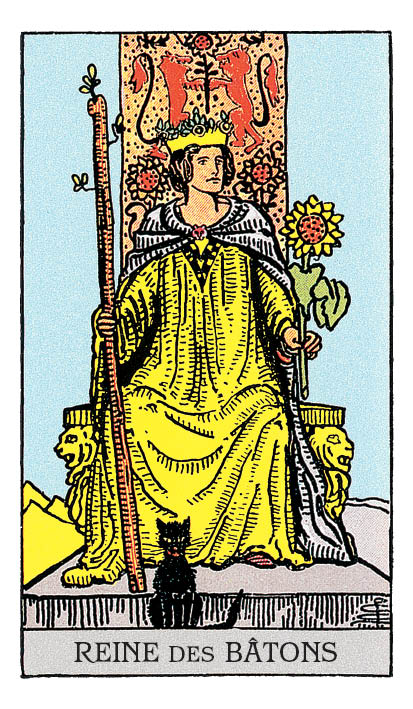

# Reine de Bâton

## Signification

**Type de Carte :** Suite : Bâtons, associée à la motivation, à la créativité, au mouvement et aux réalisations
**Élément :** le Feu
**Numérologie / Rang :** Dans les Cartes de Cour, la Reine est une présence douce et rassurante, qui exprime le côté féminin (Yin) des choses : prendre soin, nourrir, aider. La Reine maitrise les qualités de sa Suite et cette maitrise s'exprime de façon subtile, douce. Persuasive, la Reine sait convaincre sans imposer.
**Caractéristiques :** Dans un Tirage, les Cartes de Cour ou Honneurs peuvent représenter des personnes dans la vie du Consultant. Associées à la Suite des Bâtons, ces personnes peuvent être Bélier, Lion ou Sagittaire – les Signes de Feu. Ces personnes peuvent avoir les cheveux auburn ou roux, les yeux verts ou marron. Ces personnes sont fougueuses, fonceuses et motivées.

## Description

Une reine est assise sur un trône décoré de lions, symboles de force et de courage. De sa main droite, elle tient un Bâton tel un sceptre. De la main gauche, elle tient un tournesol, fleur de Soleil qui symbolise la joie et l'Abondance. L'impression de chaleur est encore renforcée par le jaune rayonnant de sa robe. Un chat noir est assis à ses pieds.

## Mots-clés

### À l'endroit
- Chaleur et dynamisme
- Détermination
- Personne qui réussit ce qu'elle entreprend

### À l'envers
- Potentiel gâché
- Bouche trou, "plante verte"
- Energie qui s'étiole et s'épuise

## Interprétation

Si le Cavalier de Bâton aime foncer tête baissée et être toujours dans le feu de l'action, l'Energie dynamique de la Reine de Bâton est beaucoup plus focalisée et efficace. Cette Reine se connait très bien elle-même : elle connait ses capacités et ses limites. Elle a domestiqué ses peurs et ses pensées limitantes, symbolisées par le chat noir à ses pieds. Elle est donc capable de réaliser ses objectifs avec une efficacité – voire une aisance – rarement égalées…et parfois déconcertantes pour son entourage.

Energie charismatique, la Reine de Bâton attire les autres spontanément vers elle grâce à son enthousiasme et son engagement.

Dans un Tirage, la Reine de Bâton apparait pour vous rappeler que vous possédez toutes ses qualités vous aussi. Force, indépendance, courage : vous avez la capacité de faire face à vos problèmes. Vous savez ce que vous souhaitez obtenir et vous êtes déterminée à réussir. C'est sans doute le moment de prendre un risque calculé, de vous montrer créatif ou innovant dans votre approche.

Faites attention à bien gérer votre Energie dans le temps. La Reine de Bâton peut se montrer entêtée. A vouloir "ne rien lâcher" pour atteindre votre but, vous pourriez aller droit à l'épuisement.

Enfin, comme toutes les Cartes de Cour, la Reine de Bâton peut représenter une personne "de la vraie vie" dans votre entourage ou une personne que vous allez bientôt rencontrer. La Reine de Bâton représente alors une personne très assurée, aimée et respectée de tous. Cette personne a des objectifs de vie – professionnels, personnels ou spirituels – ambitieux qui sont atteints ou en bonne voie de l'être. Inspirez-vous de sa détermination, écoutez ses conseils. Ils vous sont d'une grande aide pour votre propre réussite.

## Reine de Bâton et l'Amour

Si vous recherchez l'Amour, la Reine de Bâton indique que vous n'avez pas de problème à sortir, à rencontrer du monde et à créer autour de vous un bouillonnement d'Energies positives propice à la rencontre. Restez vous-même, ayez confiance en vous et en votre capacité de plaire et de séduire. Attendez-vous à nouer des relations – romantiques ou amicales – passionnantes qui vous permettront de découvrir un peu plus votre Etre Authentique.

Si vous êtes en couple, la Reine de Bâton vous conseille de "rallumer la flamme" entre vous et votre partenaire. Vous avez une relation solide, basée sur la confiance et la connaissance profonde de l'autre. La Reine de Bâton vous invite à renouer le dialogue sur ce qui vous porte tous les deux, sur ce qui donne à votre couple sa solidité et sa longévité… pour que vous puissiez tous les deux vous y épanouir pleinement.

## Reine de Bâton et le Travail

L'opportunité que vous attendiez vous a été donnée ou alors elle le sera très prochainement… C'est donc le moment que vous attendiez ! C'est le moment de briller !

La situation requiert un engagement à 200% dans votre projet professionnel. Ne laissez pas vos peurs et vos doutes vous troubler. Au contraire, dans l'Energie de la Reine de Bâton, prenez confiance en vous. Appuyez-vous sur vos compétences et montrez pleinement votre professionnalisme et votre engagement.

Vous trouvez les mots justes, vous arrivez à convaincre. Dans votre entourage professionnel, les autres sont séduits par votre charisme et sont prêts à vous suivre, profitez-en !

## Reine de Bâton et les Finances

Dans un Tirage concernant l'argent et les finances, la Reine de Bâton est un bon signe. Elle indique que vous avez réalisé un travail sur vous-même pour comprendre d'où viennent vos difficultés. Vous acceptez les erreurs budgétaires ou les mauvaises décisions que vous avez pu prendre…et vous lâchez-prise. Nul besoin de vous punir encore et encore pour des choses sur lesquelles vous n'avez plus la main.

Vous apprenez de ces erreurs et vous êtes déterminée à ne plus les reproduire. C'est très positif car vous avez dorénavant les coudées franches pour reprendre votre budget en main… et pour le faire par vous-même, sans aide extérieure.

## Reine de Bâton et la Guidance

La Reine de Bâton est apparue pour que vous puissiez faire une pause et savourer tout le chemin spirituel que vous avez déjà parcouru. A force d'avoir "le nez dans le guidon", vous ne vous rendez plus compte du travail sur soi que vous avez déjà réalisé et vous ne voyez plus les progrès accomplis.

Certes, le voyage n'est pas fini. Pourtant, vous êtes déjà en position de partager avec d'autres ce que votre expérience vous a appris. Y avez-vous déjà songé ? Comment pourriez-vous rendre ou redistribuer vers les autres ce qui vous a été utile à vous ?

---

*Source : [Vivre Intuitif](https://vivre-intuitif.com/apprendre-le-tarot/signification/batons/reine-de-baton/)*
*Illustration : Tarot de A.E. Waite — Rider-Waite-Smith*
