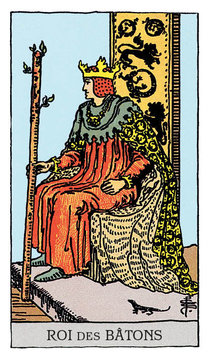

# Roi de Bâton

## Signification

**Type de Carte :** Suite : Bâtons, associée à la motivation, à la créativité, au mouvement et aux réalisations
**Élément :** le Feu
**Numérologie / Rang :** Dans les Cartes de Cour, le Roi est une présence forte et assurée, qui exprime le côté masculin (Yang) des choses : agir, persévérer, conquérir. Le Roi est la Carte de Cour qui applique le plus les qualités de sa Suite vers l'atteinte d'un objectif. Cette maitrise des qualités de la Suite s'exprime de façon évidente voire éclatante. Le Roi est visionnaire et son Energie veut changer le monde. Liés à la Carte Majeure de L'Empereur, les Rois ont le contrôle de leurs émotions et de leurs actions. Ils combinent avec efficacité leurs ressources – Energie, temps, compétences, personnalité – pour atteindre leur objectif.
**Caractéristiques :** Dans un Tirage, les Cartes de Cour ou Honneurs peuvent représenter des personnes dans la vie du Consultant. Associées à la Suite des Bâtons, ces personnes peuvent être Bélier, Lion ou Sagittaire – les Signes de Feu. Ces personnes peuvent avoir les cheveux auburn ou roux, les yeux verts ou marron. Ces personnes sont fougueuses, fonceuses et motivées.

## Description

Le Roi de Bâton est représenté de profil, assis sur son trône. Il tient fermement à la main un bâton sur lequel de petites feuilles de Printemps poussent. Il est habillé de rouge et de orange. Sa couronne semble être faite de flammes. Ces couleurs dynamiques rappellent l'Elément Feu et représentent sa créativité et sa motivation. Le Lion – symbole de Force – et la Salamandre – symbole d'Immortalité – ornent son vêtement.

## Mots-clés

### À l'endroit
- Entreprenariat, esprit de conquête
- Détermination
- Charisme, éloquence

### À l'envers
- Tyran
- Personnage sexiste, misogyne
- Manque de vision, de talent

## Interprétation

Moins passionné que le Cavalier de Bâton, le Roi de Bâton n'est cependant pas dénué de charme ou de charisme et il sait comment l'utiliser !

L'Energie du Roi de Bâton – incarnée par un homme ou une femme – est synonyme de puissance, de pouvoir. C'est une Energie intense, créative, vigoureuse et parfois même intimidante. Expert à lever les blocages et à vaincre les obstacles, il exprime toujours la vérité, même si elle est douloureuse.

Dans un Tirage, le Roi de Bâton vous invite à utiliser les qualités qui font sa force – et que vous avez en vous – afin de changer les habitudes et les comportements qui vous désservent. Son Energie vous accompagne pour "prendre le lead" et pour ne plus vous voir comme une victime des circonstances ou de votre environnement.

Le Roi de Bâton vous invite également à ne pas avoir peur des challenges mais de les accueillir et de les vivre pleinement. Pour réussir, vous pouvez vous appuyer sur votre détermination, le "travail de fond" que vous faites depuis longtemps et que vous faites très bien. Vous pourriez aussi, chemin faisant, entrainer d'autres personnes avec vous vers un succès collectif en adéquation avec vos valeurs.

Le Roi de Bâton sait toujours dans quelle direction il va et prend ses décisions en fonction de son plan d'action. Si vous utilisez vous aussi cette vision stratégique, si vous anticipez, vous pouvez vous aussi atteindre vos objectifs. Ne perdez pas de temps avec les projets ou les personnes qui ne concourent pas à l'atteinte de votre but.

Enfin, comme toutes les Cartes de Cour, le Roi de Bâton peut représenter une personne "de la vraie vie" dans votre entourage ou une personne que vous allez bientôt rencontrer. Le Roi de Bâton représente alors une personne en position d'autorité, un responsable, un manager ou un expert dans son domaine. C'est le mâle ou la femelle Alpha par excellence – une personne en position de supériorité par rapport aux autres, position qu'elle a gagnée grâce à ces compétences, son charisme et sa détermination. C'est une personne qui inspire le respect, parfois la crainte et qui peut se montrer très sûre d'elle, voire arrogante.

## Roi de Bâton et l'Amour

Si vous recherchez l'Amour, le Roi de Bâton indique que vous êtes prête à utiliser votre charisme et votre charme pour séduire et faire de belles rencontres. En miroir, le Roi de Bâton indique qu'une personne charismatique, charmante pourrait bientôt faire irruption dans votre vie. Cette personne présente un potentiel relationnel indéniable pour le long terme… mais il faudra vous montrer "à la hauteur", captiver son attention et faire vraiment chavirer son cœur.

Si vous êtes en couple, le Roi de Bâton indique que la magie de la passion opère aussi bien sur le plan sensuel que sur le plan relationnel entre vous deux. Votre relation est profonde. Votre partenaire a beaucoup de choses à partager avec vous et apprécie ce rôle de mentor qu'il ou elle joue parfois auprès de vous.

Si vous traversez des difficultés dans votre couple, utilisez l'Energie du Roi de Bâton pour casser les habitudes et ne pas retomber encore et encore dans les mêmes difficultés et problèmes de communication. Quels sont les freins à votre harmonie de couple ? Comment pouvez-vous, ensemble, lever les obstacles à un cheminement serein ? Il est possible que Roi de Bâton soit ici un expert – conseiller conjugal, thérapeute – et que le recours à ses services soit nécessaire pour que vous puisez exprimer vos difficultés respectives et coconstruire des solutions.

## Roi de Bâton et le Travail

Dans le domaine professionnel, le Roi de Bâton est apparu pour vous conseiller de vous mettre dans son Energie, d'aborder vos projets comme il le ferait lui. Que vous soyez en recherche d'emploi, en montage de projet ou installé dans votre poste, vous avez beaucoup d'idées pour aller plus loin, pour améliorer les choses. Soyez encore plus créative. Allez encore plus loin pour affiner votre vision et imaginer les actions à mettre en oeuvre. Exprimez vos idées avec audace ou commencez à les implémenter avec confiance.

Il est possible que le Roi de Bâton soit apparu pour présager une prise de responsabilités importantes de votre part. Carte de pouvoir, le Roi de Bâton indique que vous pourriez vous révéler dans ce nouveau rôle. Il indique que vous avez grandi professionnellement, que vous avez acquis l'expérience suffisante et développé les compétences nécessaires pour réussir ce nouveau challenge.

## Roi de Bâton et les Finances

Dans les Tirages de Tarot concernant l'Argent, le Roi de Bâton indique que vous avez pris de mauvaises habitudes quant à la gestion de vos finances. Il n'est cependant jamais trop tard pour bien faire.

Le Roi de Bâton représente une aide extérieure, un coach ou un "mentor" qui vous prodigue les bons conseils pour remettre votre budget "dans le vert". Trouvez dans votre entourage cette personne a qui "tout réussi" financièrement parlant. Ensuite, c'est à vous de prendre les bonnes mesures pour suivre ses conseils au mieux.

Cette aide extérieure pourrait aussi prendre la forme d'un partenariat, d'une proposition d'investissement avantageuse. Le Roi de Bâton peut aussi incarner la création d'une activité ou d'une entreprise.

## Roi de Bâton et la Guidance

Le Roi de Bâton ne permet à aucun obstacle de ralentir son cheminement ni son développement personnel. Pourquoi ? Parce qu'il sait qu'il est toujours possible de grandir, de s'améliorer pour atteindre l'harmonie et la guérison émotionnelle. Il sait aussi que sa Lumière est unique et qu'il peut l'utiliser pour réchauffer ses proches, pour illuminer le Monde.

Vous aussi vous êtes un Roi de Bâton. Le saviez-vous ?

---

*Source : [Vivre Intuitif](https://vivre-intuitif.com/apprendre-le-tarot/signification/batons/roi-de-baton/)*
*Illustration : Tarot de A.E. Waite — Rider-Waite-Smith*
