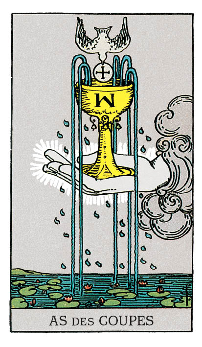

# As de Coupe

## Signification

**Type de Carte :** Arcane Mineur de la Suite des Coupes associée aux sentiments, aux émotions et à l'amour
**Élément :** l'Eau
**Numérologie / Rang :** 1, associé au commencement, aux opportunités

## Description

Une main apparait dans le Ciel. Elle sort des nuages pour tendre une Coupe qui rappelle un Calice ou le Saint Graal. Sur cette Coupe, la lettre W évoque sans doute l'initiale du créateur du Tarot A.E. Waite. De l'eau jaillit de la Coupe pour se répandre sur un plan d'eau et ses nénuphars. Ces fleurs symbolisent la montée des pensées et des désirs inconscients vers la conscience. Une colombe apporte une hostie, symbole de l'incarnation de l'Esprit dans le Monde matériel.

## Mots-clés

### À l'endroit
- Nouvel Amour
- Abondance, guérison émotionnelle
- Emotions difficiles à contenir

### À l'envers
- Emotions refoulées ou bloquées
- Déception sentimentale

## Interprétation

Comme tous les As du Tarot, l'As de Coupe vous invite à saisir l'opportunité qui vous est offerte, à boire le contenu de la Coupe. La promesse ? Amour, satisfaction et guérison émotionnelle ! Pour l'obtenir, l'As de Coupe vous demande de prendre les choses en main, d'être active dans cette recherche de bonheur et de stabilité émotionnelle. Il est possible que vous ayez à prendre un risque – exprimer vos sentiments, exprimer ce que votre coeur désire – pour que ce flot d'Amour et d'Abondance vous arrive. Avec l'As de Coupe, il est question également de "flow", le flux des émotions, de l'Energie échangée entre deux personnes. L'As de Coupe indique une nouvelle relation d'amour ou d'amitié qui promet bonheur et compréhension mutuelle. Il peut indiquer aussi que pour que ce "flow" reprenne, une discussion à "coeur ouvert" doit avoir lieu. Il peut être question de pardonner, de demander pardon, d'oublier colère et regret pour "redémarrer à zéro" avec un proche. L'As de Coupe est aussi une Carte qui symbolise la Loi de l'Attraction. Si l'As de Coupe parle de recevoir, cette Carte vous demande aussi de donner. C'est le bon moment pour exprimer votre générosité, pour partager, pour donner "un peu de vous même" sous quelque forme que ce soit. Enfin, dans les Tirages divinatoires, l'As de Coupe peut annoncer une grossesse, une naissance.

## As de Coupe et l'Amour

L'As de Coupe est une des meilleures Cartes dans un Tirage amoureux, surtout si vous recherchez l'Amour. N'attendez pas passivement que l'Univers mette sur votre route votre Ame-Soeur. Partez activement à sa rencontre ! Vous rencontrerez bientôt une personne qui fera chavirer votre Coeur. Si vous êtes en couple, l'opportunité vous est offerte d'avancer dans la relation – par un mariage ou un enfant par exemple – ou de "repartir à zéro", si la relation a été marquée par des difficultés récemment. La clé est de ressentir et d'exprimer la connexion émotionnelle que vous avez l'un à l'autre.

## As de Coupe et le Travail

Dans le domaine professionnel, l'As de Coupe indique qu'une opportunité intéressante va se présenter à vous. C'est donc une très belle Carte si vous recherchez un travail ou une nouvelle opportunité professionnelle ou que vous démarrez votre activité. L'As de Coupe indique que le plus important pour vous, à ce stade de votre carrière, est votre investissement émotionnel dans votre travail. Vous avez envie que votre travail vous plaise mais surtout, vous avez besoin que vos activités aient du sens. Cette passion peut revenir dans votre vie professionnelle si un renouveau est possible – amélioration des relations, nouvelles responsabilités… soit parce que vous décidez de changer purement et simplement d'activité.

## As de Coupe et les Finances

L'As de Coupe est une Carte synonyme d'Abondance. Elle est donc un très bon signe dans un Tirage concernant les finances. Toutefois, dans ce domaine, les émotions ne doivent pas prendre le pas sur la réflexion et la planification. Il faut toujours travailler à créer l'Abondance, même avec une Carte qui semble vous la servir sur un plateau d'argent. L'As de Coupe indique que le moment est tout choisi pour reprendre en main votre budget avec un "regard neuf", via une nouvelle approche ou un nouvel outil par exemple.

## As de Coupe et la Guidance

L'As de Coupe symbolise l'Energie d'une personne qui est dans le "flow" avec les autres. Cette personne exprime ses émotions avec aisance et fait état de ses sentiments sans s'en excuser. Est-ce votre cas ? Avez-vous tendance, à l'inverse, à garder vos émotions pour vous ? A les refouler ? L'Energie de l'As de Coupe vous permet de vous connecter à vos émotions (et à votre Intuition !) pour les ressentir pleinement, les travailler si besoin et avancer vers la guérison émotionnelle. Utilisez-la !

---

