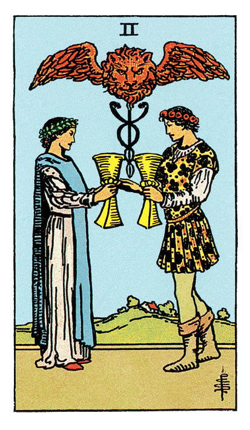

# Deux de Coupe

## Signification

**Type de Carte :** Arcane Mineur de la Suite des Coupes associée aux sentiments, aux émotions et à l'amour
**Élément :** l'Eau
**Numérologie / Rang :** 2, associé au couple, à l'équilibre et au choix

## Description

Un homme et une femme se font face. Ils échangent la Coupe qu'ils tiennent à la main. Avec leur couronne de laurier et de fleurs dans les cheveux, leur jolie tenue, ils semblent participer à une cérémonie d'union ou à un Rituel magique. Leur échange est scellé sous un Caducée. Le Caducée est un attribut du Dieu Hermès. Il symbolise la protection, l'harmonie et l'échange équitable. Comme pour la Carte de La Force, la présence du Lion évoque la sensualité et l'attraction entre les deux personnages.

## Mots-clés

### À l'endroit
- Amour, attirance, romantisme
- Relation, partenariat, mariage
- Compréhension mutuelle, soutien

### À l'envers
- Incompréhension, disputes
- Se séparer, rompre un partenariat
- Se désintéresser de quelqu'un ou d'un projet

## Interprétation

Comme la Carte des Amoureux ou la Carte du Diable, le Deux de Coupe représentent un homme et une femme et évoque nécessairement la notion de couple. Ici, chacun apporte à l'autre ce qu'il possède de plus beau – le contenu de sa Coupe – c'est à dire ses émotions, son Intuition et ses sentiments. Ici, pas de faux semblants. Pas de tricherie ni d'artifice. La relation est basée sur une attirance mutuelle, un respect profond et le besoin d'aimer l'autre, de le comprendre et de le soutenir. Dans cette Energie, il est question de bienveillance et de considération partagées. De fait, dans les Tirages de Tarot, le Deux de Coupe est un indicateur très fort d'attirance et de sentiments réciproques. Si le Deux de Coupe évoque l'amour "romantique", il peut aussi s'agir d'amour filial ou d'amitié. Le Deux de Coupe peut aussi évoquer un partenariat ou un projet dans lequel vous mettez "tout votre coeur". Dans ce projet ou partenariat, chacune des parties est aussi impliquée et "gagnante" que l'autre. Le Deux de Coupe annonce parfois des fiançailles, un mariage ou une union. La Carte évoque l'engagement que les deux personnes ou les deux parties prennent l'une envers l'autre, c'est à dire l'engagement de veiller aux besoins physiques et émotionnels de l'autre. Enfin, le Deux de Coupe représente aussi la valeur de chaque individu. Le contenu de la Coupe que chacun apporte à l'autre est unique, inestimable. Le Deux de Coupe invite le Consultant à prendre conscience de sa valeur, de sa beauté intérieure et de ce qu'il ou elle est en capacité d'apporter à l'autre. Sans cette prise de conscience, sans cette confiance en soi, la rencontre avec l'autre, la séduction ou le partenariat ne peuvent pas advenir.

## Deux de Coupe et l'Amour

Le Deux de Coupe est un excellent signal dans les Tirages de Tarot concernant l'Amour et le domaine amoureux. Si vous recherchez l'Amour avec un grand "A", le partenaire que vous attendez avec impatience pourrait faire irruption dans votre vie. Vous reconnaitrez cette personne à la profonde connexion émotionnelle que vous partagerez et à votre attirance réciproque. Cette histoire d'amour peut se mettre en place assez vite car l'entente est harmonieuse, la communication très fluide entre vous deux. Vous avez le sentiment d'avoir enfin rencontré la bonne personne. Si votre relation a démarré en mode "on verra bien, pour l'instant je profite", il se pourrait que les choses deviennent rapidement bien plus sérieuses. Si votre couple connait des difficultés, le Deux de Coupe indique que vous avez tous les deux les cartes en main pour réparer votre relation, pour pardonner ce qui doit l'être et avancer à nouveau ensemble. Vous êtes tous les deux dans de bonnes dispositions pour comprendre le point de vue de l'autre et retrouver l'harmonie.

## Deux de Coupe et le Travail

Dans un Tirage de Tarot concernant le travail, le Deux de Coupe indique qu'un partenariat professionnel ou un nouvel emploi se profile. L'Energie de cette Carte est très positive ! Les parties sont enthousiastes à l'idée de se lancer et de travailler ensemble. Les objectifs de chacun convergent vers le succès. La relation est très complémentaire : les forces et idées de l'un viennent renforcer celles de l'autre. Le Deux de Coupe indique également que vous ne devez pas avoir peur d'apporter votre pierre à l'édifice. Sollicitez des projets ou des responsabilités. Montrez que vous pouvez aider, faire partie de l'équipe. Vos compétences seront identifiées par les collègues et la hiérarchie comme essentielles.

## Deux de Coupe et les Finances

Le Deux de Coupe est d'abord une Carte de partage et de partenariat. C'est donc vers votre partenaire qu'il faut vous tourner pour vous mettre d'accord sur ce que vous voulez faire de vos finances. Pour atteindre vos objectifs financiers, vous devez vous y mettre tous les deux et vous tenir aux décisions prises. Soyez en soutien l'un pour l'autre, soyez responsable l'un pour l'autre et communiquez vos craintes et vos succès. A défaut de partenaire dans votre vie, trouvez une personne de confiance qui pourra jouer ce rôle d'écoute et vous aider à vous responsabiliser quant à votre budget. Le Deux de Coupe peut aussi annoncer une opportunité de partenariat (investissement, entreprise…) avec une personne de votre entourage.

## Deux de Coupe et la Guidance

Le Deux de Coupe représente deux personnages qui s'apportent mutuellement le meilleur : le contenu de leur Coupe. Quel est le contenu de \*votre\* Coupe ? Quelles sont vos plus belles qualités ? Quels sont les plus beaux gestes que vous pratiquez au quotidien pour les autres ? Si Jean-Paul Sartre écrivait "L'enfer, c'est les autres", le Deux de Coupe reflète que les autres sont essentiels à votre cheminement spirituel. La compassion, la vérité ou encore la communication bienveillante n'ont de sens que parce qu'elles prennent vie \*pour\* les autres.

---

*Source : [Vivre Intuitif](https://vivre-intuitif.com/apprendre-le-tarot/signification/coupes/deux-de-coupe/)*
*Illustration : Tarot de A.E. Waite — Rider-Waite-Smith*
