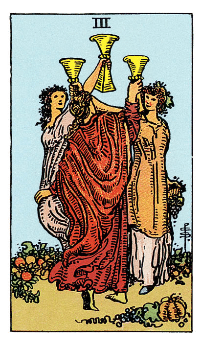

# Trois de Coupe

## Signification

**Type de Carte :** Arcane Mineur de la Suite des Coupes associée aux sentiments, aux émotions et à l'amour
**Élément :** l'Eau
**Numérologie / Rang :** 3, associé à la création, à la collaboration et à l'abondance

## Description

Trois jeunes femmes dansent en cercle et lèvent leur Coupe, en signe de fête et de célébration. Leur bras s'entre-mêlent comme pour symboliser l'amitié qui les lie, la connexion qu'elles ont les unes aux autres. Elles portent également chacune une couronne, signe de victoire et de succès. Le sol est couvert de fruits, l'abondance et la joie règnent dans ce jardin. C'est la fête ! L'Energie qui se dégage est festive, joviale et solidaire.

## Mots-clés

### À l'endroit
- Joie, amitié, soutien des proches
- Fête, célébration
- Réussite, succès

### À l'envers
- Manque de soutien
- Se réjouir trop vite, vendre la peau de l'ours avant de l'avoir tué
- Déconvenue, raté, erreurs
- Triangle amoureux

## Interprétation

Il y a peu de Cartes dans le Tarot qui représentent une activité de groupe. Le Hiérophant enseigne à une classe, les personnages du Trois de Denier co-construisent leur projet… et les trois jeunes femmes du Trois de Coupe célèbrent leur amitié, dans la joie et la bonne humeur ! Le Trois de Coupe est « la » Carte de la fête et des célébrations : mariage, vacances, fêtes et rassemblements joyeux. Son Energie est donc solidaire, festive, amusante, voire "décalée". Il s'agit d'être dans un moment qui sort de l'ordinaire, qui vous connecte aux autres, à votre "tribu", votre Communauté… pour renforcer les liens et faire du bien à l'Ame. L'Energie est débordante et le moral est au beau fixe. C'est stimulant et grisant ! Plus encore, cette Carte parle d'être et de vibrer ensemble, avec les personnes les plus chères à notre coeur. Le Trois de Coupe évoque donc la solidarité, la communauté, ce facteur qui nous relie aux autres, ce qui nous fait dire « On est fait du même bois ! » C'est une Carte de compréhension mutuelle et d'empathie. Si vous vous sentez isolée ou « déconnectée » des autres au moment du Tirage, le Trois de Coupe annonce une période d'ouverture ou une vie sociale plus riche. C'est le moment d'appeler les amis – anciens ou nouveaux – et d'organiser une sortie, une fête… Pas seulement pour se changer les idées, mais pour retrouver les autres et se (re)lier au Monde.

## Trois de Coupe et l'Amour

Le Trois de Coupe est une très belle Carte quand il s'agit d'amour dans un Tirage puisqu'elle évoque la compréhension mutuelle, le soutien et des sentiments partagés. Si vous êtes célibataire, vous pouvez vous appuyer sur vos ami(e)s et votre réseau pour faire des rencontres intéressantes. Tous les événements impliquant la notion de groupe ne sont pas à négliger non plus : cours collectif, concerts, réunions… Si vous traversez une période difficile dans votre couple, le Trois de Coupe peut symboliser un triangle amoureux. Quelque chose ou quelqu'un s'immisce dans votre couple et trouble son harmonie.

## Trois de Coupe et le Travail

Dans le domaine du travail, le Trois de Coupe signifie qu'il est grand temps pour vous de célébrer vos victoires – petites ou grandes – avec les collègues, vos associés ou vos collaborateurs. Le succès est souvent le résultat d'un travail en équipe. C'est le moment de remercier ceux qui œuvrent à la réussite et d'apprécier pleinement leur contribution. Le Trois de Coupe indique également qu'au travail comme ailleurs, il faut savoir s'entourer. Si vous recherchez du travail ou de nouvelles opportunités, vous devez vous appuyer sur votre réseau – famille, proches, amis – pour élargir votre champ des possibles.

## Trois de Coupe et les Finances

Le Trois de Coupe est d'abord une Carte d'abondance et de plaisir partagé. De fait, si le Tirage porte sur les finances du Consultant, on peut raisonnablement en déduire que si la situation financière est difficile en ce moment, elle devrait s'améliorer. Le Trois de Coupe rappelle également que même si « les temps sont durs », se faire plaisir à soi reste une nécessité. Si le Consultant a tendance à faire passer les besoins des autres avant les siens, le Trois de Coupe rappelle que ses besoins sont tout aussi importants que ceux des autres.

## Trois de Coupe et la Guidance

Le Trois de Coupe vous invite à réfléchir aux sources de joie et de plaisir de votre vie, notamment celles partagées avec vos proches. Quelle place vos proches prennent-ils dans vos moments de bonheur ? Comment fêtez-vous vos « victoires » – petites ou grandes ? Le Trois de Coupe suggère que le bien-être passe aussi par l'attachement aux autres, les activités partagées et les moments passés en groupe. Etes-vous beaucoup présent(e) pour les autres ? Qui est présent dans votre entourage pour vous soutenir vous ?

---

