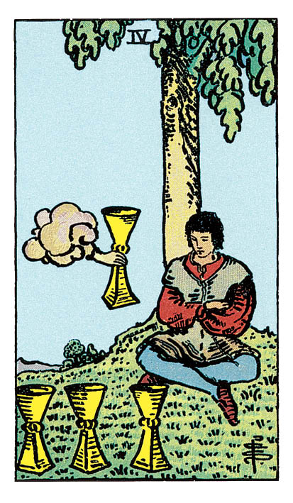

# Quatre de Coupe

## Signification

**Type de Carte :** Arcane Mineur de la Suite des Coupes associée aux sentiments, aux émotions et à l'amour
**Élément :** l'Eau
**Numérologie / Rang :** 4, associé à la stabilité, aux fondations, aux bases

## Description

Le Quatre de Coupe représente un personnage assis sous un arbre, le visage éteint. Il a les bras croisés, sa posture est fermée. Il ne semble pas s'intéresser à la Coupe qui lui est tendue par une main "magique" tout droit sortie d'un nuage comme sur la Carte de l'As de Coupe. Il ne semble pas s'intéresser non plus aux trois autres Coupes posées devant lui. Méditation ou bouderie, ce personnage est tellement absorbé par ses propres pensées qu'il ne voit pas les cadeaux, opportunités ou belles personnes autour de lui.

## Mots-clés

### À l'endroit
- Ennui, apathie, se sentir "vide"
- Méditer, réfléchir à sa vie
- Cadeau, opportunité manqués

### À l'envers
- Regain d'enthousiasme
- Opportunité saisie

## Interprétation

Il y a des moments dans la vie où "ça ne va pas trop" mais on ne sait pas bien pourquoi. On peut avoir "tout pour être heureux" et pourtant ressentir un manque, une insatisfaction. Il y a aussi des moments dans la vie où "on en a marre". On ressent de l'ennui, un manque de motivation, on "décroche" au travail, dans son couple ou vis à vis de ses proches. Le Quatre de Coupe vous conseille de plonger à l'intérieur de vous-même pour évaluer sereinement votre situation. Vous devez mettre des mots sur vos émotions. Vous avez besoin d'identifier ce qui vous manque ou ce qui vous ferait retrouver votre "drive", ce qui vous ferait vibrer. Pour sortir de l'ennui et de l'apathie, c'est votre Etre Authentique que vous devez réveiller pour bénéficier de tous les cadeaux que la vie peut vous offrir… si vous êtes prête à les accepter. Le Quatre de Coupe indique parfois de l'amertume, voire de la colère. C'est l'Energie de l'enfant qui boude, qui s'ennuie et qui s'obstine à refuser tout ce qu'on lui propose. Dans cette Energie, vous avez du mal à accepter les Coupes que l'Univers vous tend. Accepter une Coupe, c'est prendre un risque émotionnel, c'est ouvrir son Cœur et se laisser aller. Si vous avez été déçue ou meurtrie par le passé, nul doute que vous n'avez pas envie de recommencer. Demandez-vous si votre refus est motivé par la peur ou si votre refus reflète un véritable manque d'intérêt de votre part. Enfin, si une opportunité se présente à vous, le Quatre de Coupe vous invite à réfléchir à tous les tenants et les aboutissants. S'il vous manque des informations, si vous n'êtes pas encore tout à fait émotionnellement et psychologiquement à l'aise avec ce choix, rien ne presse. Donnez-vous le temps de la réflexion. Donnez-vous la possibilité de ressentir si votre Cœur le veut vraiment.

## Quatre de Coupe et l'Amour

Si vous recherchez l'Amour, le Quatre de Coupe indique que vous avez peut-être "zappé" une personne qui se trouve là, tout près de vous ! Il est possible également que vous ayez écarté ou même éconduit un certain nombre de prétendants. Le Quatre de Coupe vous conseille de regarder en vous et d'apprécier une nouvelle fois vos critères de choix en Amour. Qu'est-ce qui, pour vous, constitue la personne "idéale", celle avec qui vous avez envie de partager et d'être vraiment vous-même ? Quels sont les traits de personnalité ou les points communs que vous recherchez ? Cette mise au point est nécessaire pour que vous puissiez ouvrir les yeux sur \*la\* bonne personne. Si vous êtes en couple et notamment si vous rencontrez des difficultés, le Quatre de Coupe vous invite à réfléchir de votre côté sur votre couple mais attention à ne pas vous couper de votre partenaire. Vous avez besoin de faire le point sur ce que vous attendez de la relation de façon à pouvoir l'exprimer clairement à votre partenaire.

## Quatre de Coupe et le Travail

Dans un Tirage concernant le travail, le Quatre de Coupe indique votre ennui, votre insatisfaction quant à votre situation professionnelle actuelle. Il est possible que vous vous soyez mise en retrait de vos collègues, de votre hiérarchie, de vos projets. Vous vous sentez professionnellement "sur la touche" et ce que vous faites aujourd'hui ne vous permet plus de "grandir", d'acquérir de nouvelles compétences, de relever des challenges. Il faut donc réagir ! Qu'avez-vous envie de faire ? Qu'est-ce qui vous ferait "vibrer" professionnellement parlant ? Le challenge est-il plus important pour vous que le relatif confort de la routine ? Prenez le temps de la réflexion et au besoin faites-vous aider dans votre analyse par un bilan de compétences. Si vous recherchez un emploi, assurez-vous que vous recherchez dans un domaine qui vous plaît vraiment et n'hésitez pas à bien "explorer" l'opportunité qui vous est présentée avant de l'accepter. Pesez le pour et le contre. Un avantage comme un salaire plus élevé par exemple peut cacher un inconvénient majeur comme plus de temps de déplacement.

## Quatre de Coupe et les Finances

Dans un Tirage concernant les finances ou l'Abondance, le Quatre de Coupe peut se révéler ambigu. Il est possible que vous ratiez le coche d'une belle opportunité par entêtement ou parce que vous n'y voyez pas l'intérêt pour l'instant. Si vous avez identifié une opportunité financière – nouvel emploi, investissement, création de votre activité… – le Quatre de Coupe vous invite à y aller doucement, à bien réfléchir. Cette opportunité vous rapproche-t-elle de votre objectif financier ? Est-ce "trop beau pour être vrai" ? Il est possible que vous manquiez d'information à ce stade pour prendre une décision avisée.

## Quatre de Coupe et la Guidance

Le verre (ou la Coupe !) est-il à moitié vide ou à moitié plein ? Pour le Quatre de Coupe qui bougonne, il est à moitié vide, cela ne fait aucun doute. Si vous ressentez vous aussi cette Energie du manque, le Quatre de Coupe vous demande de prendre conscience de ce que vous avez de bon et de positif dans votre vie. Ressentez de la Gratitude. Il n'est pas interdit d'explorer votre Cœur pour mettre des mots sur vos émotions et sur ce manque. Qu'est-ce qui vous manque au juste ? Et comment pourriez-vous l'obtenir ? Une Coupe à moitié vide ne demande qu'à être remplie des découvertes de votre cheminement spirituel.

---

*Source : [Vivre Intuitif](https://vivre-intuitif.com/apprendre-le-tarot/signification/coupes/quatre-de-coupe/)*
*Illustration : Tarot de A.E. Waite — Rider-Waite-Smith*
