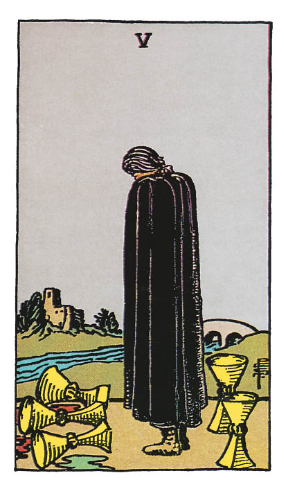

# Cinq de Coupe

## Signification

**Type de Carte :** Arcane Mineur de la Suite des Coupes associée aux sentiments, aux émotions et à l'amour
**Élément :** l'Eau
**Numérologie / Rang :** 5, associé au déséquilibre, aux tournants et aux moments décisifs

## Description

Le Cinq de Coupe représente une grande silhouette drapée de noir qui cache son visage et son chagrin. Ce personnage regarde trois Coupes dont le contenu est renversé à ses pieds. Derrière lui, deux autres Coupes sont restées debout mais il ne semble pas les voir. Le ciel, parfaitement clair, contraste avec son vêtement d'un noir profond, couleur de deuil. Au loin, une rivière le sépare d'une bâtisse qui symbolise le confort, le réconfort du foyer. Un pont enjambe la rivière.

## Mots-clés

### À l'endroit
- Déception, trahison
- Perte, deuil
- Problème relationnel, séparation

### À l'envers
- Avancer vers la guérison émotionnelle
- Pardonner
- Accepter une situation douloureuse

## Interprétation

Dans le Tarot, le Cinq de Coupe est \*la\* Carte du deuil et de la douleur morale. Vous êtes déçue par les événements et les circonstances actuels. Vous avez tout donné, tout essayé… mais les choses ne se sont pas passées comme vous le vouliez. Vous avez perdu une bataille et ce qu'il vous reste, c'est la fatigue, la tristesse et l'amertume. Le Cinq de Coupe indique que vous vous accrochez aux souvenirs, au passé. Vous aimeriez tant pouvoir revenir en arrière, ne pas avoir vécu cette épreuve ou ne pas avoir fait telle ou telle erreur. Il est possible que les regrets – ou les remords ! – vous culpabilisent énormément. Le Cinq de Coupe est apparu pour vous accompagner vers l'étape suivante, pour vous dire qu'il est temps d'entrer dans une nouvelle dynamique et de reprendre votre cheminement. Il ne s'agit pas de faire l'autruche mais de comprendre ce qui s'est passé. Il s'agit de ne pas reproduire les mêmes erreurs et avancer avec résilience. Malgré la douleur, malgré les déceptions, deux Coupes sont encore en place. Le Cinq de Coupe vous invite donc à voir – autant que possible – ce que vous avez encore et ce sur quoi vous pouvez vous appuyer pour sortir de cette épreuve encore plus forte. Ressentez de la Gratitude pour le contenu de ces Coupes et appliquez-vous à regarder devant.

## Cinq de Coupe et l'Amour

Si vous recherchez l'Amour, le Cinq de Coupe indique que vous avez probablement encore du chemin à parcourir en terme de guérison émotionnelle pour être prête à accueillir une nouvelle personne dans votre Coeur et votre vie. Vous avez peut-être encore des sentiments pour une personne ou vous n'avez pas encore tout à fait "digéré" une rupture. Le Cinq de Coupe peut également indiquer que la personne avec qui vous comptiez construire une relation stable n'est pas sur la même longueur d'onde et cela vous attriste énormément. Peut-être attendiez-vous trop de cette relation trop tôt ? Peut-être que cette personne n'est pas faite pour vous ? L'essentiel est de comprendre comment vous fonctionnez et ce que vous attendez de l'autre pour avancer et rencontrer enfin \*la\* bonne personne. Si vous êtes en couple, le Cinq de Coupe indique que votre relation est émaillée de problèmes, de difficultés de communication. Cela génère beaucoup de tristesse et d'incompréhension de part et d'autre. Vous avez déjà beaucoup pleuré, beaucoup espéré… mais votre couple n'est pas à la hauteur de vos attentes. Si le point de non-retour est atteint, donnez-vous une chance de trouver \*le\* partenaire qui construira avec vous le couple que vous voulez et que vous méritez.

## Cinq de Coupe et le Travail

Dans un Tirage concernant le travail, le Cinq de Coupe indique un regret de votre part. Vous avez peut-être mal négocié votre poste, fait une erreur dans un dossier important ou vous vous êtes trompée de stratégie. Il est contre-productif de vous apitoyer sur votre sort. Avec les ressources qu'il vous reste (les deux Coupes), frayez-vous un chemin pour sortir de cette ornière professionnelle. Si vous recherchez un emploi, vous savez que ce processus est long et qu'il est souvent ponctué d'espoirs déçus. Ne laissez pas les refus entamer votre moral et gardez le cap sur votre objectif. Si vous ne décrochez aucun entretien, si vous n'avez absolument aucune "touche" dans le domaine dans lequel vous recherchez, il est sans doute nécessaire de réévaluer la situation. Vous avez des compétences et des possibilités vont s'offrir à vous (les deux Coupes encore debout) mais vous devez aller les chercher au bon endroit en fonction de votre profil et de votre expérience.

## Cinq de Coupe et les Finances

Dans un Tirage concernant les finances ou l'Abondance, le Cinq de Coupe indique que vous avez des difficultés à gérer votre budget. Pardonnez-vous les erreurs de gestion que vous avez pu commettre et prenez l'engagement de ne pas les reproduire. Le Cinq de Coupe peut également annoncer une perte financière ou un contretemps dans vos projets financiers. Faites le "dos rond" et tirez les bons enseignements de cette situation.

## Cinq de Coupe et la Guidance

Le Cinq de Coupe est apparu pour vous accompagner vers la guérison émotionnelle. Quand vous ressentez du chagrin, quelle est votre stratégie pour faire face à vos émotions et apaiser votre Coeur ? Avez-vous tendance à vous culpabiliser, à rester engluée dans les regrets ? Le Cinq de Coupe vous invite à voir le contenu des deux Coupes encore debout. Pour vous aider, vous avez en vous deux outils incroyables : l'Intuition et la Résilience. La première vous permet de vous connecter à votre sagesse intime, à vos Guides, pour y trouver réconfort et Guidance. La deuxième vous permet d'aller de l'avant sans oublier, de (vous) pardonner ce qui doit l'être. Avec Intuition et Résilience, autorisez-vous à lâcher-prise sur les douleurs du passé et focalisez-vous sur l'avenir. Travaillez à des projets optimistes et générez de l'Energie positive autour de vous.

---

*Source : [Vivre Intuitif](https://vivre-intuitif.com/apprendre-le-tarot/signification/coupes/cinq-de-coupe/)*
*Illustration : Tarot de A.E. Waite — Rider-Waite-Smith*
