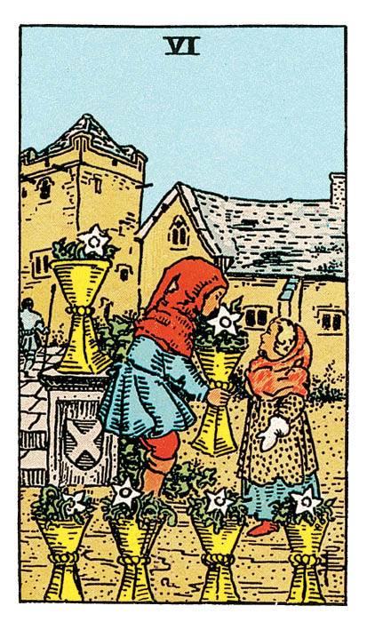

# Six de Coupe

## Signification

**Type de Carte :** Arcane Mineur de la Suite des Coupes associée aux sentiments, aux émotions et à l'amour
**Élément :** l'Eau
**Numérologie / Rang :** 6, associé à l'harmonie et à la sécurité

## Description

Le Six de Coupe représente une petite fille et un jeune garçon dans la cour d'un château. Le petit garçon donne une Coupe qui contient des fleurs à la petite fille. Cinq autres Coupes sont posées à côté d'eux, elles aussi remplies de fleurs. Il se dégage de la Carte douceur, sécurité et simplicité.

## Mots-clés

### À l'endroit
- Vivre dans le passé
- Avoir des attentes irréalistes
- Excès de naïveté

### À l'envers
- Incapacité à "lâcher prise"
- Poids du passé
- Remords ou regrets

## Interprétation

Si le Cinq de Coupe est l'expression d'un regard douloureux sur le passé, le Six de Coupe offre un dialogue avec le passé beaucoup plus doux, dans le registre de la nostalgie, de l'Energie de l'enfance, des plaisirs simples et de l'amitié vraie. Sur cette Carte, les Coupes sont à nouveau toutes debout, elles fleurissent et leur Abondance est partagée. Le Six de Coupe est apparu car vous avez le désir de revenir "aux fondamentaux", de retrouver des liens authentiques avec les personnes de votre entourage. Vous avez envie que les choses soient simples, que l'amitié soit vraie "comme avant". Il est possible que vous ayez le désir de renouer des liens avec des proches ou même l'envie de retrouver des personnes que vous avez complètement perdues depuis longtemps. Ces personnes font partie de votre histoire et vous avez besoin de les retrouver comme pour compléter le puzzle de votre histoire personnelle. Il est possible également que vous soyez prête à pardonner. Le Six de Coupe indique que vous plongez dans vos souvenirs avec nostalgie. Vous souhaitez puiser dans votre histoire la force d'affronter vos difficultés ou, peut-être, trouver dans le passé la clé de vos difficultés actuelles. Cette exploration du passé n'est pas une mauvaise idée en soi mais attention à ce que la nostalgie ne devienne pas "maladive" ou un échappatoire. Appliquez-vous à comprendre vos succès et les choses positives du passé pour que leur Energie puisse vous servir aujourd'hui. Enfin, le Six de Coupe symbolise l'enfant intérieur qui sommeille en chacun de nous. Il est probable que votre enfant intérieur, l'enfant que vous n'avez jamais cessé d'être, ait besoin de votre attention. Reconnaître les besoins de votre enfant intérieur et les écouter, c'est faire un pas de plus vers votre Etre Authentique pour en libérer sa créativité et sa spontanéité. Travailler avec votre enfant intérieur, c'est également reconnaître votre capacité à grandir, à vous développer sur tous les plans de votre vie. C'est vous appuyer sur votre capacité infinie de transformation pour atteindre vos objectifs actuels.

## Six de Coupe et l'Amour

Si vous recherchez l'Amour, le Six de Coupe peut indiquer le retour dans votre vie d'un ancien prétendant ou d'une ancienne connaissance. Dans tous les cas, la clé de la rencontre est dans votre passé : un ami de longue date, un endroit que vous avez fréquenté, un club, une association ou une activité que vous avez pratiquée. Il est temps de dépoussiérer votre carnet d'adresses… et de l'utiliser à bon escient ! Demandez à vos amis de longue date de vous présenter du monde par exemple. Si vous êtes actuellement en couple, le Six de Coupe indique que vous trouvez dans cette relation beaucoup de réconfort. Vous vous sentez entourée, comprise et vous avez envie de partager toujours plus avec votre partenaire. Si vous traversez des difficultés dans votre couple, vous vous remémorez avec nostalgie les premiers temps de votre relation et vous aimeriez que la compréhension et l'attirance de vos débuts soient encore partagées. Partagez avec votre partenaire vos émotions et vos envies. Exprimez ce que vous aviez hier et qui vous manque aujourd'hui.

## Six de Coupe et le Travail

Dans un Tirage concernant le travail, le Six de Coupe indique que votre créativité et votre côté enjoué ont besoin de s'exprimer. Vous avez besoin de "légèreté" et de simplicité. Si votre travail vous permet cette expression personnelle, c'est le moment de proposer vos idées et de faire rayonner cette belle Energie auprès de vos collègues. Si au contraire votre travail n'est pas le meilleur endroit pour accueillir votre Energie espiègle, trouvez une activité créative qui puisse répondre à vos besoins de fantaisie – cuisine, dessin, théâtre… Si vous recherchez actuellement un emploi, appuyez-vous sur votre réseau et les personnes que vous avez côtoyées professionnellement. L'opportunité pourrait venir d'une personne que vous avez connue ou d'une expérience professionnelle passée.

## Six de Coupe et les Finances

Le Six de Coupe représente un petit garçon donnant une Coupe remplie de fleurs à une petite fille. C'est un geste "tout simple" : donner avec plaisir, partager ce que l'on a. Le Six de Coupe est donc une Carte d'Abondance et de Gratitude. Si l'envie ou la peur de manquer motivent souvent les Tirages financiers, le Six de Coupe vous invite à faire l'inventaire de vos possessions matérielles et de ressentir de la Gratitude pour ce que vous avez. Dans cette Energie positive, il est possible de démultiplier l'Abondance et de partager ce qu'on a de plus cher – et qui n'a pas nécessairement de valeur marchande.

## Six de Coupe et la Guidance

Le Six de Coupe est apparu pour vous dire l'importance du Passé et de votre histoire personnelle dans votre cheminement spirituel. Vous avez envie – ou besoin – de vous reconnecter à des pratiques anciennes, à une Sagesse et à une Magie oubliées. Vous avez également besoin de vous reconnecter à votre enfant intérieur. Pour trouver plus de sens et de bonheur dans votre vie actuelle, remémorez-vous les activités qui vous procuraient satisfaction et plaisir quand vous étiez enfant. Ces centres d'intérêt sont toujours les vôtres. Combinez-les à votre expérience d'adulte pour trouver comment partager votre Lumière unique avec le Monde.

---

*Source : [Vivre Intuitif](https://vivre-intuitif.com/apprendre-le-tarot/signification/coupes/six-de-coupe/)*
*Illustration : Tarot de A.E. Waite — Rider-Waite-Smith*
