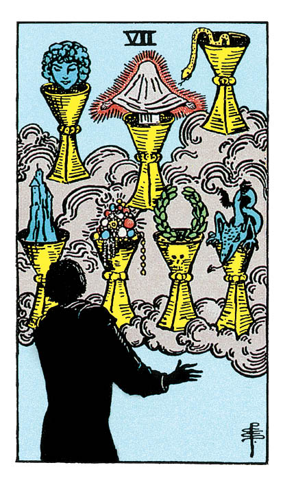

# Sept de Coupe

## Signification

**Type de Carte :** Arcane Mineur de la Suite des Coupes associée aux sentiments, aux émotions et à l'amour
**Élément :** l'Eau
**Numérologie / Rang :** 7, associé à la réflexion, à la sagesse, aux découvertes

## Description

Un personnage regarde sept Coupes qui sont apparues devant lui. Le contenu de ces Coupes est pour le moins étrange, surprenant : un fantôme, un dragon, des bijoux, une statue… Ces Coupes évoquent des rêves, des pensées, l'inconscient, le mystère… Bien que le personnage nous tourne le dos, on devine sa surprise et son émerveillement. Cela rappelle l'énergie d'un enfant devant une vitrine à Noël : Waouh !! Je veux tout ! Je prends tout ! Mais bien que ces Coupes se présentent comme des cadeaux, un sentiment de danger émane de la Carte. Parfois, face à plusieurs possibilités, toutes peuvent sembler alléchantes mais seulement l'une d'entre elles est "la bonne". Et parfois, toutes ces possibilités ne sont que des illusions…

## Mots-clés

### À l'endroit
- Illusions
- Poudre aux yeux
- Hésitation, choix
- Tentation

### À l'envers
- Lucidité
- Choix imposé
- Décision prise

## Interprétation

Le Sept de Coupe est une Carte riche et multiple… aussi fascinante que le contenu des sept Coupes apparues devant le personnage. Peut-être la percevez-vous comme une Carte négative qui indique que le Consultant vit dans « son monde », se fait des illusions ou refuse de voir la réalité en face ? Ou alors, vous voyez plutôt le Sept de Coupe de façon positive, comme une grande abondance de choix dans la vie du Consultant ? Le Sept de Coupe indique que même si rêver est une composante essentielle de la construction de son avenir, il faut savoir arrêter de rêver et passer à la phase de concrétisation. Vous avez un choix à faire et devant toutes les possibilités, vous êtes tout à la fois émerveillée, terrifiée, pétrifiée… et du coup, vous ne savez que choisir. Le Sept de Coupe vous propose donc d'évaluer avec attention les possibilités qui vous sont offertes, de peser le pour et le contre – afin de faire le meilleur choix, le choix le plus juste. Le Sept de Coupe est aussi une mise en garde : tout ce qui brille n'est pas de l'or. Attention à la poudre aux yeux, aux beaux parleurs et si c'est trop beau pour être vrai… en général, ça l'est ! Enfin, le Sept de Coupe peut évoquer la tentation. Comme nous sommes dans la Suite des Coupes, la tentation est d'ordre émotionnel, intime : relation d'un soir, amitié qui « dérape », tromperie prolongée… Vous pourriez bientôt subir les conséquences de ces comportements cachés… et les regretter si vous en êtes à l'origine.

## Sept de Coupe et l'Amour

Quand on cherche… on trouve ! Si vous recherchez l'Amour, le Sept de Coupe indique que vous avez plutôt l'embarras du choix. Attention, tous ces prétendants ne sont pas forcément sur la même longueur d'onde. Soyez claire dans vos intentions et choisissez avec prudence le partenaire avec qui vous entamez une relation. Le Sept de Coupe peut aussi indiquer que vous recherchez « le mouton à cinq pattes », c'est à dire une personne parfaite qui remplit tous vos critères, tous vos désirs. Cette personne n'existe pas. Le Sept de Coupe indique alors qu'il vaut mieux laisser sa chance à la rencontre et ne pas exclure d'entrée de jeu une personne. Si vous êtes en couple, le Sept de Coupe prévient : « Attention aux tentations ! » L'herbe paraît plus verte ailleurs… mais vous devez vous atteler à la résolution des problèmes éventuels de votre couple. L'Energie passée à rêver à d'autres est une énergie perdue pour la communication et l'entretien du désir.

## Sept de Coupe et le Travail

Dans le domaine professionnel, le Sept de Coupe indique que vous avez trop de projets en cours, trop de problèmes en tête. Du coup, c'est « le blocage » et vous ne savez pas comment prioriser vos actions. Le Sept de Coupe vous conseille donc de prendre votre temps, de réfléchir à chaque option possible. Demandez si nécessaire une aide ou un avis extérieur pour y voir plus clair et faire le bon choix. Vous devez vous montrer réaliste quant à vos envies et vos compétences de façon à faire le choix le plus judicieux et éviter de prendre un risque inconsidéré. Avec le Sept de Coupe, vous pourriez aussi vous sentir impatiente, tendue par rapport à votre situation professionnelle. Ce sentiment est causé par une vraie insatisfaction au travail. Ce qui était agréable, motivant ne l'est plus. La bonne ambiance a disparu, vos missions ont perdu de leur attrait. Vous ne vous sentez plus vraiment à votre place. Le Sept de Coupe indique qu'il est temps de « faire apparaître les Coupes », c'est-à-dire de manifester de nouvelles opportunités pour vous donner les moyens de retrouver l'épanouissement dans votre vie professionnelle.

## Sept de Coupe et les Finances

Dans le Domaine de l'Argent et des Finances, nous aimerions tous gagner au Loto, toucher un héritage ou épouser quelqu'un de riche ! Mais, le Sept de Coupe indique qu'il est temps de regarder la vraie vie en face. Fantasmer à des jours meilleurs ne rapproche en rien des objectifs de vie que vous souhaitez atteindre. Le Sept de Coupe explique qu'au lieu de rêver, il vaut mieux prendre en compte la réalité, c'est à dire les possibilités qui s'offrent réellement à vous – et il y en a certainement plus que vous ne le croyez ! L'idée est d'en choisir une ou deux, avec discernement, puis de construire un plan d'actions solide dont l'objectif est de retrouver, de façon réaliste, votre stabilité financière.

## Sept de Coupe et la Guidance

Imaginez un instant être le personnage de cette Carte. Comme par magie apparaissent devant vous Sept Coupes, chacune remplie d'un Trésor qui peut vous satisfaire entièrement, remplir votre coeur et votre esprit de contentement ! Quel est le contenu de chacune de ces Coupes ? Est-ce que vos désirs sont réalistes et comment les réaliser ? Le Sept de Coupe vous invite à réfléchir à vos rêves les plus secrets… Avez-vous abandonné certains d'entre eux ? Est-il encore temps d'en réveiller quelques-uns ? Que pouvez-vous mettre en place pour réaliser vos rêves intimes ?

---

