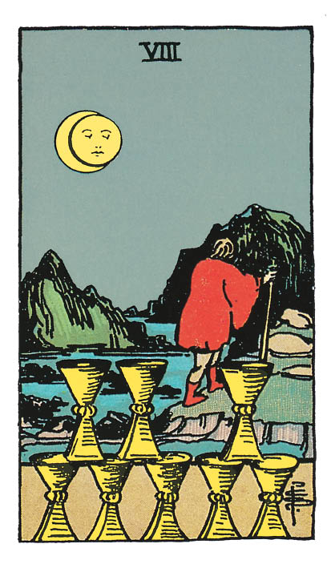

# Huit de Coupe

## Signification

**Type de Carte :** Arcane Mineur de la Suite des Coupes associée aux sentiments, aux émotions et à l'amour
**Élément :** l'Eau
**Numérologie / Rang :** 8, associé à la maîtrise et à la prospérité

## Description

Le Huit de Coupe est illustré par un personnage qui quitte une plage pour s'engager sur un terrain escarpé. Il laisse derrière lui huit Coupes qui symbolisent ce qu'il a accompli dans sa vie, ses émotions, ses Trésors. Il choisit d'abandonner son confort, son quotidien, pour aller chercher ce qui lui manque. Le voyage qu'il entreprend rappelle l'Energie de l'Arcane Majeur L'Hermite. Cette impression est renforcée par l'éclipse qui représente un moment de repli sur soi et d'exploration intérieure.

## Mots-clés

### À l'endroit
- Retrait, abandon
- Remise en question, examen de soi
- Passer à autre chose, avancer

### À l'envers
- Se défiler
- Etre découragé
- S'éparpiller

## Interprétation

Le Cinq de Coupe et le Six de Coupe ont permis d'explorer le passé. L'Energie du Huit de Coupe permet de laisser le passé derrière soi et d'avancer vers la prochaine étape du voyage. Vous êtes prête à lâcher-prise sur ce qui aujourd'hui vous entrave. En ce sens, le Huit de Coupe est à la fois un moment de relecture de votre passé. Vous souhaitez comprendre pourquoi vous agissez ou réagissez toujours de la même façon même si ce comportement vous fait souffrir ou vous dessert ; et une étape de transformation pour l'avenir. Vous partez à la recherche de nouveaux outils, de nouvelles personnes pour aller toujours au plus près des désirs de votre Etre Authentique.

Le Huit de Coupe indique que vous vous posez les "bonnes questions" – qu'est-ce qui peut me rendre heureuse ? Comment faire pour m'épanouir encore plus ? C'est un véritable "voyage intérieur" qui commence et qui peut vous mener à une remise en question profonde.

Quand le Huit de Coupe apparaît dans un Tirage, il représente une insatisfaction voire un mal-être : quelque chose dans votre vie ne va pas ou ne vous convient plus. Il est possible que vous ayez trop donné, trop attendu pour vous exprimer dans une relation interpersonnelle ou au travail. Ce "ras-le-bol" est devenu une vraie déception trop lourde à porter et vous préférez prendre vos distances, arrêter. Vous vous désengagez de la situation et refusez de vous investir.

## Huit de Coupe et l'Amour

Si vous recherchez l'Amour, le Huit de Coupe indique que vous devez abandonner quelque chose avant d'être en capacité de laisser l'Amour entrer dans votre vie. Vous devez progresser encore sur le chemin de la guérison émotionnelle pour vous (re)trouver et guérir de vos déceptions passées. Vous devez repenser votre relation idéale car ce qui était séduisant par le passé ne conviendra pas à la personne que vous êtes devenue.

Si vous êtes en couple, le Huit de Coupe indique que vous aimeriez pouvoir "tourner le dos" à vos problèmes. Vous vous échappez de la relation avec des prétextes liés au travail, à votre vie sociale pour ne pas affronter la réalité de vos difficultés de couple. Pour renouer un dialogue constructif avec votre partenaire, vous devez faire "demi-tour" et revenir pleinement dans la relation… sauf à estimer que vous vous êtes déjà trop éloignée pour des raisons valables et que vous n'avez en réalité pas envie de revenir. Dans ce cas, suivez votre Coeur et même si cela est difficile, allez chercher votre bonheur dans une relation plus épanouissante.

## Huit de Coupe et le Travail

Dans un Tirage concernant le travail, le Huit de Coupe indique que vous ressentez une insatisfaction dans le domaine professionnel. Vos missions actuelles vous ennuient, l'ambiance au travail n'est pas agréable ou vos compétences ne sont pas reconnues par votre supérieur ou vos collègues.

D'autres projets vous appellent. Il ne s'agit pas seulement de changer d'emploi ou de prendre plus de responsabilités, il s'agit de trouver une activité qui a plus de sens pour vous aujourd'hui, une activité qui vous aligne un peu plus avec les désirs de votre Etre Authentique.

Il est donc sans doute temps de tourner le dos à ce qui vous épuise ou ce qui vous frustre dans votre situation professionnelle actuelle… pour aller chercher ce qui pourrait contenter votre Coeur.

## Huit de Coupe et les Finances

Dans le domaine financier, le Huit de Coupe indique que vous devez changer vos habitudes et trouver de nouvelles façons de faire. Quel que soit votre objectif – remettre à flot votre budget ou faire croître votre patrimoine – ce qui a fonctionné par le passé n'est plus la bonne solution aujourd'hui. Vous devez modifier votre "recette", ajuster vos "ingrédients" pour atteindre l'objectif financier poursuivi.

## Huit de Coupe et la Guidance

Le Huit de Coupe symbolise l'attachement émotionnel que vous entretenez avec les personnes et les événements qui ont marqué votre vie.

Vos parents, les personnes que vous avez aimées, vos proches ont tous eu une influence sur vous et sur l'image que vous avez de vous.

Les événements de votre vie comme vos succès, vos échecs, vos immenses joies ou chagrins profonds ont fabriqué la personne que vous êtes aujourd'hui.

Vous êtes prêt(e) à présent à ne garder de ces émotions et expériences *que* ce qui vous sert à être réellement vous-même. Vous êtes prêt(e) à ne plus jouer un rôle, à ne plus faire ce que les autres attendent de vous. Vous souhaitez vivre votre vie libéré(e) des attentes que les autres peuvent avoir à votre égard.

Pour cela, vous êtes prêt(e) à faire ce cheminement intérieur vers la source de votre sagesse intime pour vous trouver *vous*.

---

