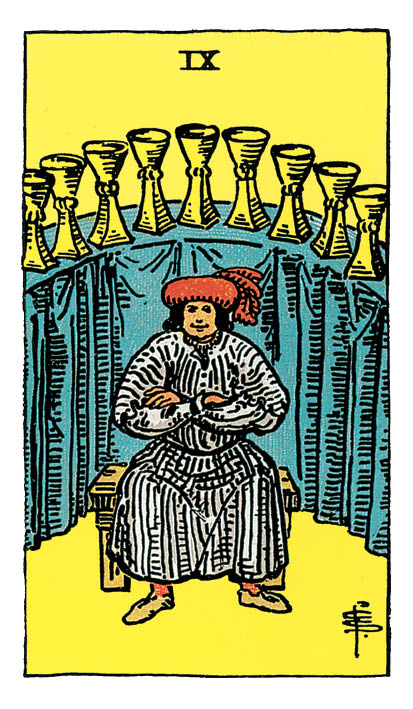

# Neuf de Coupe

## Signification

**Type de Carte :** Arcane Mineur de la Suite des Coupes associée aux sentiments, aux émotions et à l'amour
**Élément :** l'Eau
**Numérologie / Rang :** 9, associé aux résultats, à l'achèvement, à l'aboutissement

## Description

Un personnage habillé richement est installé sur un banc, les pieds solidement campés dans le sol. Neuf Coupes sont exposées, parfaitement alignées sur une table derrière lui. Qui sait quels trésors se cachent encore sous cette longue nappe ?

Il croise les bras pour indiquer son contentement et plonge son regard fier dans le vôtre semblant dire « Hé oui, tout ça, c'est à moi ! » Il n'a besoin de rien de plus, il a tout ce que son cœur peut souhaiter.

## Mots-clés

### À l'endroit
- Vœu exaucé
- Satisfaction
- Confort, sécurité

### À l'envers
- En vouloir trop, avidité
- Se laisser vivre
- Vœu non exaucé ou résultats pas à la hauteur des attentes

## Interprétation

Le Neuf de Coupe est une des Cartes les plus positives du Tarot parce qu'elle exprime la satisfaction et le contentement du Cœur. Le Neuf de Coupe est « le » signe que votre désir pourrait bien se transformer en réalité et que le chemin emprunté était bien celui du succès ! C'est le moment de bien réfléchir à ce que l'on souhaite et de faire un vœu ! L'Univers pourrait bien envoyer exactement ce que vous avez souhaité.

La satisfaction exprimée par le Neuf de Coupe peut prendre différentes formes. La Suite des Coupes indique le contentement des émotions – une relation amoureuse ou une amitié qui se consolide par exemple – mais il peut s'agir aussi d'une satisfaction du corps ou de l'esprit. La Carte exprime le regain de confiance et de positivité devant cette Abondance offerte par la Vie. C'est le moment de faire une pause et d'apprécier pleinement ce bonheur.

Le moins bon côté de l'Energie du Neuf de Coupe serait de glisser doucement vers le « Ce n'est pas encore assez ! » Au lieu d'apprécier ces Neuf Coupes, vous pourriez en vouloir et en demander encore plus. L'Energie peut rapidement basculer dans l'excès : faire « trop » la fête, « trop » manger, se laisser aller.

Le Neuf de Coupe peut parfois annoncer des lendemains de fête qui déchantent. Il arrive de souhaiter intensément quelque chose, de l'obtenir… pour s'apercevoir que finalement, ce n'est pas du tout ce qu'on attendait ou ce dont on avait besoin ! Le Neuf de Coupe peut symboliser cette déception et ce retour à la réalité.

## Neuf de Coupe et l'Amour

Avec cette Carte, non seulement le Cœur est satisfait – mais le corps et l'esprit le sont aussi !

Si vous recherchez l'Amour, le Neuf de Coupe est un excellent signe qu'une belle rencontre peut se faire dans un avenir proche. Il ne faut donc pas hésiter à sortir, à partir à la rencontre de l'autre, sans idée préconçue. Soyez bien en phase avec les qualités que vous recherchez chez l'autre et exprimer clairement vos attentes car vous pourriez obtenir exactement ce que vous espériez.

Si vous êtes en couple, vous pouvez vous attendre au renforcement du lien affectif entre vous et votre partenaire. « C'est du sérieux ! » « C'est bien parti ! » Chacun est contenté par la présence de l'autre à ses côtés et de ce qu'il/elle lui apporte dans la Vie. Appréciez ce moment et exprimez à votre partenaire ce qui justement crée votre satisfaction et votre joie.

Si vous traversez une phase difficile, le Neuf de Coupe vous invite à retrouver en l'autre le trésor qui vous a contenté par le passé. Vous êtes invité(e) à vous focaliser sur ce qui va entre vous, sur les forces de votre couple, votre histoire commune. Montrez-vous reconnaissants l'un envers l'autre et cherchez à calmer les tensions.

## Neuf de Coupe et le Travail

Le contentement du Cœur se traduit ici par un succès matériel dans votre travail ou vos projets professionnels. Avec le chiffre 9, vous atteignez l'accomplissement. Votre travail de fond va payer.

Avec le Neuf de Coupe, ce que l'on désire au travail peut se matérialiser. C'est le moment de demander plus de responsabilités, de vous voir confier un "gros dossier", de demander une formation ou de lancer une négociation.

Le Neuf de Coupe vous parle également des projets qui nourrissent votre Ame et votre Cœur et qui ne sont pas nécessairement "professionnels" au sens strict. Si vous ressentez qu'il vous manque quelque chose, que votre Etre Authentique n'est pas satisfait avec ce que vous faites, avec ce que vous créez, le Neuf de Coupe indique que vous devez investir plus de temps et d'Energie à combler ce besoin. Le véritable travail dans la vie, après tout, est de construire son bonheur. Vous avez sans doute besoin de vous tourner vers des activités – professionnelles, associatives, loisirs – qui nourrissent votre Etre Authentique.

## Neuf de Coupe et les Finances

Dans le Domaine de l'Argent et des Finances, le Cœur est contenté par la sécurité financière.

Le Neuf de Coupe vous souffle : « Ca va aller, respire ! »

Cela ne veut pas dire que vous allez doubler votre salaire ou gagner au Loto… mais la pression sur les Finances baisse et l'anxiété associée également. Une solution au problème peut être trouvée.

En terme d'Abondance, le Neuf de Coupe exprime également l'idée que vous prenez conscience que ce que vous possédez est « suffisant ». Est-il nécessaire de s'acharner à toujours vouloir obtenir « plus » ? Ressentez de la Gratitude pour ce qui fait aujourd'hui votre bonheur.

## Neuf de Coupe et la Guidance

Imaginez cette Carte comme le Génie dans l'histoire d'Aladdin. Vous venez de le faire sortir de sa lampe magique et il va exaucer vos trois vœux !

Quels sont vos vœux ? Que souhaitez le plus dans la Vie ?

Le Neuf de Coupe permet de s'interroger sur cette question fondamentale : qu'est-ce que je veux *vraiment* obtenir ou construire dans la Vie ? Qu'est-ce qui m'apporterait le contentement profond du Cœur ? Quelles Coupes faudrait-il que je possède pour me sentir entièrement satisfait(e), comme le personnage du Neuf de Coupe ?

Le Neuf de Coupe vous invite à faire la part des choses entre le superflu et le nécessaire… et vous interroge sur comment manifester dans votre vie ce qui vous tient vraiment à cœur et ce dont vous avez réellement besoin.

---

