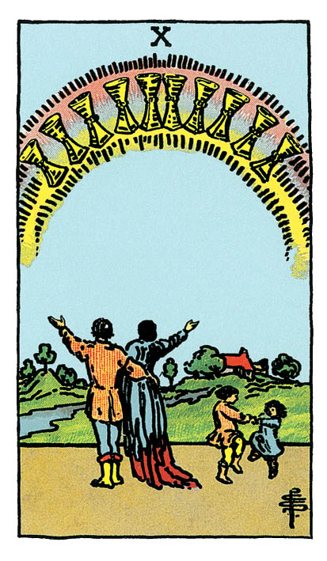

# Dix de Coupe

## Signification

**Type de Carte :** Arcane Mineur de la Suite des Coupes associée aux sentiments, aux émotions et à l'amour
**Élément :** l'Eau
**Numérologie / Rang :** 10, associé à la transcendance et au commencement d'un nouveau cycle

## Description

Le Dix de Coupe dans le Tarot montre une famille réunie sous un arc-en-ciel, symbole d'alliance et de bénédiction. Les enfants font une ronde joyeuse. Les parents lèvent les bras vers le ciel d'un geste dynamique et festif. A l'arrière plan, on distingue la maison du couple qui symbolise la sécurité et la stabilité. Elle est entourée d'un grand jardin qui représente l'Abondance et la fertilité. Le plan d'eau représente le partage des émotions et les sentiments forts qui unissent les membres de la famille. Il se dégage de la Carte une Energie de joie et d'émerveillement qui rappelle l'Energie de la Carte Majeure Le Soleil.

## Mots-clés

### À l'endroit
- Harmonie, vie de famille heureuse
- Sécurité et stabilité
- Contentement, se sentir à sa place

### À l'envers
- Problèmes de famille
- Fin d'une belle période
- Ne plus être aligné(e) avec ses valeurs

## Interprétation

Le Neuf de Coupe a exaucé vos voeux les plus chers. Son Energie vous a permis de ressentir un immense contentement. Le Dix de Coupe vous demande de faire une pause et de ressentir de la Gratitude pour tout ce qui vous a été offert. Vous partagez ces sentiments de bonheur et d'accomplissement total avec vos proches, c'est-à-dire celles et ceux avec qui vous avez partagé votre histoire et qui ont accompagné votre cheminement.

Le Dix de Coupe symbolise la vie de famille heureuse, harmonieuse et la sécurité que les relations vraies, l'amitié et le soutien vous apportent. Dans son Energie, pas de tension, de jalousie ou de manipulation. Chacun est à sa place et vous êtes aligné(e) avec vos valeurs et votre Etre Authentique. En ce sens, le Dix de Coupe indique vous savez exactement ce à quoi votre vie idéale doit ressembler et vous travaillez à la manifester dans votre quotidien. Les valeurs familiales qui vous ont été inculquées ont une influence forte sur ce projet – soit parce qu'elles font partie intégrante de vous-même soit parce que vous les avez rejetées pour devenir vous-même.

Le Dix de Coupe est un encouragement à poursuivre votre cheminement dans l'Energie des Coupes, c'est à dire celle des sentiments, des émotions et de l'Intuition. Visez les projets et activités qui vous rapprochent de votre idéal. Le Dix de Coupe vous invite à mettre votre Energie dans la construction active de votre sécurité, de votre harmonie et de votre bien-être.

Parfois, le Dix de Coupe peut annoncer une occasion heureuse de retrouver la famille et de resserrer les liens. Il peut s'agir d'une grande réunion de famille, d'une fête ou d'un mariage.

## Dix de Coupe et l'Amour

Le Dix de Coupe est une Carte très positive et le domaine de l'Amour ne fait exception ! Si pour vous amour partagé + maison + enfants = bonheur total, vous êtes comblé(e) ou votre voeu est en voie d'être exaucé. Si vous pensiez que votre idéal était moins conventionnel, le Dix de Coupe indique que votre désir de construire, votre envie de sécurité émotionnelle sont bien réels. Vous devez le reconnaître et l'honorer parce que vous méritez ce bonheur.

Si vous êtes en couple, le Dix de Coupe indique que le lien émotionnel entre vous deux est très fort. Vous pouvez vous appuyer sur la confiance et les sentiments réciproques pour construire le "nid douillet" dont vous rêvez.

Si votre couple est actuellement en difficulté, ouvrez le dialogue avec votre partenaire en toute bienveillance. Chacun cherche à retrouver harmonie et bonheur de son côté mais vos efforts seraient plus fructueux s'ils étaient conjoints.

## Dix de Coupe et le Travail

Dans un Tirage concernant le travail, le Dix de Coupe reflète un état quasi idéal dans lequel vous vous sentez intellectuellement et émotionnellement connecté(e) à votre travail et aux missions qui vous sont confiées. C'est la Carte de l'engagement fort et du bien-être au travail. Cet état résulte de différents facteurs : l'alignement du contenu des missions ou projets avec vos valeurs, un équilibre vie personnelle / vie professionnelle respecté, une ambiance "familiale" avec de l'entr'aide et de la bienveillance entre les collègues.

Si cette description ne correspond pas à ce que vous vivez actuellement, le Dix de Coupe veut vous dire que d'autres environnements de travail existent. D'autres projets vous appellent. Vous méritez de travailler dans une équipe où vos compétences seront reconnues et votre personne sera respectée. Déterminez ce qui seraient vos conditions idéales et commencez à créer cette réalité.

Le Dix de Coupe indique que les relations interpersonnelles jouent un rôle prépondérant dans le domaine du travail pour vous. Il est possible que votre prochain challenge professionnel soit en lien fort avec les autres. Vous pourriez être appelé(e) vers le coaching, la formation, l'accompagnement ou la relation d'aide. Il est possible également que vous ayez besoin d'agrandir votre réseau professionnel, de travailler ou de rencontrer de nouvelles personnes. Soyez en alerte sur toutes les opportunités qui vous permettent de nouer de nouvelles relations professionnelles.

## Dix de Coupe et les Finances

Dans le domaine financier, le Dix de Coupe met l'accent sur la vie personnelle et le temps passé avec vos proches plutôt que sur l'argent "sonnant et trébuchant". La vraie richesse serait donc là : dans les relations authentiques construites dans le temps. La sécurité n'est pas uniquement financière. Elle se joue aussi dans le réseau de personnes que vous avez tissé autour de vous et qui sont là pour vous. Il y a certainement parmi elles une personne qui pourrait vous guider et vous aider dans la gestion de votre budget ou de votre portefeuille d'investissement.

## Dix de Coupe et la Guidance

Dans l'Energie du Huit de Coupe ou de L'Hermite, vous avez acquis une connaissance profonde de vous-même, de vos valeurs, de ce qui est essentiel à vos yeux. A présent, il est temps de le partager avec les autres ! Si le cheminement spirituel est souvent solitaire, la pratique de la spiritualité se fait nécessairement en lien avec les autres. C'est dans la relation à l'autre que nous pratiquons la bienveillance, la confiance, la gentillesse et l'Amour.

Vous possédez toutes ces qualités. Elles jaillissent de vous comme l'Eau jaillit de l'As de Coupe. Partagez votre Abondance, votre joie et votre Lumière ! Le monde en a bien besoin.

---

