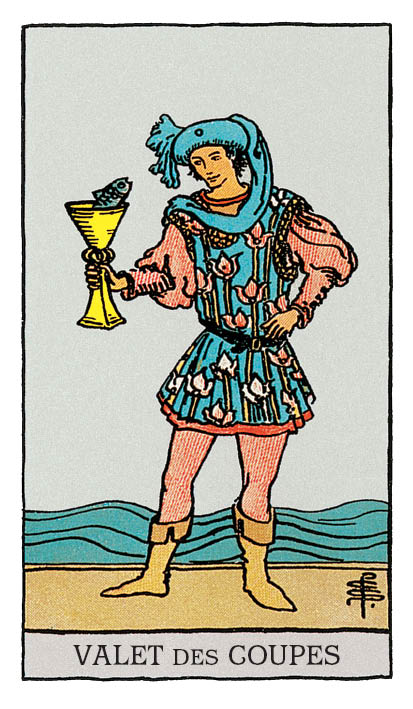

# Valet de Coupe

## Signification

**Type de Carte :** Arcane Mineur de la Suite des Coupes associée aux sentiments, aux émotions et à l'amour
**Élément :** l'Eau
**Caractéristiques :** Dans un Tirage, les Cartes de Cour ou Honneurs peuvent représenter des personnes dans la vie du Consultant. Associées à la Suite des Coupes, ces personnes peuvent être Cancer, Scorpion ou Poissons – les Signes d'Eau. Ces personnes peuvent avoir les cheveux blonds, les yeux clairs. Ces personnes sont sensibles, empathiques et émotives.
**Numérologie / Rang :** Dans les Cartes de Cour, le Valet est l'enfant espiègle. Il incarne les qualités de sa Suite avec plaisir et légèreté. Il ne maîtrise pas encore tout à fait les qualités de sa Suite mais il les manipule avec facilité et spontanéité. Le Valet, comme Le Fou dans les Cartes Majeures, est un symbole d'aventure, de possibilités et d'opportunités.

## Description

Un jeune homme, richement vêtu, semble prendre du bon temps sur la plage. Il tient à la main une coupe qu'il porte à ses lèvres. De façon inattendue, un petit poisson sort la tête de la coupe. Aussi étrange que cela puisse paraître, le jeune homme et le poisson semblent converser amicalement. Le petit poisson représente notre voix intérieure, notre Intuition qui remonte non pas des profondeurs de la mer mais des profondeurs de notre Etre. Elle exprime des informations, des émotions et des sensations authentiques.

## Mots-clés

### À l'endroit
- Nouvel amour ou aventure amoureuse
- Message intuitif, message du Coeur
- Enfant studieux, enfant désiré et aimé

### À l'envers
- Rêvasser, procrastiner
- Rupture amoureuse, refus de l'autre
- Co-dépendance

## Interprétation

Le Valet de Coupe représente votre enfant intérieur, une Energie pleine de fougue et de créativité. Une Energie intuitive et inspirée. Cette Energie "pousse" en vous. Elle remonte des profondeurs de votre Etre Authentique pour sortir au grand jour et s'exprimer. Vous n'arrivez pas encore à mettre des mots sur ce désir mais votre Intuition cherche à vous y aider. Elle exprime cette Energie à travers des signes, des synchronicités et vos rêves. La période est propice aux pratiques intuitives – Tarot, Pierre & Cristaux, communication avec votre Ange Gardien – parce que votre Intuition et l'Univers veulent vous aider à appréhender ce désir et à transformer le rêve en réalité.

Le Valet de Coupe indique également que vous avez envie d'exprimer vos sentiments et votre vérité. Vous n'avez plus envie de "faire semblant" ou de faire "ce qui est attendu de vous". Vous avez besoin de plus de transparence, vous voulez exprimer votre sensibilité. N'hésitez pas à communiquer l'amour que vous avez pour vos proches, laissez votre Coeur parler.

Dans un Tirage, il arrive que le Valet de Coupe soit un messager. Dans ce cas, son message est souvent une déclaration d'amour. Quelqu'un s'apprête à déclarer sa flamme et à vous révéler ses sentiments. Il peut aussi s'agir de bonnes nouvelles concernant un enfant aimé et désiré. Le Valet de Coupe peut également annoncer un signe positif pour la suite de votre cheminement, une synchronicité donnée directement par l'Univers. Dans tous les cas, ce message inattendu éveille en vous des sentiments positifs, de l'amour ou de l'empathie.

Enfin, comme toutes les Cartes de Cour, le Valet de Coupe peut représenter une personne "de la vraie vie" dans votre entourage ou une personne que vous allez bientôt rencontrer. Le Valet de Coupe peut, dans ce cas, représenter une personne jeune émotionnellement, une personne empathique et sensible qui ne maîtrise pas tout à fait ses émotions. Vous pourriez vous lier d'amitié avec cette personne ou découvrir que vous comptez beaucoup l'un pour l'autre. Vous nouez une relation intime avec cette personne et vous vous trouvez tous les deux grandis émotionnellement par ce partage.

## Valet de Coupe et l'Amour

Si vous recherchez l'Amour, le Valet de Coupe indique que la rencontre est possible – et peut-être même proche ! – même si vous avez cessé d'y croire. Le Valet de Coupe est apparu pour vous dire "Reste toi-même, sois authentique et surtout, ne jette pas forcément ton dévolu sur la première personne venue !" Il s'agit de vous connaître, de savoir ce que vous recherchez chez l'autre et d'exprimer ce que vous attendez clairement. C'est essentiel pour savoir si "ça colle" sur l'essentiel ou uniquement sur le superficiel avec une personne. Vos objectifs amoureux, ce que vous voulez construire et avec quel type de personnalité, doivent être votre priorité.

Si vous êtes en couple et surtout si vous connaissez des difficultés, c'est le moment de communiquer l'un avec l'autre de façon transparente et authentique. Vous devez exprimer à l'autre ce que vous attendez dans la relation, vos souhaits immédiats et vos espoirs pour la suite. De la même façon, votre partenaire doit exprimer ce qu'il ou elle attend de vous. Si ces informations ne sont pas plaisantes, elles doivent cependant être exprimées. Initiez le dialogue, créez les conditions pour que chacun puisse dire sa vérité avec bienveillance et empathie.

## Valet de Coupe et le Travail

Le Valet de Coupe est apparu pour vous demander de regarder au-delà de la routine, des avantages de votre position actuelle pour que vous puissiez vous poser "les vraies questions." Que vous soyez en poste ou en recherche d'emploi, quel travail pourrait vous correspondre vraiment ? Quelles activités feraient vibrer votre Etre Authentique et s'accorderaient avec votre sensibilité et votre bienveillance ? Le Valet de Coupe vous invite à trouver la réponse puis à mettre en œuvre un plan pour atteindre ce potentiel.

Si vous pensez changer de voie professionnelle ou reprendre une formation, le Valet de Coupe vous invite à regarder du côté des métiers en relation avec les autres et notamment en relation d'aide à la personne. Le milieu associatif, un projet avec des bénévoles, une entreprise profondément humaine pourrait être le terrain de jeu idéal pour vos compétences et votre personnalité.

## Valet de Coupe et les Finances

Le Valet de Coupe est apparu pour vous dire qu'en matière de finances, il n'est jamais trop tard pour bien faire. Quel que soit votre objectif – mettre de côté, sortir du rouge, vous constituer un patrimoine durable – commencez petit mais commencez dès aujourd'hui.

Le Valet de Coupe vous invite à penser à votre futur en terme d'Abondance. De quoi allez-vous avoir le plus besoin ? De compétences pour obtenir l'emploi que vous souhaitez ? De relations autour de vous pour vous soutenir émotionnellement ? D'argent sonnant et trébuchant pour assurer vos besoins et envies ? Votre Abondance future se prépare maintenant, étape par étape. Il est essentiel de mettre en place aujourd'hui ce qui vous assurera stabilité et équilibre à moyen et long terme.

## Valet de Coupe et la Guidance

Vous êtes prête à écouter votre Intuition, à décoder les messages de vos Guides ou encore les synchronicités que l'Univers place sur votre chemin. Bien sûr, vous ne pouvez pas prédire les routes sur lesquelles votre cheminement spirituel vous emmène mais vous savez qu'au bout du chemin se trouve plus de bienveillance, d'empathie et la rencontre avec votre Etre Authentique. Vous savez aussi que ces routes, ce seront les vôtres et uniquement les vôtres. Vous créez le chemin, vous choisissez de bifurquer à tel ou tel embranchement. L'expérience des autres, l'opinion des autres, ce sont au mieux des panneaux signalétiques que vous choisissez de suivre… ou pas !

---

