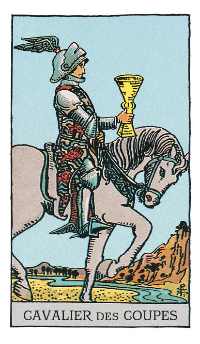

# Cavalier de Coupe

## Signification

**Type de Carte :** Arcane Mineur de la Suite des Coupes associée aux sentiments, aux émotions et à l'amour
**Élément :** l'Eau
**Caractéristiques :** Dans un Tirage, les Cartes de Cour ou Honneurs peuvent représenter des personnes dans la vie du Consultant. Associées à la Suite des Coupes, ces personnes peuvent être Cancer, Scorpion ou Poissons – les Signes d'Eau. Ces personnes peuvent avoir les cheveux blonds, les yeux clairs. Ces personnes sont sensibles, empathiques et émotives.
**Numérologie / Rang :** Dans les Cartes de Cour, le Cavalier est l'adolescent excessif. Il incarne les qualités de sa Suite en mode "tout ou rien". Ces émotions ou ces comportements extrêmes peuvent être positifs ou négatifs, selon les circonstances. Comme le Valet, le Cavalier ne maîtrise pas non plus les qualités de sa Suite mais il les manipule avec un enthousiasme débordant et de façon débridée. Le Cavalier, comme Le Chariot dans les Cartes Majeures, est un symbole de changement, de mouvement et d'action.

## Description

Un jeune cavalier monte son cheval le long d'un cours d'eau. Contrairement au galop du Cavalier de Bâton ou du Cavalier d'Epée, le Cavalier de Coupe avance doucement. Il dégage calme et prestance et chacun se sent attiré comme un aimant par sa présence. Les tons clairs de la Carte et la couleur blanche du cheval évoquent le cheminement spirituel sur lequel le Cavalier avance jusqu'à la maîtrise totale des qualités de sa Suite, maîtrise détenue par le Roi de Coupe. Son casque et ses bottes sont ailées, ce qui rappelle Hermès, le messager des Dieux et évoque la créativité. Sa tunique est parsemée de poissons, symboles de l'Elément Eau et de l'Intuition.

## Mots-clés

### À l'endroit
- Chevalier servant, Prince charmant
- Romantisme, galanterie
- Suivre son Coeur et ses rêves

### À l'envers
- Jalousie
- Attentes non-réalistes
- Problèmes de dépendance

## Interprétation

Le Cavalier de Coupe avance doucement dans la vie en écoutant son coeur beaucoup plus que sa tête. Il partage avec le Valet de Coupe la capacité à écouter sa petite voix intérieure et à se laisser guider par elle vers la réalisation de son Etre Authentique.

Dans un tirage de Tarot, le Cavalier de Coupe signifie que vous êtes prête à vous mettre dans son Energie pour aller chercher ce qui vous fait vibrer, ce qui comblerait vos désirs. Et vous avez envie qu'on vous remarque et qu'on vous "chouchoute". Vous avez envie de suivre ce que votre Coeur vous dicte, parfois sans réfléchir à deux fois aux conséquences. Vous avez envie de vous laisser aller à la vie et à ce qu'elle peut vous offrir, sans peur ni attentes spécifiques.

Comme toutes les Cartes de Cour, le Cavalier de Coupe peut représenter une personne "de la vraie vie" dans votre entourage ou une personne que vous allez bientôt rencontrer. Le Cavalier de Coupe représente alors une personne émotive et douce. Une personne qui a beaucoup de charme, de charisme et qui attire à elle comme un aimant. Un peu rêveuse, un brin poète, cette personne est en quête d'amour et de romantisme. C'est d'abord une connection émotionnelle très forte qui vous liera à elle.

Le Cavalier de Coupe peut parfois annoncer un voyage ou un événement impactant par delà un océan ou un cours d'eau.

## Cavalier de Coupe et l'Amour

En Amour, le Cavalier de Coupe est une Carte très positive puisqu'il représente le "chevalier servant", le "Prince Charmant" ! Romantique, doux, il fait passer les désirs de son partenaire avant les siens. Il a toujours les mots, les gestes et les petites attentions qui comblent le coeur amoureux de bonheur.

Si vous recherchez l'Amour, préparez-vous à être emportée dans un tourbillon romantique ! N'attendez pas que l'Energie du Cavalier de Coupe sonne à votre porte. Vous devez vous aussi faire en sorte qu'elle puisse entrer dans votre vie. Cela signifie que vous devez, vous aussi, faire usage de votre charme et de votre charisme. Cela signifie aussi qu'une posture d'ouverture est de mise. Soyez prête à recevoir l'Amour que vous méritez et que ce Cavalier veut vous donner. C'est un risque à prendre – et cela vous fait peut-être peur ? – mais ce jeu de séduction en vaut la chandelle.

Si vous êtes en couple et que vous éprouvez des difficultés, il est temps d'identifier les besoins amoureux et émotionnels que votre relation ne couvre plus. Ouvrez votre Coeur à votre partenaire pour exprimer vos difficultés et vos souhaits pour l'avenir de votre couple. Utilisez l'Energie du Cavalier de Coupe pour amener plus de romantisme et d'échanges, pour retrouver les émois "du début" et relancer la relation.

Le Cavalier de Coupe est peut-être apparu parce qu'une tierce personne s'invite dans votre couple pour vous séduire ou parce que vous-même commencez à "regarder ailleurs". Attention à ne pas imaginer des sentiments ou des intentions chez l'autre. Identifiez bien ce qui vous pousse vers cette autre personne, en quoi elle vous attire et n'idéalisez pas la situation.

## Cavalier de Coupe et le Travail

Un collègue vous fait un clin d'oeil et votre coeur chavire ! Oui, le Cavalier de Coupe peut indiquer que le romantisme s'invite au bureau. Mais pas seulement…

Dans le monde professionnel, pour ne pas trainer les pieds tous les jours en allant travailler, il faut autant que possible aligner son travail avec ses valeurs et son Etre Authentique. C'est exactement ce que le Cavalier de Coupe vous encourage à faire. Encore faut-il identifier votre "job de rêve" pour aller le décrocher. Quelles sont vos passions ? Que voulez-vous atteindre comme objectif personnel dans le travail ?

Une fois ce but identifié, ne laissez rien au hasard : analysez vos forces, vos compétences, vos ressources et comparez-les à votre objectif. Le changement est-il réalisable ? La marche est-elle "trop grande" ? Qui pourrait vous aider à concrétiser votre objectif ? Le Cavalier de Coupe vous invite à prendre courage et à donner à votre passion l'importance qu'elle mérite dans votre vie professionnelle.

## Cavalier de Coupe et les Finances

Dans un Tirage de Tarot concernant vos finances, le Cavalier de Coupe indique que vous aimeriez recevoir plus et que sans nul doute, vous le méritez. Alors, comment obtenir cette Abondance financière et la pérenniser ? Vous cherchez comment augmenter vos revenus et vous êtes prête à vous lancer : recherche d'un nouvel emploi, nouvelle activité professionnelle. Le moment est effectivement propice pour passer en revue les possibilités et vous lancer dans celle qui vous semblera la plus intéressante à moyen terme. Faites preuve de persévérance et vous serez récompensée.

## Cavalier de Coupe et la Guidance

Le Cavalier de Coupe suit son Coeur et ses rêves. Il prend ses décisions avec le Coeur, en écoutant plutôt son Intuition que son intelligence rationnelle. Qu'en est-il pour vous ? Quand vous devez prendre une décision importante, impactante, faites-vous confiance à votre Intuition pour vous guider ? Restez-vous dans une démarche très intellectuelle ? Réagissez-vous à l'instinct ou prenez-vous toujours le temps de la réflexion ?

Le Cavalier de Coupe est apparu pour vous questionner sur votre processus de décision, notamment dans les domaines où vous avez le sentiment de "toujours faire le mauvais choix." Il est peut-être temps d'essayer de nouvelles méthodes, de mitiger votre tendance naturelle avec son opposé. Si vous êtes "100% rationnelle", donnez à votre Intuition une chance de vous guider. Si vous êtes "100% intuition", remettez une pincée de réflexion et d'intellect dans vos prises de décisions. Cela n'enlèvera rien à la personne chaleureuse, amicale et aimante que vous êtes.

---

