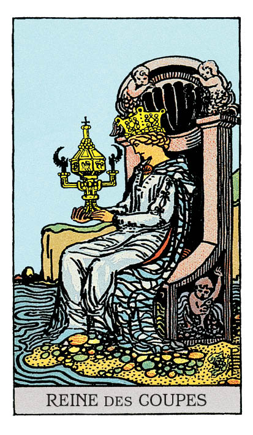

# Reine de Coupe

## Signification

**Type de Carte :** Arcane Mineur de la Suite des Coupes associée aux sentiments, aux émotions et à l'amour
**Élément :** l'Eau
**Caractéristiques :** Dans un Tirage, les Cartes de Cour ou Honneurs peuvent représenter des personnes dans la vie du Consultant. Associées à la Suite des Coupes, ces personnes peuvent être Cancer, Scorpion ou Poissons – les Signes d'Eau. Ces personnes peuvent avoir les cheveux blonds, les yeux clairs. Ces personnes sont sensibles, empathiques et émotives.
**Numérologie / Rang :** Dans les Cartes de Cour, la Reine est une présence douce et rassurante, qui exprime le côté féminin (Yin) des choses : prendre soin, nourrir, aider. La Reine maitrise les qualités de sa Suite et cette maitrise s'exprime de façon subtile, douce. Persuasive, la Reine sait convaincre sans imposer. Si les Valets sont des messagers, les Reines représentent l'atteinte d'un objectif, le passage de l'idée au concret. Liées à la Carte Majeure de L'Impératrice, les Reines sont maternantes et profondément aimantes. Elles symbolisent aussi les grandes étapes de la vie d'une femme et ses rites de passage.

## Description

Une reine est assise au bord de l'Océan. Elle tient dans la main une grande Coupe magnifiquement ornée d'angelots, comme le trône sur lequel elle est assise. Sa posture de profil rappelle celle de L'Hermite et la Reine de Coupe partage avec cet Arcane Majeur le goût de l'introspection et du cheminement émotionnel. L'Eau, élément associé à la Suite des Coupes, symbole des émotions et des sentiments, est omniprésente sur la Carte.

## Mots-clés

### À l'endroit
- Aide et soutien
- Guérison émotionnelle, psychothérapie
- Une figure maternelle
- Une personne aimante et empathique

### À l'envers
- Codépendance
- Amour étouffant

## Interprétation

Si le Cavalier de Coupe cherche à contenter son Coeur en explorant le monde extérieur, la Reine de Coupe obtient le contentement du Coeur en écoutant son monde intérieur, c'est à dire son Intuition et les besoins de son Etre Authentique.

Centrée et ancrée dans ses émotions, la Reine de Coupe est capable d'un amour et d'une empathie immenses sans pour autant se renier ou se perdre dans cette relation à l'autre. Elle est une présence sensible et à l'écoute, capable de trouver "la" solution qui contente toutes les parties. Son Energie s'incarne souvent sous les traits des Soignants, des Thérapeutes traditionnels et Energétiques. C'est à la fois sa grande force et sa grande faiblesse car elle devient facilement un "aimant à souffrance" pour les autres qui peuvent alors se montrer en demande continuelle d'écoute et de soutien.

L'Intuition et l'intelligence émotionnelle de la Reine de Coupe sont extrêmement développées… et elle en fait toujours bon usage.

Dans un Tirage, la Reine de Coupe est apparue car vos proches ont besoin de votre soutien, de votre écoute. Ils cherchent eux-aussi à vivre plus alignés avec leur Etre Authentique et ils souhaitent apprendre de vous. Montrez-leur comment ils peuvent écouter leur "petite voix intérieure" et recevoir les messages et conseils de leur Intuition, comme vous-même vous avez appris à le faire.

Si vous êtes celui ou celle qui a besoin de soutien, la Reine de Coupe vous invite à agir comme elle le ferait elle. Interrogez-vous sur les relations que vous entretenez avec vos proches. Pensez aux activités que vous pratiquez qui vous mettent en lien avec les autres. Les limites sont-elles bien posées ? Ces relations sont-elles équilibrées, "donnant-donnant" ? Votre bien-être émotionnel est une priorité et vous ne pouvez être là pour les autres que si vous êtes d'abord présent(e) à vous-même.

Enfin, comme toutes les Cartes de Cour, la Reine de Coupe peut représenter une personne "de la vraie vie" dans votre entourage ou une personne que vous allez bientôt rencontrer. La Reine de Coupe représente alors une personne très empathique, sensible, romantique, Intuitive et ces qualités peuvent parfois déconcerter ou être jugées "excentriques". Cette personne est extrêmement douée pour vous faire parler de vous, de vos problèmes et vous aider à envisager des solutions innovantes ou créatives. Vous aurez l'impression qu'elle tend un miroir à votre Ame et vous serez attiré(e) et réconforté(e) par sa présence.

## Reine de Coupe et l'Amour

Si vous recherchez l'Amour, la Reine de Coupe est un signe très favorable. Sa présence indique que l'Amour durable et la compréhension mutuelle sont à l'horizon. La personne qui sera votre "Reine de Coupe" avec ses très belles qualités émotionnelles – et il peut bien entendu s'agir d'un homme – va bientôt montrer de l'intérêt pour vous. Cette relation n'est pas un feu de paille. Au contraire, il s'agit de s'aimer, de se comprendre et de se soutenir mutuellement pour construire un avenir commun.

Si vous êtes en couple, la Reine de Coupe souligne la connexion émotionnelle intense entre vous deux et l'Amour que vous vous portez. Votre histoire a le potentiel de se renforcer et de durer car son point fort est votre capacité réciproque à exprimer vos sentiments et à ne pas garder ce que vous avez sur le cœur.

Si votre couple connait des difficultés, attention à ne pas anticiper les besoins de l'autre avant qu'il ou elle ne les exprime. Gardez de l'Energie pour vous et posez les limites. Vous ne pouvez pas être le thérapeute de votre partenaire ni celui de la relation. Au besoin, cherchez cette compétence chez un professionnel et renouez le dialogue grâce à sa médiation.

## Reine de Coupe et le Travail

Comme la plupart des Cartes des Coupes, la Reine de Coupe indique votre besoin d'être émotionnellement investi(e) dans votre travail. La valeur de votre travail pour les autres, l'impact de celui-ci pour les autres et la Communauté sont essentiels à vos yeux.

Plus précisément, la Reine de Coupe vous invite à réfléchir à votre façon de communiquer au travail et sur votre façon de poser vos limites. Si vous avez des choses désagréables à exprimer à vos collègues, à votre responsable ou encore à vos clients, vous pouvez le faire avec respect. La Reine de Coupe vous encourage à trouver les mots justes pour exprimer votre vision, vos idées. Il ne s'agit pas tant d'être aimé(e) ou apprécié(e) au travail mais d'être respecté(e) pour votre professionnalisme. Articuler vos opinions et idées avec clarté et force est essentiel.

## Reine de Coupe et les Finances

Dans le domaine financier, la Reine de Coupe indique que vous avez atteint un niveau de stabilité financière agréable et sécurisant… ce qui ne veut pas dire que vous devez vous arrêter là. L'Abondance financière permet le partage et l'argent est un outil impactant pour changer le monde et les choses.

L'Energie de la Reine de Coupe pouvant parfois verser dans l'émotionnel, prenez garde aux achats compulsifs qui viendraient remplir un manque. Si ce manque est réel, posséder plus n'est pas forcément la réponse à y apporter. Tournez-vous vers votre Cœur, vos émotions, et mettez à nu ce besoin d'"avoir" pour le remplacer par une envie de mieux "être".

## Reine de Coupe et la Guidance

Comme La Grande Prêtresse, la Reine de Coupe est une Energie profondément intuitive et connectée au monde subtil. Sa présence indique que vous vous ouvrez de plus en plus à cette Energie. Vos expériences intuitives, les synchronicités que vous avez remarquées, les messages de vos Guides ont ouvert votre esprit et vous ont permis d'acquérir sagesse et connaissances spirituelles. Ne vous arrêtez pas en si bon chemin ! La Reine de Coupe, telle un mentor, vous accompagne avec tout son soutien. Elle vous encourage à aller plus loin dans l'exploration de vos besoins Authentiques et dans la recherche de moyens pour vivre toujours plus aligné(e). Bientôt, vous deviendrez à votre tour le mentor et vous serez en capacité d'aider les autres dans leur cheminement… votre façon de rendre à l'Univers ce qu'il vous a transmis.

---

*Source : [Vivre Intuitif](https://vivre-intuitif.com/apprendre-le-tarot/signification/coupes/reine-de-coupe/)*
*Illustration : Tarot de A.E. Waite — Rider-Waite-Smith*
