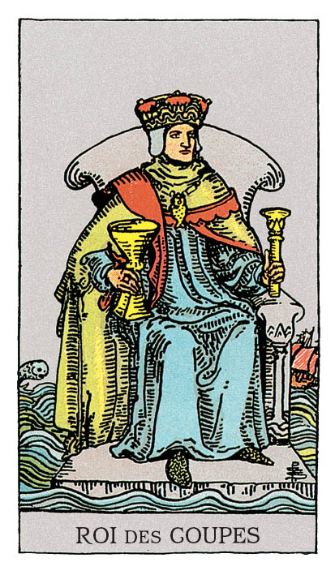

# Roi de Coupe

## Signification

**Type de Carte :** Arcane Mineur de la Suite des Coupes associée aux sentiments, aux émotions et à l'amour
**Élément :** l'Eau
**Caractéristiques :** Dans un Tirage, les Cartes de Cour ou Honneurs peuvent représenter des personnes dans la vie du Consultant. Associées à la Suite des Coupes, ces personnes peuvent être Cancer, Scorpion ou Poissons – les Signes d'Eau. Ces personnes peuvent avoir les cheveux blonds, les yeux clairs. Ces personnes sont sensibles, empathiques et émotives.
**Numérologie / Rang :** Dans les Cartes de Cour, le Roi est une présence forte et assurée, qui exprime le côté masculin (Yang) des choses : agir, persévérer, conquérir. Le Roi est la Carte de Cour qui applique le plus les qualités de sa Suite vers l'atteinte d'un objectif. Cette maitrise des qualités de la Suite s'exprime de façon évidente voire éclatante. Le Roi est visionnaire et son Energie veut changer le monde. Liés à la Carte Majeure de L'Empereur, les Rois ont le contrôle de leurs émotions et de leurs actions. Ils combinent avec efficacité leurs ressources – Energie, temps, compétences, personnalité – pour atteindre leur objectif.

## Description

Le Roi de Coupe est assis sur son trône de pierre, flottant sur l'Océan. Il tient de la main droite une Coupe et de la main gauche un sceptre. Il porte une couronne et un médaillon en forme de poisson, symbole de l'Elément Eau et de fertilité. Autour de lui, la mer est agitée mais il émane de ce Roi calme et ancrage. Comme sur l'illustration du Valet de Coupe, un petit poisson pointe sa tête hors de l'eau. Il représente les pensées inconscientes, les messages Intuitifs que le Roi écoute, comprend et intègre.

## Mots-clés

### À l'endroit
- Ancrage et confiance
- Une personne aimante et généreuse
- Un partenaire de vie ou un parent qui écoute et soutient

### À l'envers
- Manipulation émotionnelle
- Sautes d'humeur, instabilité
- Addictions possibles

## Interprétation

Le Roi et la Reine de Coupe maîtrisent aussi bien l'un que l'autre leurs émotions mais contrairement à la Reine, le Roi les exprime moins ouvertement et fait preuve de plus de retenue.

L'Energie du Roi de Coupe – incarnée par un homme ou une femme – est synonyme de loyauté, d'engagement, de responsabilité et d'Amour. Comme tous les Rois, il est une Energie intense mais moins intimidante que les autres Rois. Le Roi de Coupe est un excellent guide qui écoute avec tolérance et conseille avec bienveillance. Comme un phare, il est une présence ancrée, apaisante dans l'océan émotionnel de ses proches.

Dans un Tirage, le Roi de Coupe indique que vous savez exactement ce que vous ressentez et pourquoi vous ressentez ces émotions. Cette maturité émotionnelle vous aide dans les difficultés ou les défis qui se présentent à vous. Vous êtes en capacité de vous ouvrir aux autres quand cela est nécessaire. Votre approche mesurée, calme est grandement appréciée.

Dans une situation particulièrement tendue, le Roi de Coupe vous invite à faire preuve de compréhension et de diplomatie. Une fois les limites posées, vous devez communiquer ce qui est acceptable et ce qui ne l'est pas pour qu'elles soient respectées. Vous pouvez le faire en restant sensible au point de vue de l'autre et en répondant à son besoin émotionnel.

Enfin, comme toutes les Cartes de Cour, le Roi de Coupe peut représenter une personne "de la vraie vie" dans votre entourage ou une personne que vous allez bientôt rencontrer. Le Roi de Coupe représente alors une personne douce, attentionnée et bienveillante. Il peut s'agir d'une personne plus âgée, le "vieux sage" calme et zen qui propose toujours une solution juste.

## Roi de Coupe et l'Amour

Jouer avec les sentiments des autres, avoir des liaisons sans lendemain : très peu pour lui ou elle ! Le Roi de Coupe a dompté ses envies passagères et son Energie est synonyme d'engagement. Partenaire de vie "idéal", la compréhension mutuelle et la stabilité émotionnelle sont pour le Roi de Coupe les deux piliers d'une relation solide et d'un engagement durable.

La présence du Roi de Coupe est un signe fort que cette personne est en route vers vous… elle est peut-être déjà bien plus proche de vous que vous ne le pensez ! Gardez une approche calme et apaisée dans votre quête de l'être aimé. Prenez le temps de faire éclore les sentiments comme une fleur de printemps.

Si vous êtes déjà en couple, le Roi de Coupe indique que chacun grandit émotionnellement dans la relation. Vous aimeriez peut-être que votre partenaire "grandisse plus vite" et montre plus de considération pour vos sentiments et désirs… mais votre partenaire souhaite cette connexion émotionnelle forte et il ou elle fait peut-être déjà de son mieux. Aidez votre partenaire à grandir encore en pratiquant une communication bienveillante et en montrant l'exemple de ce que vous souhaitez voir chez lui.

## Roi de Coupe et le Travail

Le Roi de Coupe est une Energie ancrée et émotionnellement intégrée. Dans un tirage professionnel, il indique que vous avez une capacité naturelle pour créer un environnement de travail agréable et équilibré. Contrairement au Roi de Bâton qui dirige et manage en frontal, le Roi de Coupe écoute et prend en compte les besoins émotionnels des uns et des autres de façon à équilibrer les différentes forces et personnalités du collectif.

Le Roi de Coupe est peut-être apparu pour vous interroger sur votre bien-être émotionnel au travail. Vos valeurs sont-elles actuellement heurtées par ce qu'il vous est demandé de faire ? Aspirez-vous à moins d'émotions négatives au travail ? Souhaitez-vous y trouver plus d'Energie positive sous forme d'échanges constructifs avec les collègues ou sous forme de reconnaissance ? Il est peut-être temps d'aligner vos souhaits authentiques avec votre réalité professionnelle. Pour cela, faites le point sur vos ambitions professionnelles et les émotions positives que le travail devrait vous permettre de ressentir et qui sont essentielles pour vous.

## Roi de Coupe et les Finances

Dans un Tirage concernant les finances, le Roi de Coupe indique votre souhait de retrouver le contrôle de vos finances et un apaisement du Coeur par rapport à cette problématique.

Pour cela, il vous conseille de vous mettre dans son Energie afin de reconnaître les émotions que vous avez vis-à-vis de votre situation financière. Si celles-ci sont particulièrement négatives ou culpabilisantes, si elles ne peuvent pas vous aider à sortir de vos difficultés, le Roi de Coupe vous conseille de lâcher-prise pour faire émerger des émotions plus propices à l'atteinte de vos objectifs financiers.

Le Roi de Coupe vous conseille aussi, malgré les difficultés, de ne pas renoncer à la générosité et au partage. Donner avec gentillesse et ouverture – et pas forcément quelque chose de matériel – vous permet de renouer avec l'Abondance et de l'attirer à nouveau dans votre vie.

## Roi de Coupe et la Guidance

Comme il est doux de vivre aligné(e) avec ses valeurs, d'avoir posé des limites et de ressentir chaque émotion qui surgit à sa juste place. Le Roi de Coupe est capable de faire cela et son Energie vous accompagne pour que vous en soyez capable également.

Quels sont vos besoins pour grandir encore spirituellement ? Qu'avez-vous envie de mettre en place pour que vous aussi vous puissiez ressentir cet alignement ? Quels sont les sentiments et les émotions que votre Etre Authentique veut ressentir ? En plongeant dans votre Coeur, votre propre nature n'aura plus de secret pour vous et sur cette fondation, vous pourrez construire votre chemin sans peur ni regret.

Le Roi de Coupe vous interroge aussi sur votre relation à l'autre, notamment en terme de générosité et de don. Il faut parfois savoir donner à l'Univers. Une contribution, aussi infime soit-elle, faite en conscience, suffit à (re)créer harmonie et beauté autour de vous. Elle peut aussi actionner la Loi d'Attraction en votre faveur.

---

*Source : [Vivre Intuitif](https://vivre-intuitif.com/apprendre-le-tarot/signification/coupes/roi-de-coupe/)*
*Illustration : Tarot de A.E. Waite — Rider-Waite-Smith*
