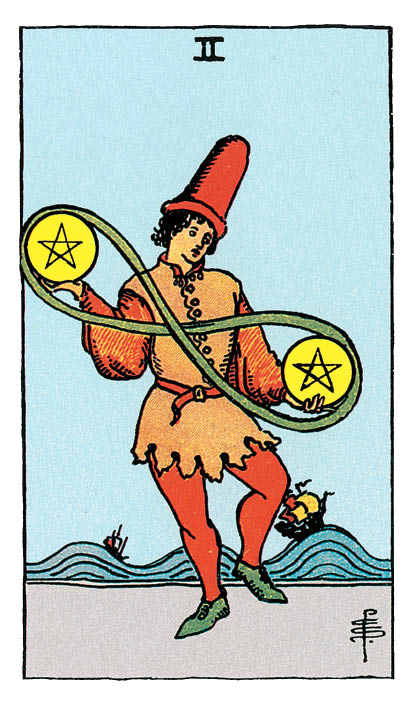

# Deux de Denier

## Signification

**Type de Carte :** Arcane Mineur de la Suite des Deniers, associée au monde matériel, à l'argent et aux possessions
**Élément :** Terre
**Numérologie / Rang :** 2, choix, dualité et couple

## Description

Un personnage vêtu de couleurs vives et portant un très grand chapeau jongle avec deux Deniers. Sa posture trahit la difficulté de l'exercice car il tient tout juste son équilibre. Les deux Deniers sont liés l'un à l'autre par un ruban et forment le symbole de l'infini. Au loin, la mer est houleuse. Les bateaux subissent les vagues mais gardent le cap.

## Mots-clés

### À l'endroit
- Jongler avec ses ressources
- Planifier son temps et/ou son budget
- Faire face aux imprévus

### À l'envers
- Se sentir dépassé
- Incapacité à prendre une décision, à s'engager
- Difficulté à maintenir équilibre et harmonie

## Interprétation

Vos ressources – votre temps, votre argent, votre Energie – ne sont pas inépuisables. Le Deux de Denier est apparu car vous devez travailler l'équilibre de vos ressources ou faire un choix quant à leur utilisation.

Si l'As de Denier représente l'étincelle, le commencement d'un projet devant générer de la valeur ou de l'argent pour vous, le Deux de Denier symbolise le besoin de trouver l'équilibre entre ce projet et les autres domaines importants de votre vie – la famille, la santé. Il est possible que vous soyez tiraillée entre deux désirs, deux centres d'intérêt. Si pour le moment vous arrivez à maintenir votre équilibre, c'est au prix d'un effort croissant que vous ne pourrez peut-être pas maintenir encore très longtemps.

Le Deux de Denier est la Carte de l'argent bien budgété, du temps bien employé, de la réussite via une bonne gestion de ses ressources. Cette Carte vous invite à vous focaliser sur votre quotidien et à mettre en place des habitudes qui vous permettront de jongler avec toutes vos activités, sans manquer de temps et sans stress.

Enfin, le Deux de Denier vous demande de rester attentive à ce qui vous entoure car le changement est permanent. Il vous faut rester en capacité de vous adapter à ce changement. Gardez vos priorités bien en ligne, priorisez vos activités et votre temps tout en gardant l'esprit ouvert sur les opportunités ou les challenges qui pourraient se présenter.

## Deux de Denier et l'Amour

Le Deux de Denier indique que vous jonglez avec différents partenaires ou avec différents projets. Vous souhaitez garder toutes vos possibilités ouvertes, sans choisir ou vous engager pour l'instant.

Si vous recherchez une relation durable, vous avez les cartes en main pour faire ce choix. Un partenaire n'est pas "meilleur" que l'autre mais pour avancer, vous devez renoncer à l'un ou l'autre. Faites votre choix en conscience, soyez au clair sur vos priorités et donnez-vous l'opportunité que "ça marche" vraiment.

Si vous êtes en couple, vous avez peut-être le sentiment que le temps passé ensemble est de plus en plus rare. Les responsabilités, le travail, les tracas quotidiens vous éloignent l'un de l'autre et vous vous sentez mise de côté. La situation ne peut pas s'améliorer sans une communication ouverte et bienveillante. Chacun doit revoir ses priorités pour accorder plus de temps et d'Energie à l'autre. Travaillez ce point ensemble, mettez-vous d'accord sur un planning et des activités à faire ensemble. Cela peut vous paraître un peu "cadré" mais cela vous remettra sur de bons rails. Vous pourrez ensuite laisser la spontanéité agrémenter votre quotidien.

## Deux de Denier et le Travail

Dans le domaine professionnel, le Deux de Denier indique que vous êtes très occupée, pour ne pas dire "débordée". Au travail, vous gérez les urgences. Il est possible que vous soyez investie dans plusieurs projets – votre emploi, une création d'entreprise, des responsabilités dans le domaine associatif… Votre challenge immédiat est de réussir à jongler avec toutes ces activités sans vous épuiser. Vous devez aussi prioriser les activités qui vont générer le plus de valeur ou de revenus sur le moyen terme.

Si vous recherchez un emploi ou avez envie de changer de voie professionnelle, vous courrez probablement trop de lièvres à la fois. Trouver un autre emploi, reprendre une formation, vous concentrer sur votre passion et en faire votre travail : peut-être recherchez-vous en fait un équilibre entre ce qui vous fait réellement vibrer et la stabilité d'un emploi fixe ? Il existe sans doute un moyen de les concilier.

## Deux de Denier et les Finances

Concernant vos finances et votre argent, le Deux de Denier représente un équilibre à trouver ou un choix à faire. Commencez par faire le point sur vos ressources et vos rentrées d'argent : tous vos oeufs sont-ils dans le même panier ? Quelles sont vos possibilités de diversifier vos investissements ou vos rentrées d'argent ? Menez cette réflexion pour vous procurer la sécurité financière dont vous avez besoin.

Le Deux de Denier est également une Carte qui conseille de jongler avec les recettes et les dépenses de façon très précise. Si vous avez des difficultés financières, il est temps de regarder de près votre budget et de vous engager à respecter votre équilibre recettes/dépenses.

## Deux de Denier et la Guidance

Qu'est-ce qui a le plus d'importance pour vous ? Vivez-vous en fonction de vos valeurs ? Comment utilisez-vous votre temps et votre argent ? Le Deux de Denier vous rappelle que dans la vie, tout est choix. A tout moment, vous choisissez, à tout moment vous décidez. Ce sont autant d'opportunités d'aligner vos actes avec votre Etre authentique.

Vous avez peut-être le sentiment que votre cheminement Spirituel est "grignoté" par les tracas du quotidien. La Spiritualité demande effectivement du temps et de l'Energie, de la disponibilité mentale. Assurez-vous de vous ménager des pauses, du temps pour vos pratiques intuitives et Energétiques, pour vous ressourcer et vous connecter à la Nature. Ces activités vous procurent plus de sérénité, ce qui en retour vous aide à gérer les tracas du quotidien. C'est un cercle vertueux "infini", comme le symbole des deux Deniers de la Carte, que vous pouvez mettre en place pour plus d'harmonie dans votre vie.

---

