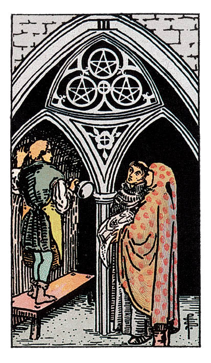

# Trois de Denier

## Signification

**Type de Carte :** Arcane Mineur de la Suite des Deniers, associée au monde matériel, à l'argent et aux possessions
**Élément :** Terre
**Numérologie / Rang :** 3, création, abondance, la réalité, le concret

## Description

Avec le Trois de Coupe, le Trois de Denier est une des rares Cartes du Tarot qui représente trois personnages faisant ensemble une activité. Dans une église, les trois personnages font un point sur le chantier de construction. Le jeune sculpteur attend les instructions des deux architectes qui lui montrent un plan. Chacun écoute et respecte l'idée de l'autre. Le Trois de Denier est une Carte qui évoque le travail d'équipe, la réussite collective.

## Mots-clés

### À l'endroit
- Esprit d'équipe, collaboration
- Compétences
- S'aider des autres pour réussir

### À l'envers
- Manque de concertation, d'esprit d'équipe
- Réparer les erreurs des autres
- "Intrigues" dans le milieu professionnel, au bureau

## Interprétation

Après avoir trouvé l'équilibre avec le Deux de Denier, le Trois de Denier représente un premier pallier atteint, une première réussite dans un projet de création, d'entreprenariat ou de construction. Le Trois de Denier est donc un message d'encouragement à persévérer. Vous avez les compétences nécessaires pour mener à bien ce projet, ne laissez pas le découragement ou le doute vous submerger.

Le Trois de Denier évoque les autres et leur place dans votre succès. Le succès est rarement obtenu en travaillant seul, il est le plus souvent le fruit d'une collaboration réussie. Sur quelles personnes pouvez-vous vous appuyer pour avancer ? Qui pourrait vous aider ? Le Trois de Denier est une invitation à élargir votre réseau, y compris en dehors de votre périmètre professionnel ou géographique. Ces nouvelles rencontres peuvent nourrir votre projet d'une nouvelle Energie et de nouvelles idées.

Le Trois de Denier représente également une communication et un retour sur vos actions. Parfois, il faut savoir écouter l'avis d'une personne, d'un collègue et prendre en compte ses remarques. Ne vous vexez pas, au contraire ! Demandez des retours puis accueillez ces idées comme autant de possibilités de faire encore mieux et de vous améliorer.

Enfin, le Trois de Denier peut aussi évoquer des choses très "pratico-pratiques" comme décorer sa maison, rénover une pièce, commencer une activité manuelle.

## Trois de Denier et l'Amour

Si vous pensez que le travail n'est pas l'endroit où trouver l'Amour, reconsidérez la chose. Chaque collègue, chaque client, chaque fournisseur est en capacité de vous présenter quelqu'un avec qui vous avez déjà un point commun. Et c'est parfois en se cotoyant professionnellement tous les jours que les sentiments naissent… Certes, ce n'est peut-être pas l'histoire romantique dont vous aviez rêvé, mais c'est une base solide pour construire une relation durable.

Si vous êtes en couple, le Trois de Denier indique que votre couple a d'excellents atouts pour durer. Vous "travaillez bien" ensemble, votre communication est honnête et bienveillante. En cas de difficultés, vous vous serrez les coudes, vous vous soutenez mutuellement. Vous pourriez aussi utiliser cette belle entente pour collaborer à un projet plus "fun", quelque chose que vous avez envie tous les deux de faire.

## Trois de Denier et le Travail

Le Trois de Denier est une excellente Carte dans un Tirage éclairant votre domaine professionnel. Cette Carte évoque les compétences, le travail collaboratif, le management et la réussite. Vous êtes en train de construire les bases sur lesquelles la suite de votre avenir professionnel va se construire. Vos compétences et talents seront reconnus, et récompensés, à leur juste valeur. Le Trois de Denier vous encourage à garder ce cap vers le succès.

Ce succès sera le fruit d'une collaboration réussie avec d'autres professionnels : des collègues dans le cadre du travail salarié, des "personnes ressources" dans le cadre de votre entreprise. C'est le moment de rejoindre un réseau professionnel, de vous rendre à des salons, d'aller à cette réunion du Club des Entrepreneurs… afin de faire des rencontres et d'ajouter du "sang neuf" à vos projets.

## Trois de Denier et les Finances

Le Trois de Denier indique que le succès matériel est à portée de main, à condition de continuer à travailler dur pour l'obtenir. Comme le sculpteur qui petit à petit taille la pierre, il faut de la patience et un travail régulier pour obtenir Abondance et stabilité financière.

Le Trois de Denier étant une Carte de collaboration, il est possible que vous ayez besoin d'aide ou de conseils pour (re)prendre en main votre situation financière ou pour la gérer au mieux. N'ayez pas peur de vous tourner vers les professionnels compétents : notaire, conseiller bancaire, expert-comptable. Chaque point de vue enrichit votre réflexion et vous aidera à mettre en place les "bonnes habitudes" nécessaires à l'Abondance durable.

## Trois de Denier et la Guidance

Chacun vit sa propre vie et fait ses propres expériences. Nous sommes tous extrêmement différents, nous vivons au quotidien des choses extrêmement différentes et pourtant, nous sommes des hommes et des femmes et cette expérience là a quelque chose d'Universel. Comme Le Fou / Le Mat, nous partons toutes et tous à la découverte de qui nous sommes, même si nous empruntons des chemins forts différents.

Ainsi, vous n'êtes pas seule dans votre quête spirituelle. Vous êtes accompagnée par toutes les personnes qui vous entourent, même si elles n'en parlent pas. Quelqu'un pourrait bien avoir besoin de vous, de vos conseils, de votre Lumière.

---

