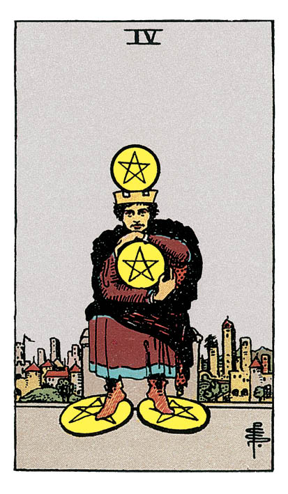

# Quatre de Denier

## Signification

**Type de Carte :** Arcane Mineur de la Suite des Deniers, associée au monde matériel, à l'argent et aux possessions
**Élément :** Terre
**Numérologie / Rang :** 4, stabilité, fondations

## Description

Un personnage portant une couronne est assis devant une ville opulente. L'homme tient fermement un Denier dans ses mains. Il en possède un sous chaque pied et un quatrième Denier tient en équilibre sur sa tête. Richement vêtu, il semble vous regarder et vous dire : "Je ne partage pas et tu n'auras rien !"

## Mots-clés

### À l'endroit
- Se protéger, ne pas tout donner
- Investir pour soi, sur soi
- Rechercher la sécurité et la stabilité
- Peur du changement

### À l'envers
- Avarice, être pingre
- Matérialisme
- Dépenser au-dessus de ses moyens

## Interprétation

Dans l'Energie du Trois de Deniers, l'accent est mis sur la coopération, la co-construction et le partage des ressources. Pour le Quatre de Denier, il n'est plus question de partager. Vous appréciez la stabilité que vous apporte votre gestion très prudente de votre patrimoine. Votre objectif est de faire croître encore ce patrimoine pour vous donner les moyens d'atteindre des objectifs encore plus ambitieux. Cela indique votre besoin de sécurité mais aussi votre envie de prendre soin de vous et de vos proches.

Sur le versant plus "négatif" de cette Carte, le Quatre de Denier peut révéler une soif intarissable, le besoin quasi compulsif d'accumuler sans donner en retour. Cette possessivité est alors le révélateur d'une peur ancrée en vous : peur de prendre des risques, peur de perdre ce que vous avez durement économisé.

Le Quatre de Denier indique parfois que, mis à part l'argent et le plan matériel, vous avez du mal à apprécier la valeur des choses. Faire croître son patrimoine est un objectif de vie tout à fait respectable. Mais les possessions matérielles ne sont pas la seule manifestation possible de l'Abondance dans votre vie.

Enfin, comme le Quatre d'Epée, le Quatre de Denier peut indiquer un refus d'évoluer ou de changer. Cette attitude intransigeante se traduit ici par une envie de régenter votre environnement et de toujours obtenir exactement ce que vous voulez… au risque de ne jamais être totalement satisfait(e) et de vous isoler de vos proches.

## Quatre de Denier et l'Amour

Dans un Tirage concernant l'Amour et les relations amoureuses, le Quatre de Denier peut indiquer que vous êtes tellement focalisé(e) sur vous-même que vous faites passer vos envies avant celles de votre partenaire et que vous pouvez vous montrer insensible à leurs envies.

En réalité, votre besoin d'obtenir toujours plus de la part de l'autre est dicté par la peur d'être blessé(e) ou de perdre votre partenaire. Mais cette attitude possessive risque d'étouffer votre partenaire.

Le conseil des Cartes est alors de créer des moments d'intimité émotionnelle et de partage avec votre partenaire. Communiquez, créez des souvenirs inoubliables que vous aurez plaisir à vous remémorer. Faites-vous confiance aussi. Le véritable amour a besoin d'espace pour grandir.

Si vous êtes seul(e), lâchez-prise et aggrandissez votre cercle de recherche. Soyez ouvert(e), ne vous aggripez pas au passé ni à une vision fantasmée de la rencontre. Soyez la personne avec qui vous avez envie de passer du temps… ce qui attirera à vous le bon partenaire.

## Quatre de Denier et le Travail

Dans un Tirage de Tarot concernant votre travail, le Quatre de Denier indique que vous avez un bagage de compétences dont vous connaissez la valeur. Vous aimeriez d'ailleurs le développer encore plus.

Si investir sur vous et vos compétences est une excellente idée, cette démarche ne doit pas être entreprise au détriment des autres, au risque de vous retrouver isolé(e). De plus, les collègues, clients ou fournisseurs peuvent être pour vous une source d'apprentissage et de développement, voire la clé de votre évolution professionnelle.

Le Quatre de Denier est également un fort indicateur de ce que le travail doit vous procurer. A ce stade de votre cheminement, un poste dans un environnement très challengeant, des changements rapides et/ou un niveau de stress important ne vous conviendrait pas. Vous avez besoin de stabilité et de sécurité.

## Quatre de Denier et les Finances

Dans un Tirage concernant l'argent et vos finances, le Quatre de Denier indique que vous avez un patrimoine satisfaisant à votre actif et/ou que l'atteinte de vos objectifs financiers est en très bonne voie.

Cet objectif financier ne doit cependant pas devenir le point central autour duquel toute votre vie s'organise. L'Abondance prend différentes formes et le plan matériel, symbolisé par les Deniers, comprend également votre santé, votre temps et votre Energie.

Le Quatre de Denier vous invite donc aussi à investir sur vous. De ce point de vue, ne soyez pas avare de votre temps ni de vos efforts. Développez vos compétences, prenez soin de votre corps, organisez votre temps pour gagner en efficacité. Sans négliger vos proches ! Prenez soin d'eux aussi car ils constituent le système de soutien de votre développement personnel.

## Quatre de Denier et la Guidance

Votre cheminement Spirituel et votre alignement sur les désirs de votre Etre Authentique n'ont de sens que s'ils peuvent être communiqués et partagés. Chacun emprunte son propre chemin mais le but est partagé par tous.

Alors, l'Univers veut que vous partagiez vos découvertes Intuitives. Partagez vos connaissances, votre expérience. Devenez la Lumière de L'Hermite pour éclairer le chemin d'autres personnes, elles aussi en quête d'alignement et de Spiritualité.

---

*Source : [Vivre Intuitif](https://vivre-intuitif.com/apprendre-le-tarot/signification/deniers/quatre-de-denier/)*
*Illustration : Tarot de A.E. Waite — Rider-Waite-Smith*
