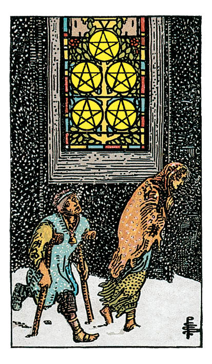

# Cinq de Denier

## Signification

**Type de Carte :** Arcane Mineur de la Suite des Deniers, associée au monde matériel, à l'argent et aux possessions
**Élément :** Terre
**Numérologie / Rang :** 5, déséquilibre, tournant, moment décisif

## Description

Dans la nuit noire, deux personnages se trouvent à l'extérieur d'une église. Habillés de guenilles, la jeune femme est nu-pieds dans la neige. Le jeune homme semble affligé d'une grave maladie, probablement la lèpre, ce qui explique les béquilles, le pansement et la clochette autour de son cou. Cherchent-ils à entrer dans l'église ? En sont-ils chassés ? Il se dégage de l'illustration un profond sentiment de désarroi face aux difficultés des deux malheureux.

## Mots-clés

### À l'endroit
- Difficultés financières
- Perte (emploi, maison…)
- Absence d'Abondance

### À l'envers
- Se remettre d'un passage à vide notamment financier
- Nouvel emploi, nouvelle opportunité financière
- Pauvreté spirituelle

## Interprétation

Quand vous pensez aux Cartes "négatives" du Tarot, vous pensez peut-être à La Tour (La Maison-Dieu) ou au Dix d'Epées… et pas au Cinq de Denier. Pourtant, la situation des deux personnages ici n'est vraiment pas enviable.

Le Cinq de Denier renvoie à une période difficile, douloureuse, marquée par le besoin et le manque.

Cette pauvreté peut se manifester dans tout ce que la Suite des Deniers représente : la pauvreté financière bien sûr mais aussi la pauvreté de la santé, du niveau Energétique, des compétences ou encore un manque de soutien amical.

Ainsi, le Cinq de Denier est la Carte des mauvaises passes, des périodes difficiles qui peuvent frapper à tout moment. Quand il apparait dans un Tirage, il est temps d'imaginer le scénario le moins favorable de façon à vous y préparer. C'est le moment de mettre de l'argent de côté, de prendre soin de vous et, au besoin, de demander de l'aide aux amis ou à un professionnel.

Si vous êtes déjà dans cette mauvaise passe, le Cinq de Denier indique qu'une solution existe. De l'aide est à votre portée même si actuellement vous ne vous en rendez pas compte.

Le Cinq de Denier peut aussi vous renvoyer à votre peur d'être seul(e) ou abandonné(e). Il est possible que vous vous sentiez mis(e) à l'écart du collectif – familial, professionnel, sociétal – et vous avez un grand besoin de soutien et de réconfort pour revenir petit à petit dans le groupe.

## Cinq de Denier et l'Amour

Dans un Tirage de Tarot concernant le domaine amoureux, le Cinq de Denier indique que vous avez toutes les peines du monde à trouver le bonheur et le contentement.

Si vous êtes à la recherche d'un(e) partenaire, les rencontres ne se font pas comme vous le souhaitez. "Ça ne colle pas" entre vous et les prétendant(e)s. Vous avez épuisé votre réseau relationnel et vous êtes à court d'idées.

Il est possible également que vous ayiez trop de choses en tête pour vous consacrer à cette recherche amoureuse. Si vous avez des problèmes d'ordre financier, ils sont à gérer en priorité pour dégager par la suite du temps et de l'Energie pour l'autre.

Si vous êtes en couple, vous traversez sans doute une période difficile. Le Cinq de Denier est la Carte de la co-dépendance, mode relationnel dans lequel un partenaire se repose trop sur l'autre, l'empêchant ainsi de déployer son plein potentiel.

En couple, il est possible aussi que votre relation soit devenue très difficile à vivre, notamment si les tracas financiers s'en mêlent. Vous vous sentez très seul(e), incapable de faire avancer votre couple dans la bonne direction. Votre partenaire en souffre certainement aussi.

## Cinq de Denier et le Travail

Dans un Tirage de Tarot concernant le travail, le Cinq de Denier indique que vous vous sentez en difficulté, isolé(e) voire mis(e) à l'écart.

Il est possible que le marché du travail et/ou votre secteur d'activité soient en tension actuellement. Votre entreprise connait peut-être un plan de restructuration. Si vous êtes à votre compte, votre chiffre d'affaire peut connaître une baisse relativement inexpliquée… et si vous pensiez à vous lancer, le moment n'est pas encore venu.

Dans tous les cas, obtenir de l'aide est possible. Comme pour les personnages de l'illustration, obtenir cette aide est parfois aussi simple que d'oser pousser la porte de l'église. Gardez votre orgueil pour vous et faites le premier pas.

## Cinq de Denier et les Finances

Sans surprise, dans un Tirage concernant l'argent et les finances, le Cinq de Denier n'est pas bon présage. La Carte annonce une perte financière, des problèmes d'argent voire la perte de votre emploi.

Vous voilà prévenu(e). C'est là tout l'intérêt du Cinq de Denier dans votre Tirage.

Sachez que dépenser de façon inconsidérée, investir ou prendre une décision très impactante financièrement n'est pas conseillé à ce stade. Au contraire, prévoyez d'ores et déjà une épargne et envisager des solutions de repli.

Au cœur de la tempête, n'hésitez pas à demander de l'aide. Vous pourrez compter sur la générosité de votre réseau personnel et sur l'aide octroyée par la société.

## Cinq de Denier et la Guidance

Le Quatre de Deniers collectionne ses richesses et ne les partage pas. Le Cinq de Denier est la conséquence logique de cette position égoïste. Ne pas partager ses richesses – toutes ses richesses – c'est appauvrir les autres.

Il est donc possible que vous vous sentiez vide spirituellement, pour ne pas dire vidée. Vous avez trop donné ou pas assez reçu – ces deux positions étant les deux faces de la même Energie.

Le Tarot vous conseille de vous reconnecter à votre Spiritualité, si possible via un groupe de pratique. Vous ressourcer dans l'Energie des autres et du groupe vous permettra de recharger vos batteries et de sortir de votre isolement. Quand vous sentirez que vous vous (re)mettez à donner au groupe autant que vous recevez, votre période de disette spirituelle sera terminée.

---

