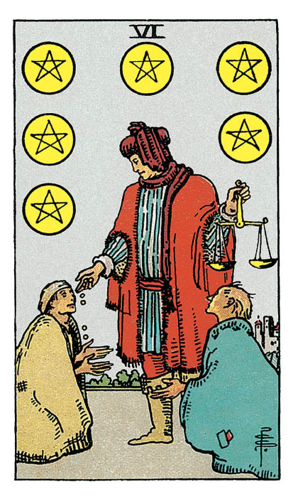

# Six de Denier

## Signification

**Type de Carte :** Arcane Mineur de la Suite des Deniers, associée au monde matériel, à l'argent et aux possessions
**Élément :** Terre
**Numérologie / Rang :** 6, harmonie et sécurité

## Description

Un homme richement vêtu fait la charité à deux mendiants agenouillés à ses pieds. Son vêtement de velours rouge symbolise sa richesse et son statut social. La balance qu'il tient de la main gauche symbolise la justesse de son action. Il se dégage de la Carte un sentiment de soulagement après les difficultés endurées dans l'Energie du Cinq de Denier.

## Mots-clés

### À l'endroit
- Partage, don, cadeau
- Se montrer charitable et généreux
- Equilibre et justesse matérielle

### À l'envers
- Dettes, problèmes financiers
- Egoïsme, ignorer les difficultés des autres
- Donner mais en attendant un retour

## Interprétation

Comme le Cinq d'Epée, la Carte du Six de Denier illustre sur une même Carte de Tarot le point de vue fort différent de deux ensembles de personnages.

D'un côté, l'homme riche a atteint l'Abondance et partage dorénavant ses richesses avec les plus pauvres.

De l'autre, les mendiants représentent la faculté de recevoir ce qui est offert et d'accepter les cadeaux – surtout quand on en a vraiment besoin.

Chacun de nous peut se trouver un jour dans l'une ou l'autre de ces deux postures. Elles sont toutes les deux caractéristiques de la relation à l'autre.

Si vous vous retrouvez dans la posture de l'homme qui donne, cela signifie que l'Abondance est bien présente dans votre vie, à tel point que vous êtes en capacité de redistribuer autour de vous ce flot Energétique. Il ne s'agit pas seulement d'argent sonnant et trébuchant mais aussi de votre temps, de vos compétences, de votre écoute. Vous êtes en mode "partage" vis-à-vis de vos proches… alors regardez autour de vous qui pourrait avoir besoin de votre soutien.

Si vous vous trouvez dans la posture des personnages qui reçoivent, recevez avec gratitude. Cette aide vous est d'un grand secours car elle vous permet de vous remettre de difficultés passagères pour mieux repartir. Ce moment doit vous servir à imaginer comment péréniser votre propre flot d'Abondance pour ne pas ou ne plus dépendre des autres. Pensez aussi à comment vous pouvez, à votre tour, venir en aide à d'autres personnes qui sont dans le besoin.

## Six de Denier et l'Amour

Dans un Tirage de Tarot concernant l'Amour, le Six de Denier vous interroge sur la notion de donner et de recevoir.

Si vous êtes à la recherche d'un(e) partenaire, analysez vos relations passées à la lumière de la dynamique du Six de Denier. Etiez-vous plutôt du genre "Je donne, je donne !" … quitte à apparaître comme une personne qui manque de confiance en soi ? Etiez-vous plutôt du genre "Je prends, je prends !" … quitte à vous investir dans des relations éphémères et peu équilibrées ?

Le Six de Denier peut aussi indiquer qu'un proche pourrait vous aider à trouver l'Amour en vous présentant à quelqu'un. Alors, n'hésitez pas à rencontrer cette personne, même si l'exercice vous parait un peu forcé.

En couple, le "donner – recevoir" est idéalement vécu comme harmonieux et équilibré par les deux partenaires. Dans votre Tirage, le Six de Denier indique que ce n'est probablement pas le cas.

L'un de vous investit peut-être plus que l'autre dans la relation en terme de temps, d'Energie et/ou d'argent. Cela provoque chez ce partenaire du ressentiment et de l'amertume.

A l'inverse, l'un de vous pourrait volontairement refuser à l'autre ce dont il/elle a besoin pour être bien dans le couple.

Dans les deux cas, un profond déséquilibre de la relation s'installe avec un risque fort de domination d'un partenaire sur l'autre. Si ce schéma est effectivement ce que vous vivez, l'appui d'un psychologue ou d'un thérapeute est sans doute nécessaire pour briser le cercle vicieux et les habitudes prises.

## Six de Denier et le Travail

Le monde du travail est rarement un environnement dans lequel toutes les relations sont harmonieuses et équilibrées. Vous pouvez vous sentir "tout petit(e)" face à votre supérieur hiérarchique ou face à un collègue ; certains collègues peuvent essayer d'obtenir de vous du temps, des compétences pour se faciliter la tâche ; un client peut tenter d'en obtenir toujours plus de vous.

Vous pouvez aussi avoir le sentiment que vous n'êtes pas rémunéré(e) à hauteur de votre engagement… ou que des compétences vous manquent pour faire le travail qui vous est demandé.

Le Six de Denier vous invite à être très vigilant(e) sur ces aspects dans votre travail et à tout mettre en œuvre pour rétablir l'équilibre. Il en va de votre niveau Energétique, de votre contentement du Coeur au travail.

Le Six de Denier peut aussi sortir dans un Tirage pour vous alerter sur l'équilibre entre votre vie privée et votre vie professionnelle. Assurez-vous que suffisamment de temps et d'Energie soit consacré à ces deux aspects fondamentaux de votre vie. Si le travail devait prendre une part très – voire trop – importante, cet investissement de votre part doit être reconnu et ne pas être soutenu indéfiniment dans le temps.

## Six de Denier et les Finances

Dans un Tirage concernant l'argent et les finances, le Six de Denier indique que l'aide dont vous avez besoin pourrait vous être accordée. Pour cela, vous devez la demander.

Il n'est pas question ici de gagner une somme d'argent aux jeux ou de toucher un héritage miraculeux. Il s'agit de travailler avec la ou les personnes qui peuvent vous aider à régler vos problèmes financiers et à tout mettre en œuvre pour vous mettre sur la voie de l'indépendance financière.

Si votre situation financière est bonne, le Six de Denier indique que l'Abondance est toujours au rendez-vous. Vous pouvez utiliser votre stabilité financière pour contribuer au bien-être de votre Communauté.

## Six de Denier et la Guidance

Qu'est-ce qui se cache derrière le plaisir si simple et pourtant si agréable de faire plaisir à quelqu'un ? Le plaisir du partage. Le plaisir d'avoir aidé. De s'être rendu utile. D'être entré en relation à l'autre de façon pure, sans rien attendre de particulier en retour.

D'une certaine façon, cette émotion donne du sens à l'existence. Chacun peut se dire : "Je cherche peut-être encore ce que je fais sur cette Terre, mais au moins, j'étais là pour aider !"

Dans toutes les relations, quelqu'un donne et quelqu'un reçoit. Cela est vrai aussi de votre relation à l'Univers et au Divin.

Le Six de Denier explique ce qui peut sembler être à première vue un paradoxe. Pour recevoir, il faut donner… et plus vous voulez recevoir, plus vous devez donner. Votre générosité et vos dons attirent l'Abondance vers vous. Cet "effet boomerang" est une loi karmique.

---

*Source : [Vivre Intuitif](https://vivre-intuitif.com/apprendre-le-tarot/signification/deniers/signification-du-six-de-denier-dans-le-tarot/)*
*Illustration : Tarot de A.E. Waite — Rider-Waite-Smith*
