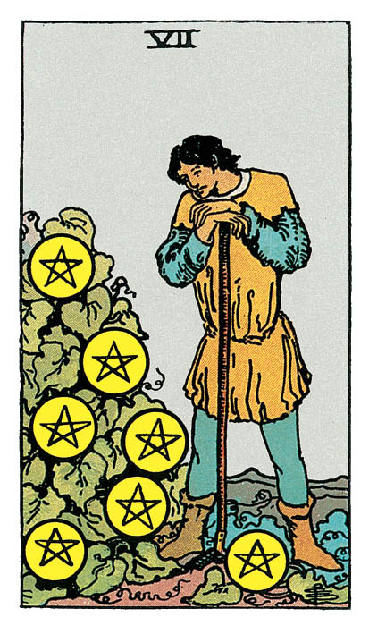

# Sept de Denier

## Signification

**Type de Carte :** Arcane Mineur de la Suite des Deniers, associée au monde matériel, à l'argent et aux possessions
**Élément :** Terre
**Numérologie / Rang :** 7, contemplation, voyage intérieur, sagesse

## Description

Dans son jardin, un personnage regarde un massif de plantes qui arrive à maturité. Les fruits, symbolisés par les Deniers, ne sont pas encore tout à fait mûrs. La récolte doit attendre… et le jardinier aussi. Bien que la récolte à venir soit très abondante, le jardinier, appuyé sur sa binette, semble pensif, presque triste. Contemple-t-il le résultat de son dur labeur en se disant "J'espérais plus" ? Est-il fier de son travail et de ses résultats ?

## Mots-clés

### À l'endroit
- Patience
- Travail acharné
- Progrès lents et réguliers

### À l'envers
- Abandonner trop vite
- Fainéantise
- Espérer pour rien

## Interprétation

Après la fin d'une période difficile représentée par le Cinq de Denier et le Six de Denier, votre situation matérielle connait une accalmie. Votre travail de longue haleine, vos efforts sur le long terme finissent par payer.

Mais le Sept de Denier soulève une question importante… Dans l'après-coup, le jeu en valait-il la chandelle ? Récoltez-vous des fruits en adéquation avec les efforts que vous avez déployés ?

Si vous pensez que oui, alors, le Sept de Denier annonce un moment joyeux. Vous avez travaillé dur, vous avez fait des efforts. Il est possible que vous vous soyez "challengé(e)" pour atteindre un résultat que vous pensiez loin d'être acquis. Le moment est presque venu de profiter pleinement de ce gigantesque travail et d'en être fier(e) !

Si vous pensez au contraire que vos efforts auraient dû générer plus de résultats, alors, le Sept de Denier reflète une perte de moral et d'enthousiasme. Vous avez le sentiment d'avoir sacrifié du temps et de l'Energie pour rien… ou si peu.

Dans les deux cas, l'Energie du Sept de Denier est une leçon de patience. Ce sont les efforts réguliers, à long terme, qui seront récompensés. Les solutions miracles n'existent pas.

Ainsi, le Sept de Denier vous invite à penser votre vie, vos activités, à long terme. Le jardinier connait sa terre et le climat dans lequel il cherche à faire pousser ses fruits. Comme lui, réfléchissez aux domaines de votre vie qui ont besoin de votre attention maintenant pour vous offrir, en temps voulu, les meilleures récompenses. Identifiez, à l'inverse, les domaines de votre vie qui épuisent votre temps et votre Energie sans vous offrir un juste retour sur votre investissement.

Le Sept de Denier vous invite à évaluer les stratégies que vous avez mises en place et les résultats que vous avez obtenus. Si vous avez l'impression que vous avez (trop) dévié de votre trajectoire, il est temps de faire les ajustements qui s'imposent pour atteindre votre objectif.

## Sept de Denier et l'Amour

Le Sept de Denier est une Carte d'attente. Alors, dans un Tirage de Tarot concernant l'Amour – quelle que soit votre situation amoureuse – le Sept de Denier indique que vous devez faire preuve d'un peu de patience.

Si vous êtes célibataire, vous pouvez utiliser ce temps pour réfléchir à ce que vous recherchez vraiment chez un partenaire et continuer à apprendre des choses sur vous-même. Puisque la rencontre n'est pas pour tout de suite, autant avancer vers elle en sachant ce que votre Coeur souhaite authentiquement trouver chez l'autre. Vous serez ainsi en mesure de savoir quand vous l'aurez trouvé.

Si vous êtes en couple, vous avez le sentiment que cette histoire vaut vraiment la peine de vous investir pleinement. Vous savez que construire un couple solide et durable prend du temps et se fait à deux. Vous êtes prêt(e) à faire votre part de ce travail, en toute authenticité.

Il est possible d'ailleurs que les choses n'aillent pas aussi vite que vous aimeriez. Si tel est le cas, ne vous perdez pas dans cette relation. Observez le tempo de l'autre et continuez à entretenir "votre jardin" – vos centres d'intérêt, vos amis – de façon à équilibrer les choses, votre Energie et votre temps.

Si vous venez de rompre, le Sept de Denier peut parfois signifier une possible reprise de la relation. Cette reprise ne peut se faire qu'à long terme, quand chacun aura suffisamment cheminé pour comprendre ce qui n'a pas fonctionné la première fois.

## Sept de Denier et le Travail

Le Sept de Denier représente le travail au long cours, le travail de fond et la motivation soutenue dans le temps.

Dans un Tirage de Tarot au sujet de votre carrière professionnelle, le Sept de Denier met donc l'accent sur le processus, sur les tâches à accomplir, plutôt que sur le résultat.

Comment pouvez-vous soutenir votre motivation jusqu'à l'atteinte de votre objectif ? Comment pouvez-vous trouver du contentement au travail dans le quotidien de vos tâches ?

Le Sept de Denier vous demande également de "dézoomer" sur votre carrière professionnelle et de la regarder à long terme. Comment voyez-vous votre avenir ? Avez-vous besoin de suivre une formation pour parfaire vos compétences ? Souhaitez-vous changer de voie pour vous assurer une suite professionnelle plus en adéquation avec vos attentes ? Si tel est le cas, vous êtes prêt(e) à vous lancer dans un parcours de transformation professionnelle qui vous apportera plus de satisfaction à long terme.

Si votre carrière est déjà bien établie et que vous ne souhaitez pas de changement radical, le Sept de Denier vous invite à réfléchir sur les années à venir. Est-ce que vos objectifs professionnels pour le long terme sont clairs ? Mettez-vous en place les actions qui vous permettront de les atteindre ?

## Sept de Denier et les Finances

Dans un Tirage concernant l'argent et les finances, le Sept de Denier souligne votre mécontentement. Vous avez certainement le sentiment que votre situation financière n'évolue pas dans le bon sens malgré vos efforts ou qu'elle évolue trop lentement.

Toutefois, si vous avez fait les efforts nécessaires pour équilibrer votre budget, vous êtes en train d'améliorer votre situation, même si l'amélioration est lente. Vérifiez vos chiffres et faites les ajustements nécessaires pour accélérer le processus. Si vous êtes en effet sur la bonne voie, vous devez prendre patience et continuer.

Le Sept de Denier peut aussi indiquer la nécessité de mettre de l'argent de côté pour un coup dur éventuel.

## Sept de Denier et la Guidance

Le but du cheminement spirituel n'est pas tant la destination mais plutôt le voyage.

Chaque initié(e) le sait bien.

Si vous reconnaissez en vous le désenchantement du personnage du Sept de Denier face à sa récolte, vous devez sans doute revoir vos objectifs spirituels et savourer un peu plus votre cheminement.

L'Eveil n'est pas un état grâce qui vous tombe dessus d'un seul coup. Comme la chenille subit plusieurs transformations avant de prendre son envol de papillon, votre cheminement spirituel est fait d'avancées, de transformations, parfois de régressions… mais chaque étape vous livre un Secret, chaque étape vous transforme pour que vous deveniez toujours un peu plus vous-même.

L'Eveil n'est pas une fin en soi. Il s'agit d'un processus d'apprentissage, de développement de soi, de compréhension de soi, des autres et du monde. Ce cheminement n'a pas de fin puisqu'il est le travail de toute une vie.

---

*Source : [Vivre Intuitif](https://vivre-intuitif.com/apprendre-le-tarot/signification/deniers/sept-de-denier/)*
*Illustration : Tarot de A.E. Waite — Rider-Waite-Smith*
