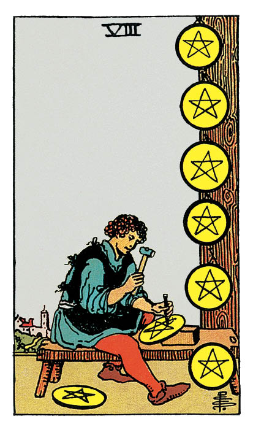

# Huit de Denier

## Signification

**Type de Carte :** Arcane Mineur de la Suite des Deniers, associée au monde matériel, à l'argent et aux possessions
**Élément :** Terre
**Numérologie / Rang :** 8, mouvement, action

## Description

Seul dans son atelier, un personnage est affairé à graver des pentacles. Il a déjà réalisé six pentacles, exposés sur le mur. Il travaille sur le septième et le huitième est à ses pieds. L'atelier est à l'écart de la ville et de ses distractions. Ainsi, le personnage peut consacrer toute son attention et toute son Energie à son projet. Il semble très concentré sur sa tâche, comme s'il souhaitait réaliser un travail parfait.

## Mots-clés

### À l'endroit
- Harmonie au travail
- Travail de qualité
- Acquérir des compétences, pratiquer

### À l'envers
- Perfectionnisme
- Manquer d'ambition ou de direction
- Régler les problèmes des autres

## Interprétation

Le Huit de Denier est une Carte qui représente le développement des compétences et le travail nécessaire à la maîtrise d'une discipline. Dans l'Energie du Huit de Denier, vous êtes en croissance, vous grandissez vers une version plus compétente de vous-même. Vous faites ce travail naturellement, sans que cela vous coûte. Dans cet apprentissage, rien n'est difficile ou rebutant.

Développer vos compétences implique apprendre de nouvelles choses, essayer de nouvelles façons de faire qui vous permettent d'atteindre vos objectifs de façon plus éclatante. Vous avez choisi consciemment d'entreprendre ses efforts et vous êtes parfaitement concentré(e) sur les tâches à accomplir. Votre persévérance est la clé de votre succès.

Le Huit de Denier valide votre travail et vous encourage donc à continuer vos efforts et à terminer le travail entrepris. Par exemple, si vous avez commencé à apprendre le Tarot, le Huit de Denier vous invite à poursuivre dans cette voie jusqu'au niveau de maîtrise qui vous satisfait réellement.

Comme avec le Sept de Denier, la patience est nécessaire… mais pas suffisante. Continuez à faire les ajustements nécessaires, à vous améliorer, à travailler sur votre projet. Bientôt, le succès sera au rendez-vous.

## Huit de Denier et l'Amour

Le Huit de Denier est une Carte de "travail"… ce qui n'est pas a priori associé à l'Amour. Pourtant, pour qu'un couple fonctionne, il arrive parfois que chacun doive travailler sur lui-même et/ou travailler à rendre la relation plus satisfaisante.

C'est de cela dont il s'agit avec le Huit de Denier.

Votre relation représente beaucoup à vos yeux et vous êtes prêt(e) à faire tout ce qui est nécessaire pour que votre couple soit harmonieux et durable. Vous vous investissez donc fortement pour que votre relation fonctionne, pour que les besoins de votre partenaire soient satisfaits. Attachez-vous bien à faire ce travail ensemble, à construire votre couple et sa réussite ensemble par un dialogue ouvert et Authentique.

Si vous recherchez un(e) partenaire, vous savez que vous avez besoin de travailler sur vous avant d'être prêt(e) à faire des rencontres. Vous avez envie d'être dans les meilleures dispositions pour accueillir l'autre dans votre vie. Alors, si vous avez des soucis – financiers, de santé, liés à d'autres relations – vous choisissez de mettre de l'ordre dans ces domaines avant de vous considérer disponible pour une rencontre.

Il est possible également que le Huit de Denier indique que votre travail et/ou un projet vous occupe tellement en terme de temps et d'Energie qu'une rencontre n'est pas possible pour l'instant.

## Huit de Denier et le Travail

Dans un Tirage de Tarot concernant votre carrière professionnelle, le Huit de Denier indique que vous souhaitez maîtriser vos domaines de compétences, être reconnu(e) comme Expert.

L'acquisition de nouvelles compétences est plus importante pour vous qu'une augmentation, un nouveau poste ou toute autre "récompense" octroyée par une tierce personne. A vos yeux, le processus de développement professionnel dans lequel vous êtes engagé(e) est suffisamment générateur de plaisir qu'il se suffit à lui-même.

Pour cela, vous concentrez vos efforts de façon consciente et vous travaillez dur. Dans ces conditions, le succès n'est jamais bien loin. Même si ce n'est pas votre unique but, votre travail acharné et votre implication seront remarqués et récompensés. Ainsi, votre récompense sera double : votre montée en compétences ET la possibilité de les exercer dans un nouveau poste ou dans un nouveau cadre encore plus gratifiant.

## Huit de Denier et les Finances

Dans un Tirage concernant l'argent et les finances, le Huit de Denier est une indication forte que l'investissement le plus pertinent que vous puissiez faire est d'investir en vous et en vos compétences.

Vous devez peut-être garder ce travail moins rémunérateur… et y apprendre les savoir-faire nécessaires à l'obtention d'un poste plus gratifiant.

Pour développer votre entreprise, vous avez sans doute besoin de développer tel ou tel aspect de votre posture entrepreneuriale.

Avec le Huit de Denier, il s'agit d'envisager le domaine financier à long terme. Votre situation ne va pas s'améliorer du jour au lendemain mais elle peut tout à fait s'améliorer si vous mettez en place, petit à petit, un plan pour l'améliorer. Ce plan passe par l'identification des compétences précises dont vous avez besoin… et l'acquisition de ces compétences via une formation ou la pratique.

## Huit de Denier et la Guidance

Avec le Sept de Denier, vous avez compris que l'Eveil spirituel, le développement personnel ne sont pas des fins en soi mais des voyages dont vous devez apprécier chaque étape.

La leçon du Huit de Denier est que ce cheminement est fait d'essais, d'erreurs… et qu'il est parfois nécessaire, comme le dit le proverbe, de remettre cent fois sur le métier son ouvrage.

Le Huit de Denier vous invite donc à vivre votre Eveil comme le travail de toute une vie, de ne pas abandonner trop vite une pratique intuitive, de vous accrocher un minimum pour commencer à ressentir les effets bénéfiques qui porteront votre prochaine étape d'apprentissage.

---

