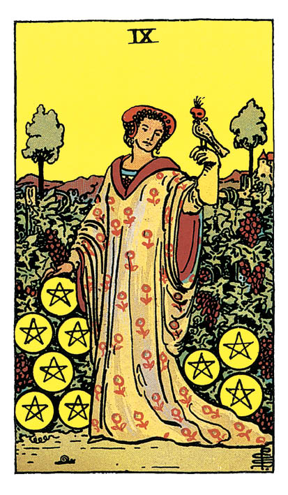

# Neuf de Denier

## Signification

**Type de Carte :** Arcane Mineur de la Suite des Deniers, associée au monde matériel, à l'argent et aux possessions
**Élément :** Terre
**Numérologie / Rang :** 9, achèvement et sagesse

## Description

Une belle dame, richement vêtue est seule dans son jardin. Les fruits sont nombreux sur la vigne, symbole de son Abondance et de sa réussite sur le plan matériel. Elle est accompagnée d'un faucon sagement perché sur sa main gantée. L'oiseau renvoie à l'Elément Air, lié aux pensées et aux processus intellectuels. Le fait que le faucon soit domestiqué symbolise le contrôle que la femme exerce sur la dimension Mentale de son existence. Pour arriver à ce succès, elle a remplacé les ruminations et pensées obsédantes par la visualisation, la méditation et un regard optimiste sur la vie. Il se dégage de la Carte une sensation apaisante. Cette femme est libre et à sa place dans le monde.

## Mots-clés

### À l'endroit
- Sécurité, stabilité
- Abondance
- Indépendance

### À l'envers
- Se sentir coincé(e), dans une cage dorée
- Contre-temps dans la réussite matérielle
- Se comparer aux autres, être envieux(-se)

## Interprétation

Succédant immédiatement au Huit de Denier, le Neuf de Denier représente le résultat de la persévérance et du travail acharné. Quand vous avez acquis une compétence grâce à votre ténacité, elle s'intègre complètement à votre Etre. Elle devient actionnable à l'envie, aussi naturelle que la respiration ou la marche.

Le Neuf de Denier indique que vous avez acquis les compétences nécessaires à la gestion du plan matériel de votre existence et vous appréciez à présent les fruits de ce travail.

Comme vous ne devez cette maîtrise qu'à vous-même, votre estime de soi est boostée. Vous avez confiance en vous. Vous vous sentez capable de subvenir à vos besoins, d'assurer un flux d'Abondance durable dans votre vie. Vous vous sentez indépendant(e) et libre.

Le Neuf de Denier exprime ce moment si plaisant qui consiste à savourer les fruits de son travail. Souvenez-vous du Sept de Denier, le jardinier un brin déçu de devoir attendre encore le moment de la récolte… Vous y êtes à présent ! Profitez ! Célébrez le parcours qui vous a amené(e) jusqu'ici. Ressentez la gratitude et la joie immense que procure le travail bien fait.

## Neuf de Denier et l'Amour

Le Neuf de Denier est une Carte d'indépendance. La femme d'âge mûr représentée sur la Carte est parfaitement à l'aise seule. Elle apprécie son indépendance et sa liberté car elle n'a pas besoin d'être en couple pour se sentir accomplie.

Si vous êtes à la recherche de l'amour, le Neuf de Denier indique que vous devez d'abord vous sentir en harmonie avec vous-même. Vivez une vie riche de ce qui fait vibrer votre Coeur – amis, hobbys, travail, performances… Remplissez votre vie des bonheurs petits et grands qui vous apportent de la joie.

Ainsi, la personne que vous rencontrerez ne viendra pas remplir un vide dans votre vie ou vous compléter de quelque manière. Au contraire ! Vous serez en capacité de lui apporter autant et chacun s'intègrera dans la vie d'Abondance de l'autre.

Si vous êtes en couple, le Neuf de Denier indique que vous ne devez pas vous y perdre. Même si vos vies sont profondément entremêlées, vous êtes chacun une personne distincte qui ne peut pas tout attendre de son partenaire. Vous devez cultiver les fleurs exclusives de votre jardin : votre individualité, votre vie sociale, vos passions. Votre bonheur dépend de votre capacité à ne pas vous fondre dans votre partenaire et/ou l'un dans l'autre.

Enfin, le Neuf de Denier est toujours un rappel de votre valeur en tant qu'individu. Vous méritez le meilleur dans vos relations amoureuses et vous méritez de partager un amour réciproque avec une personne qui vous traite avec le plus grand respect.

## Neuf de Denier et le Travail

Dans un Tirage de Tarot concernant votre carrière professionnelle, le Neuf de Denier indique que vos efforts finissent par payer. Vous récoltez les fruits de votre travail acharné et cela pourrait se matérialiser par une augmentation de salaire, une promotion ou toute forme de reconnaissance que vous attendiez. Prenez un moment pour fêter cette réussite car elle est amplement méritée. Sachez que vous pouvez aller plus loin encore !

Le Neuf de Denier est une Energie de confiance en soi. Vous savez que vous pouvez réussir et vous allez continuer à tracer votre voie. Allez-vous le faire seul(e) ou – surtout si vous êtes entrepreneur ou profession libérale – engager de l'aide ciblée pour aller encore plus loin ? Si vous êtes salarié(e), la possibilité de manager une équipe pourrait également se présenter.

## Neuf de Denier et les Finances

Dans un Tirage concernant l'argent et les finances, le Neuf de Denier est une Carte de très bon augure. Après avoir âprement travaillé pour assurer votre Abondance financière, vous êtes récompensé(e) ou sur le point de l'être.

Le Neuf de Denier indique plus profondément encore que l'argent et les possessions matérielles ont trouvé leur juste place dans votre vie. Si ce domaine était une préoccupation constante, il passe à présent au second plan. Vous développez une relation plus saine et plus équilibrée avec vos finances.

## Neuf de Denier et la Guidance

La belle dame qui illustre le Neuf de Denier est seule et pourtant elle est parfaitement heureuse. Elle est capable d'apprécier tout ce qui l'entoure. Il ne lui manque rien.

Elle connait la valeur de ce qu'elle chérit – possessions matérielles, relations profondes, objectifs atteints… – car elle a travaillé d'arrache-pied pour les obtenir.

En d'autres termes, cette femme vit la vie dont elle a toujours rêvé parce qu'elle l'a construite de ses mains.

Le Neuf de Denier est apparu pour vous inspirer à faire la même chose.

Devenez cette belle dame qui construit, jour après jour, sa propre Abondance. Vivez cette Abondance pleinement, comme il vous chante.

Pour cela, vous pouvez commencer par évacuer de votre vie ce qui ne vous sert pas – et cela peut littéralement commencer sur le plan matériel par un "grand ménage".

Gardez ce qui résonne profondément avec vos valeurs, votre idée du bonheur. Sur cette base, élevez ce château fort de stabilité, de bonheur et d'Amour qui sera votre vie Abondante et comblée.

---

*Source : [Vivre Intuitif](https://vivre-intuitif.com/apprendre-le-tarot/signification/deniers/neuf-de-denier/)*
*Illustration : Tarot de A.E. Waite — Rider-Waite-Smith*
