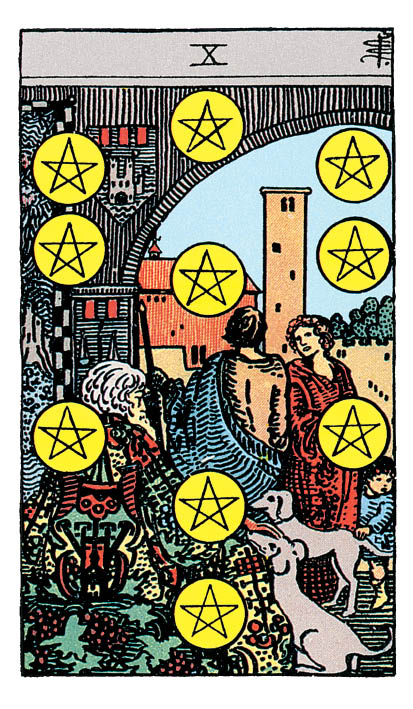

# Dix de Denier

## Signification

**Type de Carte :** Arcane Mineur de la Suite des Deniers, associée au monde matériel, à l'argent et aux possessions
**Élément :** Terre
**Numérologie / Rang :** 10, transcender, commencer un nouveau chapitre de son existence avec sagesse

## Description

Un vieil homme est assis au premier plan, entouré de ses enfants et de ses petits-enfants. Maintenant en retraite, il est heureux de profiter des fruits de son travail. Il sait qu'il transmet à sa descendance non seulement ses richesses mais aussi ses valeurs. Cela va leur permettre de vivre dans le bonheur et la joie. Tout sur la Carte respire l'harmonie et l'Abondance.

## Mots-clés

### À l'endroit
- Héritage, descendance
- Sécurité financière, stabilité familiale
- Liens familiaux

### À l'envers
- Conflits familiaux, mésentente
- Problèmes financiers
- Solitude

## Interprétation

L'Abondance et le succès peuvent prendre plusieurs formes : une carrière professionnelle accomplie, de l'argent mis de côté, la stabilité et l'harmonie familiales. Malgré les difficultés et les contre-temps, le Dix de Denier indique que l'Abondance va récompenser votre cheminement. Vous vous sentez fière de ce que vous avez accompli et vous avez envie de partager ce succès avec celles et ceux qui vous sont chers.

Le Dix de Denier est fortement lié à la famille. Vous avez besoin de prendre soin de vos proches, de vos enfants et/ou de vos parents. Vous souhaitez vous assurer qu'ils ne manquent de rien. Vous voulez être réellement présente auprès d'eux, échanger, discuter. Si la famille est si importante en ce moment, c'est parce qu'elle vous relie à quelque chose de plus grand (vos Ancêtres, votre Communauté) et parce qu'elle vous renvoie aux liens authentiques que vous avez tissés avec vos proches et qui font aujourd'hui la personne que vous êtes.

Enfin, le Dix de Denier est également associé à la temporalité, aux générations futures. Cette Carte indique votre souhait profond de construire une vie meilleure pour vous et pour ceux qui vous sont chers. Vous envisagez les impacts de vos actions sur le long-terme et vous ne voulez pas que vos décisions entament la sécurité financière de votre famille.

## Dix de Denier et l'Amour

Le Dix de Denier évoque la stabilité et la famille. Cette Carte indique que vous recherchez avant tout une relation dans laquelle vous vous sentirez en sécurité et en confiance avec un partenaire qui lui aussi a envie de construire une relation durable.

Si vous recherchez ce partenaire, pourquoi ne pas vous appuyer sur votre famille et vos amis proches ? Ils ont certainement dans leur réseau des personnes à vous faire rencontrer. Soyez vous-même et ne cherchez pas à séduire à tout prix. Avant de vous demander si vous pouvez correspondre à cette personne, demandez-vous plutôt si cette personne peut vous correspondre à vous.

Si vous êtes déjà dans une relation, le Dix de Denier peut indiquer que les choses deviennent "sérieuses". Emménagement, décision de faire un enfant, mariage ou PACS : votre relation, et votre amour, se matérialisent par un engagement concret.

## Dix de Denier et le Travail

Le Dix de Denier est une très bonne Carte dans un Tirage professionnel. Elle indique que votre objectif va bientôt être atteint, que vous allez vivre le succès professionnel pour lequel vous avez travaillé si durement. Il peut s'agir de trouver un emploi, de vous assurer une source stable de revenus, d'une promotion ou une augmentation.

Ce succès arrive "au bon moment" puisque vous êtes prête à briller. Ce Dix indique que vous avez appris de vos erreurs, que vous avez développé les compétences attendues. Vous êtes prête à relever ce nouveau challenge, surtout s'il s'agit d'un poste ou d'un projet à forte responsabilité.

## Dix de Denier et les Finances

Pour les finances et l'argent, le Dix de Denier est une Carte très positive. Vous avez utilisé vos ressources avec intelligence et vous en récoltez les fruits.

Pour que votre patrimoine puisse être transmis selon votre volonté, il est temps de mettre vos affaires en ordre. Bien sûr, cela peut vous sembler triste – ou complètement prématuré – mais rédiger un testament, désigner vos bénéficiaires est un acte de générosité essentiel pour que vos souhaits soient respectés. Il est temps d'y penser sérieusement.

Le Dix de Denier peut également annoncer une transaction financière, immobilière ou un héritage à votre bénéfice. Profitez de cette Abondance financière pour investir ou mettre cet argent de côté et assurer votre avenir financier.

## Dix de Denier et la Guidance

Le Dix de Denier est apparu pour vous interroger sur l'Abondance. Qu'est-ce que l'Abondance pour vous ? Quel rapport entretenez-vous avec elle ? Vous sentez-vous digne de l'accueillir dans votre vie ?

Vous pouvez faire l'expérience de l'Abondance sur le plan Matériel – argent, possessions matérielles – et sur le plan Spirituel – Intuition riche, Energies positives et ancrage par exemple.

Le Dix de Denier vous interroge sur les véritables trésors de votre existence. Quels sont-ils ? A qui valent-ils la peine d'être transmis ?

Ces plaisirs immatériels font les joies authentiques.

---

*Source : [Vivre Intuitif](https://vivre-intuitif.com/apprendre-le-tarot/signification/deniers/dix-de-denier/)*
*Illustration : Tarot de A.E. Waite — Rider-Waite-Smith*
