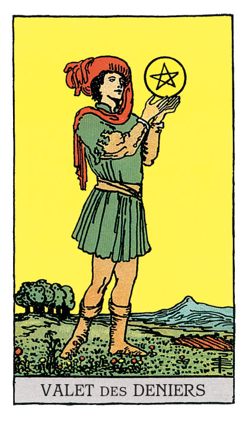

# Valet de Denier

## Signification

**Type de Carte :** Arcane Mineur de la Suite des Deniers, associée au monde matériel, à l'argent et aux possessions
**Élément :** Terre
**Numérologie / Rang :** Valet — les premières étapes, l'enfant espiègle, le commencement

## Description

Un jeune homme se tient seul dans un champ. De jolies fleurs, un champ labouré et des arbres fruitiers l'entourent, symboles de la récolte et de l'Abondance à venir. Il tient à la main un Denier. Il le regarde intensément. Il l'étudie. Le Ciel est dégagé. Ce Valet construit tranquillement sa route vers le succès matériel. Comme tous les Valets du Tarot, le Valet de Denier représente un commencement, les premières étapes d'un projet. La Suite des Deniers est la Suite associée à l'Elément Terre, aux possessions matérielles et à tout ce qui nous est cher – notre santé, nos valeurs, nos compétences. Le Valet de Denier symbolise une prise de conscience : l'importance de tous les aspects matériels de la vie.

## Mots-clés

### À l'endroit
- Opportunité professionnelle
- Changement au travail
- Message concernant la famille ou l'argent
- Etudiant, études, apprentissage

### À l'envers
- Vision sur le court-terme
- Promesses non tenues
- Problèmes à l'école
- Difficultés d'apprentissage
- Investissements hasardeux

## Interprétation

Le Valet de Denier symbolise les premières étapes d'un projet et l'Energie d'une envie irrépressible : transformer son rêve en réalité ! Le projet du Valet de Denier est lié à son élément, la Terre. Il s'agit donc d'acquérir quelque chose qui a beaucoup de valeur, quelque chose d'important pour vous, quelque chose que vous allez faire fructifier par la suite. Ce "Trésor" peut être l'acquisition de compétences pour accéder à un meilleur emploi, l'apprentissage d'un nouveau métier, la réalisation d'investissements rentables, le fait de prendre soin de votre santé…

A ce stade, vous avez la motivation infaillible des débuts. Ce dont vous avez besoin pour réussir, c'est d'un plan, étape par étape, pour atteindre votre objectif. Restez focalisée sur les aspects "pratico-pratiques" et sur les aspects matériels de votre projet, de votre idée. De quoi avez-vous besoin pour réussir en terme de temps, d'Energie, de compétences ou encore d'aide extérieure ? Quel délai vous donnez-vous ? Soyez pragmatique et réaliste. Posez plusieurs objectifs atteignables et successifs pour dérouler la voie vers le succès.

Le Valet de Denier représente également l'envie et le plaisir d'apprendre, de devenir plus sage. Il est peut-être apparu pour attirer votre attention sur le fait que, pour atteindre vos objectifs, vous avez besoin d'acquérir de nouvelles compétences, de vous documenter sur un sujet. Vous avez peut-être besoin de vous y prendre totalement différemment pour réussir.

Dans un Tirage, il arrive que le Valet de Denier soit un messager. Dans ce cas, il pourrait vous annoncer une opportunité professionnelle ou d'investissement. Cette proposition est à considérer avec attention, en évaluant bien le risque associé.

Enfin, comme toutes les Cartes de Cour, le Valet de Denier peut représenter une personne "de la vraie vie" dans votre entourage ou une personne que vous allez bientôt rencontrer. Le Valet de Denier peut, dans ce cas, représenter une personne jeune – de corps ou d'esprit ! – qui apprend avec beaucoup d'application. Il s'agit d'une personne motivée pour qui l'atteinte de ses objectifs est primordiale. Vous pourriez vous appuyer sur leur dynamisme si vous traversez une phase de doute ou de démotivation.

## Valet de Denier et l'Amour

Si vous recherchez l'Amour, ouvrez l'œil et repérez les personnes calmes, studieuses et autonomes… Quelqu'un qui reste "dans son coin", sans faire de bruit. Une fois que vous aurez remarqué cette personne, vous découvrirez ce que vous avez en commun et toutes les choses que vous avez à vous dire.

Si vous êtes en couple, le Valet de Denier indique qu'il est temps de parler de la suite avec votre partenaire. Votre relation est peut-être encore récente mais vous connaissez suffisamment l'autre, ses défauts et ses qualités, pour savoir si vous souhaitez vous engager pour de bon. Vous semblez prête à faire évoluer la relation et vous devez découvrir si votre partenaire l'est aussi !

## Valet de Denier et le Travail

L'Energie du Valet de Denier est celle de l'apprentissage, du savoir-faire et des compétences. Si vous avez envie depuis quelques temps de changer de poste ou de reprendre une formation, c'est le moment ! Certes, vous pourriez vous retrouver "à la case départ" mais vous défrichez ce nouveau territoire avec plaisir et enthousiasme et surtout, vous plantez les graines de votre stabilité matérielle future.

Si vous ne souhaitez pas de changement aussi radical dans votre carrière, le Valet de Denier est apparu pour vous dire qu'il est essentiel pour vous, à ce stade, de vous poser et de réfléchir à vos objectifs. Voulez-vous obtenir une promotion ? Que souhaitez-vous réaliser concrètement ? Vous devez établir votre plan d'action en vous fixant des objectifs réalistes et atteignables. Pour réussir, vous avez sans doute besoin d'informations complémentaires, d'une formation, d'une aide personnalisée. Soyez pragmatique et honnête avec vous-même dans votre approche. Vous êtes au début du voyage… planifiez-le avec soin et faites appel aux ressources dont vous avez besoin.

## Valet de Denier et les Finances

Dans le domaine de l'argent et des finances, le Valet de Denier indique une nouveauté : nouvelle occasion d'investir, nouveau budget à respecter. L'Energie du Valet de Denier est "planter aujourd'hui pour récolter demain". Autrement dit, il s'agit pour vous de mettre en œuvre aujourd'hui ce qui garantira votre sécurité matérielle et votre Abondance demain. Vous devez planifier votre démarche. Sachez que dans ce projet, vous commencez "à la case départ" et que la démarche est longue. La récolte des fruits de vos efforts n'est donc pas prévue à court terme.

Dans l'Energie du Valet de Denier, développez vos connaissances sur les produits financiers, les investissements et placements possibles. Renseignez-vous auprès de votre conseiller bancaire ou de votre Notaire de façon à prendre des décisions informées et à bien évaluer les risques et les bénéfices potentiels.

## Valet de Denier et la Guidance

Le Valet de Denier est apparu pour souligner l'importance du travail sur soi. Ce Valet de Denier est toujours en quête de développement personnel, de développement de ses compétences. Il sait que cette démarche de travail sur soi demande des efforts et de l'implication.

Est-ce que vous avez bien "budgété" dans votre journée ou votre semaine du temps pour vous ? Pour méditer, pour écrire dans votre Carnet de Voyage, pour marcher dans la Nature ou pour vos pratiques intuitives ?

Vous devez allouer du temps et de l'Energie à ces moments, comme pour toutes vos autres activités. Ces moments de connexion intime à soi sont essentiels dans votre cheminement spirituel. Prenez-en bien soin.

---

*Source : [Vivre Intuitif](https://vivre-intuitif.com/apprendre-le-tarot/signification/deniers/valet-de-denier/)*
*Illustration : Tarot de A.E. Waite — Rider-Waite-Smith*
